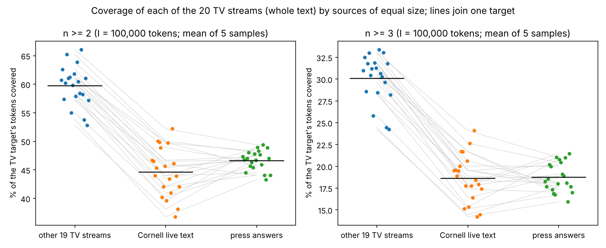
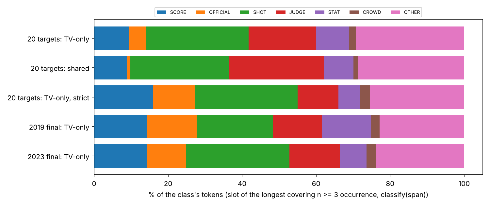
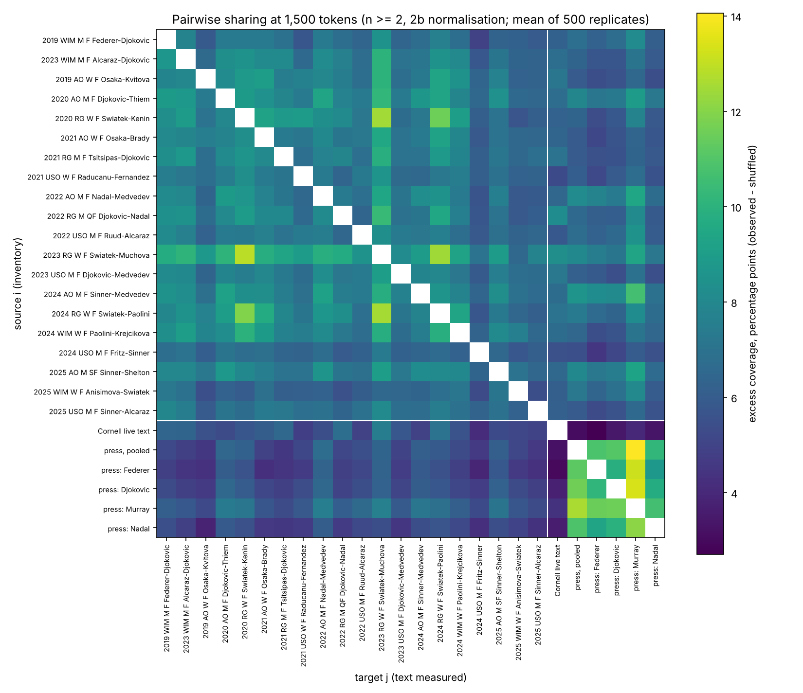
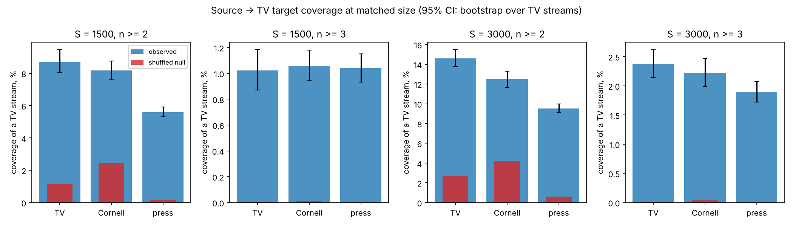
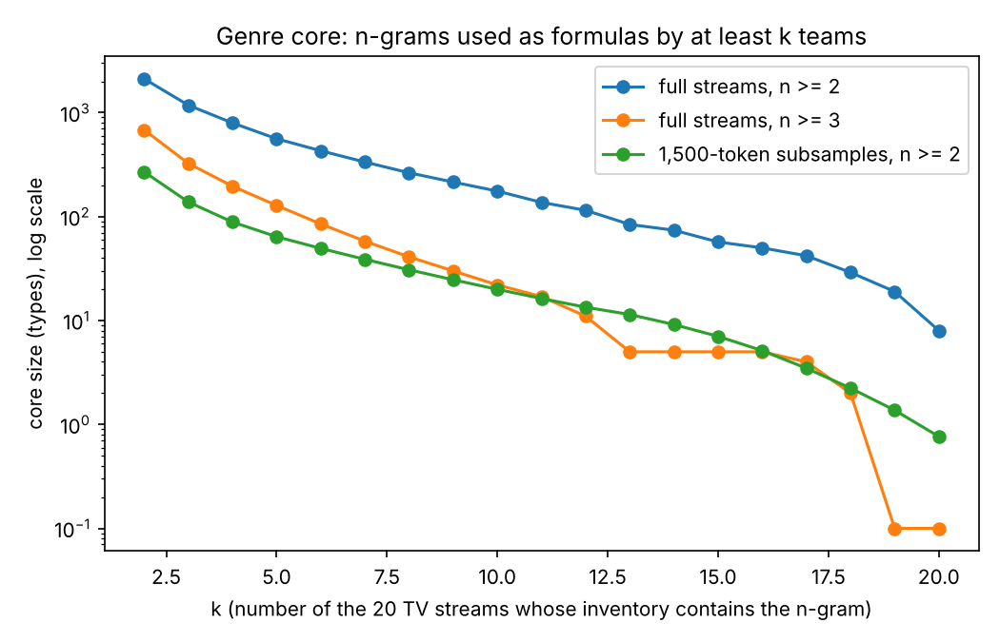
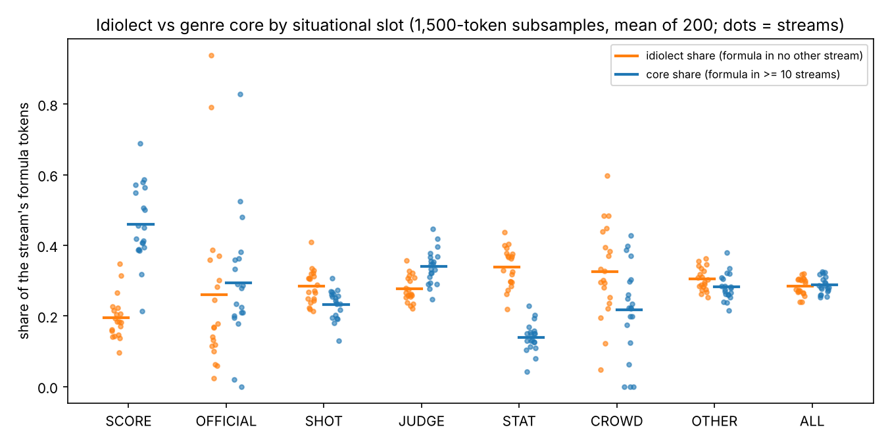
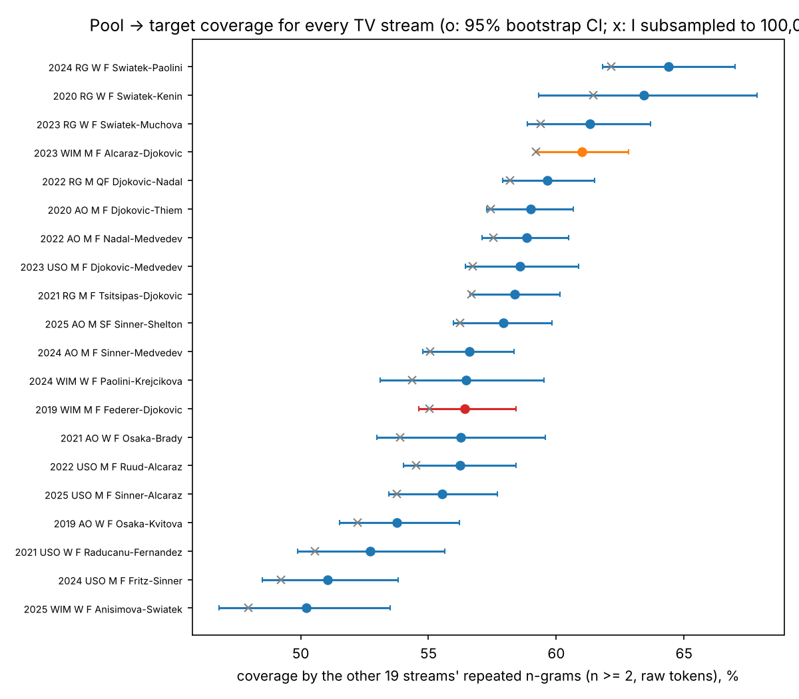
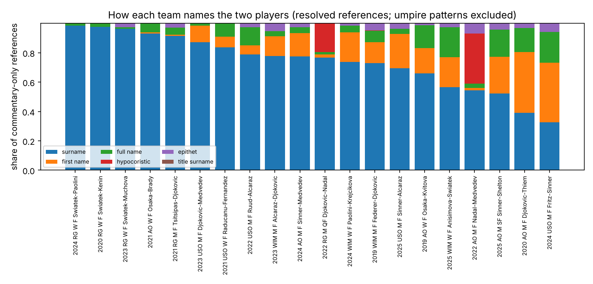
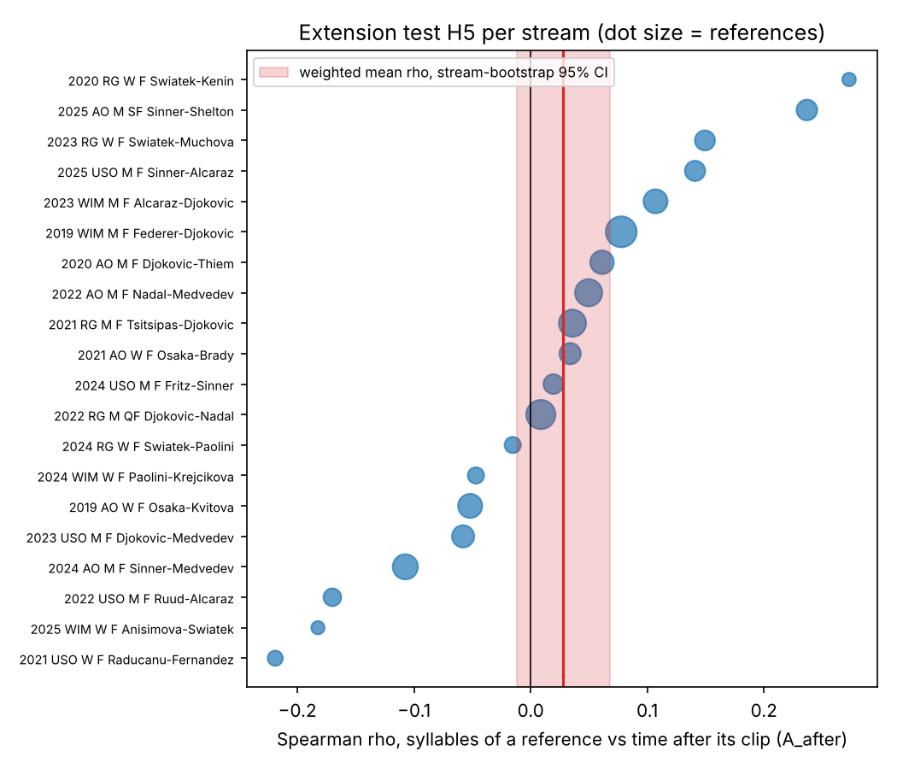
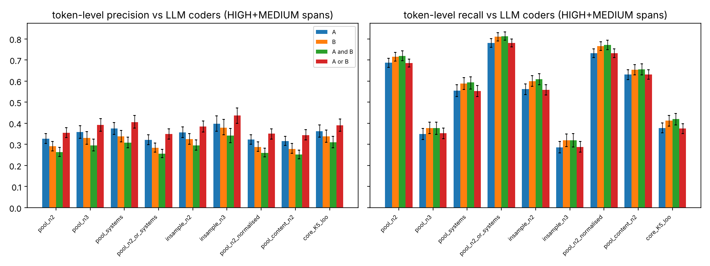

# Phase 2b: the tradition across broadcasts (shared stock, calibration, thrift per slot)

Generated by `analysis/parry/make_report.py` from `analysis/parry/results/`; rerun everything with `bash analysis/parry/run_all.sh`. The plan `analysis/parry/plan.md` was committed before any 2b test script was written or run (commit 34478c3 2026-10-08 00:16:36 +0000). **All of Phase 2b is exploratory relative to the pre-registered Phase 2**: it was added after every Phase 2 result had been seen, on the same corpus. Within 2b, seven tests were fixed in the plan as **2b-primary** and are Holm-corrected together (section 5); every other number is exploratory, and p-values outside section 5 are unadjusted. Brackets are 95% intervals; the kind of interval is stated each time.

**Revision 1.** This version adds the analyses of plan addendum 1 (dated, committed before they were run, and **post hoc**: written after the first report and the critic's review `review/critic_parry_v1.md`, whose own reruns the addendum adopts). The pre-registered analyses are rerun unchanged and reproduce: all 43 pre-registered results files are identical to commit 476a088 (run-time fields excluded; `results/rerun_check.csv`). The cross-corpus comparison now rests on 100,000-token identification sets (section 2.0); the 1,500-token matched design is kept as the secondary design. No verdict sentence in this report is typed by hand: each is chosen by a rule stated in `make_report.py` from the results files. Post hoc changes are listed in section 7.

**What is measured.** As in Phase 2, 'formula' below means an exact word n-gram repeated in at least two utterances of a text (a repetition statistic), not Parry's metrically conditioned formula; the calibration in section 3 measures how far that statistic agrees with judgements of formulaicity by two LLM coders working from Parry's definition. A TV 'stream' (called 'team' in the plan) is one match with one unnamed broadcaster; team, match and broadcaster are confounded, and every commentator hint is [unverified].

## Key results

* **Is there a TV-specific multiword stock? (post hoc; section 2.0).** Each TV stream (whole text) was covered by the formulas of a 100,000-token sample of the other 19 TV streams, of the Cornell live text and of the press answers (5 samples each; names and numerals normalised). Observed coverage, mean over the 20 targets: n >= 2: TV 59.7%, Cornell 44.6%, press 46.6%; n >= 3: TV 30.1%, Cornell 18.6%, press 18.7%. TV minus Cornell: 15.14 [14.29, 15.98] pp at n >= 2 (20 of 20 targets positive) and 11.43 [10.70, 12.16] pp at n >= 3 (20/20); TV minus press: 13.09 [11.85, 14.22] and 11.33 [10.36, 12.23] pp (20/20, 20/20; bootstrap over targets). TV sources of the same size cover TV targets more than written live text and press answers do, at n >= 2 and at n >= 3, for every one of the 20 targets. With the umpire's calls and point-score calls removed from the targets the n >= 3 differences are 11.08 [10.42, 11.79] and 10.85 [9.96, 11.68] pp; on raw tokens 10.63 [9.91, 11.38] and 8.06 [7.29, 8.78] pp. Differences of the excess over the unigram-shuffled null: n >= 2 10.27 / 5.42, n >= 3 12.60 / 10.27 pp (Cornell / press).
* **What the TV-specific n >= 3 stock consists of (post hoc; Tables 2.D-2.G).** In the 2019 final 10.3% of tokens lie in n >= 3 strings that the TV sample shares with it and that neither the Cornell nor the press sample repeats ('TV-only'), and 20.7% in n >= 3 strings that a baseline sample also has (2023 final: 11.0% / 21.5%; mean over the 20 targets 9.6%, range 7.8-11.0%). By the span-mode slot classifier (kappa 0.49 / 0.48 against the two coders), SCORE, STAT and OFFICIAL frames are a minority (23%) of its tokens, SHOT and JUDGE 46% and OTHER 29% (pooled over the 20 targets; by slot OTHER 29%, SHOT 28%, JUDGE 18%, SCORE 9%, STAT 9%, OFFICIAL 5%, CROWD 2%; slot of the longest covering string); 6% of them lie inside umpire or score-call patterns (18% and 17% in the 2019 and 2023 finals). Among the 40 most frequent TV-only strings, 20 are SCORE, STAT or OFFICIAL by modal slot (`and <num> minutes`, `<name> leads by`, `<num> miles an`, `<num> miles an hour`, `miles an hour`, `ball was called`), the others SHOT, JUDGE or OTHER (`he's trying to`, `that second serve`, `games to two`, `he's got to`, `by the way`, `look at this`; the classifier puts some score frames in OTHER, e.g. `games to two`, `six games to`). Almost all of the TV-only tokens (8.9% of tokens on average, against 9.6%) are in strings attested in at least two other TV streams. Under the strictest reading (no covering string is repeated anywhere in the whole Cornell text or the 81,974-answer press corpus) the TV-only share falls to 1.8% on average (2.8% in 2019), and 18% of those tokens are umpire or score-call patterns. So most of the TV-only stock consists of strings the other registers also use, less often (a difference of frequency; rates in Table 2.F); umpire and score-call patterns are a larger part of the strictly TV-only tokens (18%) than of all TV-only tokens (6%).
* **Shared stock beyond lexicon (H1; a check that the pipeline detects collocation).** At 1,500 tokens per stream the formulas of one TV stream cover 8.7% of another's tokens against 1.1% for unigram-shuffled texts: excess 7.6 pp [7.0, 8.2] (n >= 2; 20/20 targets) and 1.02 pp [0.87, 1.18] (n >= 3). The shuffle destroys every collocation, and most of this excess is reached by sources that are not TV commentary: press answers reach 72% and Cornell live text 76% of it, and four press speakers share 10.9 pp among themselves (TV streams 7.6). H1 therefore establishes repetition beyond the lexicon, not a commentary-specific stock; the TV-specific part is in the first two bullets.
* **H2 at 1,500 tokens (pre-registered).** The pre-registered statistic (difference of excess over the shuffled null) is 1.84 pp [1.42, 2.33] against Cornell and 2.14 pp [1.66, 2.71] against press (Holm-rejected: yes, yes). On observed coverage, on which the claim rests, the differences are 0.53 [0.12, 1.01] pp (15/20 targets positive) and 3.10 [2.46, 3.84] pp (20/20), so at this size TV sources cover TV targets more than the written source (6% of the TV -> TV coverage of 8.70%) and more than the press source (36% of the TV -> TV coverage of 8.70%). The excess exceeds the observed difference for Cornell because the shuffled Cornell inventory is larger (54 types at 1,500 tokens against 16-32 for TV streams): Cornell's unigram distribution is more concentrated (Simpson index 0.0156 against 0.0096 per TV stream; `<name>` 5.6% and `<num>` 2.8% of tokens against 2.6% and 2.1%), so its chance bigrams cover shuffled TV text, and the size of the excess difference is a property of the null. At n >= 3 the 1,500-token inventories are near-empty (17-49 n >= 3 types per TV stream, TV -> TV coverage 1.02%) and their differences are not informative: the TV minus Cornell n >= 3 difference is -0.04 pp at 1,500 tokens, 0.15 at 3,000 and 11.43 at 100,000.
* **Genre core.** 8 n-grams are formulas of all 20 streams and 176 of at least 10 (22 of them with n >= 3; 0 with n >= 3 in all 20). Of the >= 10-stream core, 93% are formulas of a Cornell sample and 89% of a press sample of the same total size (120,682 tokens): most of the most widely shared strings are also formulas of the written and press baselines.
* **Stream-specific share (called 'idiolect' in the plan).** On full texts 17.0% of a stream's formula tokens (mean; range 11.8-20.0%) lie only in formulas that no other stream's inventory contains; at 1,500 tokens the share is 28.4% (range 24.0-31.9%). By slot (full texts) it is lowest for SCORE (10.6%) and highest for CROWD (23.6%; descriptive: the slot of a formula is computed from its own words). The share correlates with stream length (Spearman rho 0.44, p = 0.0510 on full texts; -0.66, p = 0.0015 at 1,500 tokens), and a stream is one match with one broadcaster, so the share mixes team and match topic and depends on sampling.
* **Clusters (exploratory).** Pairs from the same slam share more (excess 0.65 pp above other pairs; permutation p = 1.0e-04), which mixes broadcaster with venue and surface vocabulary. The only commentator-hint cluster with two members (the 2019 and 2023 Wimbledon finals, 'Tim') ranks 44 of 190 pairs (p = 0.2316): no sign that the hinted pair shares more than other pairs. Inventory overlap rises with shared players (Mantel r = 0.29, p = 0.0008).
* **Is the 2019 figure typical?** With the other 19 streams as identification set, 2019's coverage (raw tokens, n >= 2) ranks 13 of 20 (median 57.3%, range 50.2-64.4%); the Phase 2 value with the 18-stream pool is reproduced (55.03%).
* **Calibration (2b.2; the coders are two LLM agents).** The coders agree with each other at token-level kappa 0.77 [0.75, 0.80]. The automatic measures agree with them less than half as well: kappa 0.13-0.22 for the six measures of the brief against every coder reference set (0.11-0.22 with the exploratory measures); against the union of the coders precision exceeds its chance level (the coders' positive share, 0.28) by 0.07-0.16 and recall exceeds its chance level (the measure's own positive share) by 0.10-0.17. The Phase 2 measure (pool n >= 2) marks 54% of tokens: precision 0.35 (chance 0.28, ceiling 0.52), recall 0.68 (chance 0.54), kappa 0.16 [0.14, 0.18]; pool n >= 3: kappa 0.15, precision 0.39, recall 0.35 (chance 0.25); systems: kappa 0.22, precision 0.41, recall 0.55. Every automatic measure is therefore a weak proxy for the coders' judgement (kappa below 0.40 against every reference set). The higher precision on the 2019 utterances (0.43 vs 0.27 for coder A) is mostly a base rate (precision minus chance 0.09 vs 0.06): chance precision is 0.34 vs 0.21 (median utterance 26 vs 59 tokens; kappa 0.19 vs 0.12). At span level, 64% of coder A's HIGH spans lie wholly inside pool n >= 2 coverage (chance, by circular shifts: 35%) and 89% touch it (chance 79%).
* **Slot classifier.** In span mode (used for formula spans: Tables 2.11, 2.E-2.G, 4.7) it agrees with the coders' slot labels on 58% / 57% of their spans (kappa 0.49 / 0.48); in context mode (used for the situational slot of a reference in H4) on 26% / 26% of coder spans (kappa 0.14 / 0.15) and on 46% / 49% of the commentary references that lie inside a coder span (kappa 0.35 / 0.39; n = 65 / 69). Slot labels this noisy (kappa below 0.6) attenuate any association between slot and form (H4b) toward zero and make per-slot attributions unreliable.
* **Naming habits (H4a).** Over 2833 commentary-only references to the players, the bare surname is 73%, the first name 12%, the full name 7%, hypocoristics 5% and descriptive epithets 3% (at most 4% if every unresolved epithet referred to a player). Streams (team, match and broadcaster together) differ in naming habits: 303 distinct stream x slot x category cells against 388.4 expected (p = 1.0e-04; surname 33-98% and first name 0-41% of references by stream). Verdict after the post hoc checks: **rejected (robust)** (p 1.0e-05-5.0e-05 over 8 seeds and variants, among them surname, first and full name only: p = 5.0e-05; leave-one-stream-out p <= 0.0002).
* **Slot-bound form choice (H4b).** Pre-registered: 472 distinct stream x player x slot forms against 483.3 expected, p = 0.0221, Holm p = 0.0442 (rejected). Verdict after the post hoc checks: **not robust / inconclusive**. With 100,000 permutations at three seeds p = 0.0233-0.0236 (Holm 0.0465-0.0473); without hypocoristic and epithet forms p = 0.0646; surname and first name only p = 0.1232; with the span-mode slot p = 0.0055 (span mode lets the reference's own words enter the classifier, e.g. an epithet containing `number one` counts as STAT, so this variant can favour rejection); without the 3 streams with hypocoristics p = 0.0443; one reference per player per utterance p = 0.0097; leaving out one stream at a time p = 0.0104-0.0902 (17 of 20 below 0.05). Per stream, 2 of 20 situational and 3 of 20 syntactic tests reach p < 0.05 (1 expected each). The transcripts have no speaker labels, so a play-by-play voice and an analyst voice that differ both in naming and in typical slot would produce the same deficit; H4b cannot separate that from slot-conditioned choice. No stream shows the Parryan pattern of one form per slot with different forms in different slots (situational slots: not one form per slot: 18 streams; one form throughout (economy without slot conditioning): 2 streams); the economy that exists is a stream's habitual naming, chiefly the surname.
* **Functional equivalents (E2, exploratory).** Of 16 tested equivalence classes (17 declared; the others have one attested form), stream choice among the alternatives is more consistent than chance (unadjusted p < 0.05, fewer forms per stream) for speed_unit (p = 1.0e-04), along_the_line (p = 0.0018), match_point (p = 0.0207), serve_wide (p = 0.0381); not for tied_at_forty, break_chance, net_error, serve_centre, serve_body, small_degree, praise_stroke, well_played, obligation, opinion_hedge, major_titles, audience. Of the 32 E2 p-values 10 are below 0.05 (1.6 expected); after a Bonferroni bound over the 32, only speed_unit remains.
* **Formula economy per slot (E1, exploratory).** With the inventory identified on all 20 streams pooled, every slot shows fewer distinct formula types per stream than chance; this is guaranteed by construction, because a string repeated inside one stream only enters the pooled inventory. With the inventory identified on the other 19 streams (post hoc), 7 of 7 slots still do (SCORE, OFFICIAL, SHOT, JUDGE, STAT, CROWD, OTHER): streams reuse their own selection of strings that other streams also use (a stream being one match and one broadcaster); Table 4.7b.
* **Extension (H5).** No association was detected between the syllable length of a reference and the time available after its clip: weighted within-stream rho = 0.028 (stream bootstrap [-0.012, 0.068]; permutation p = 0.1402; 2811 references in 20 streams; minimum detectable rho about 0.053); with the stored time field, valid in all 20 streams since the corpus correction, rho = 0.025, p = 0.1891 (post hoc).
* **2b-primary family (Holm, 7 tests; section 5).** Rejected as pre-registered: H1a, H1b, H2a, H2b, H4a, H4b; not rejected: H5. Read with the post hoc checks: H1a/H1b: most of the detected excess is also reached by the baseline sources; H2a/H2b on observed coverage: 0.53 [0.12, 1.01] and 3.10 [2.46, 3.84] pp (both above 0), 15.1 and 13.1 pp with 100,000-token sources; H4a: rejected (robust); H4b: not robust / inconclusive; H5: not rejected.

## 1. Data and definitions

**Teams** (plan section 0). Utterance = one rally clip (TV, `text_corrected`), one live-text update (Cornell), one player answer (press).

| team | medium | utterances | tokens |
|---|---|---|---|
| 2019 WIM M F Federer-Djokovic | tv | 318 | 9,791 |
| 2023 WIM M F Alcaraz-Djokovic | tv | 245 | 7,216 |
| 2019 AO W F Osaka-Kvitova | tv | 187 | 6,527 |
| 2020 AO M F Djokovic-Thiem | tv | 262 | 8,371 |
| 2020 RG W F Swiatek-Kenin | tv | 49 | 1,597 |
| 2021 AO W F Osaka-Brady | tv | 112 | 3,276 |
| 2021 RG M F Tsitsipas-Djokovic | tv | 228 | 7,837 |
| 2021 USO W F Raducanu-Fernandez | tv | 115 | 3,498 |
| 2022 AO M F Nadal-Medvedev | tv | 302 | 11,505 |
| 2022 RG M QF Djokovic-Nadal | tv | 222 | 8,046 |
| 2022 USO M F Ruud-Alcaraz | tv | 124 | 6,231 |
| 2023 RG W F Swiatek-Muchova | tv | 173 | 3,800 |
| 2023 USO M F Djokovic-Medvedev | tv | 141 | 5,992 |
| 2024 AO M F Sinner-Medvedev | tv | 252 | 9,256 |
| 2024 RG W F Swiatek-Paolini | tv | 86 | 2,368 |
| 2024 WIM W F Paolini-Krejcikova | tv | 133 | 3,825 |
| 2024 USO M F Fritz-Sinner | tv | 128 | 5,756 |
| 2025 AO M SF Sinner-Shelton | tv | 176 | 7,113 |
| 2025 WIM W F Anisimova-Swiatek | tv | 71 | 2,592 |
| 2025 USO M F Sinner-Alcaraz | tv | 169 | 6,085 |
| Cornell live text (written) | text | 3962 | 178,770 |
| press answers, pooled | press | 81974 | 5,435,611 |
| press: Federer | press | 4192 | 430,223 |
| press: Djokovic | press | 4579 | 377,847 |
| press: Murray | press | 4265 | 356,166 |
| press: Nadal | press | 3425 | 286,973 |

Press answers are dated 2007-01-15 to 2015-10-18 (358 interviewees); the Cornell records carry no dates (outlet: Sports Mole live text (per Cornell dataset README; written, not speech) [source site not independently verified]); the TV matches are from 2019 to 2025.

**Tokens.** Phase 2 tokeniser and STOP list (`analysis/formulas/common.py`, unchanged). **2b normalisation** (primary): digit strings and `love fifteen thirty forty deuce` -> `<num>`; first names and surnames of the players of the 20 TV matches (Phase 2 lexicon), plus the players of a Cornell update and the interviewee of a press answer -> `<name>`. Raw Phase 2 tokens are a sensitivity. Hypocoristics (`rafa`, `nole`, `rog`, `carlitos`) are not in the name lexicon: 155 such tokens in the TV streams (1.28 per 1,000), 0.25 per 1,000 in press and 0.10 in Cornell. `<name>` is 2.60% of TV tokens, 5.59% of Cornell and 0.10% of press tokens (press answers rarely name the players of the TV matches), so frames around player names (`from <name>`, `for <name>`) cannot be shared from press for a reason of genre.

**Formula of a team** = n-gram (2 <= n <= 12) in >= 2 distinct utterances of the team's text, not made only of STOP words; variants n >= 3 and 'content' (not made only of STOP words and numerals). **Coverage** of a text by an inventory = share of its tokens inside an occurrence of an inventory n-gram. **Large identification sets** (post hoc, addendum 1): each TV stream (whole text) is the target; the source is a 100,000-token sample (whole utterances) of the other 19 TV streams, of Cornell or of press, 5 samples each; the target and each source sample are also unigram-shuffled once per sample (null). **Matched size** (pre-registered, now secondary): each team subsampled to S = 1,500 tokens (all 20 TV streams) or 3,000 (17 TV streams), R = 500 / 200 replicates. **Null (a)**: tokens permuted over the positions of a text (lexicon, topic and utterance lengths kept, multiword units destroyed), identification and coverage repeated. **Excess** = observed minus shuffled coverage. **Vertex bootstrap**: the 20 TV streams resampled with replacement, the statistic averaged over ordered pairs of distinct original streams (each pair's replicate mean held fixed).

**Situational slot classifier** (plan section 5; code `lib2b.SlotClassifier`): (1) OFFICIAL if the span touches an umpire/Hawk-Eye pattern (`mr <name>`, `... is challenging`, `challenges remaining`, `ball was called`, `new balls please`, `thank you (players|please)`, `quiet please`, `time violation`, `hawk eye`, ...); (2) SCORE if it touches a score pattern (`<score> <score|all>`, `deuce`, `advantage <name>`, `game <name>`, `<name> leads by N games to M`, `N games all`, `break/set/match point`, `tie break`); (3) otherwise the slot whose keyword lexicon has most hits in the span (ties: OFFICIAL > SCORE > CROWD > STAT > SHOT > JUDGE); (4) the same on a window of 4 tokens either side; (5) OTHER. Two modes: **span mode** (`classify`, steps 1-5 on the span itself; used for formula spans) and **context mode** (`classify_context`, steps 1-3 on the 4-token window either side excluding the span; used for the situational slot of a reference, so that the name form cannot determine its own slot). Both modes are scored against the coders' slot labels in section 3. The lexicons are frozen in the plan and were not tuned on any 2b output.

**Available time.** 2b found that `t_to_next_first_hit_s` was invalid in 6 of the 20 streams (videos at about 29.97 frames per second whose clip times had been computed as frames/25); the corpus has since been corrected (corpus/README.md section 3.3: frame rate detected per stream, frame-derived times recomputed, hit times unchanged). The pre-registered analyses use the hit clock, which the correction did not touch: **A_after** = first hit of the next clip minus last hit of this clip (the clip's text runs into the following dead time). The stored field, valid in all 20 streams after the correction, enters a post hoc sensitivity of H5 (last row of Table 4.6).

## 2. Shared stock: what TV commentary repeats that other registers do not (2b.1)

### 2.0 Large identification sets (post hoc, addendum 1; the primary cross-corpus design of this revision)

Each of the 20 TV streams (whole text) is a target; a source is a 100,000-token sample of the other 19 TV streams pooled, of the Cornell live text or of the press answers (5 samples per source and target); its inventory is identified on the sample. Commentary-only = target tokens inside `common.official_mask_v2` patterns (umpire calls, Hawk-Eye announcements, point-score calls) removed from numerator and denominator. Intervals: percentile bootstrap over the 20 targets (B = 10,000 for differences). The targets' TV sources share 18 of their 19 streams, so this bootstrap treats targets as exchangeable and understates between-broadcast uncertainty; the number of targets with a positive difference is given for that reason.

**Table 2.A. Coverage of TV targets by 100,000-token sources** (% of the target's tokens, mean over the 20 targets [bootstrap 95% CI]; min over targets).

| tokens | source | inventory types | of which n >= 3 | observed n >= 2 | observed n >= 3 | shuffled n >= 2 | shuffled n >= 3 | commentary-only n >= 3 | min n >= 3 |
|---|---|---|---|---|---|---|---|---|---|
| norm | other 19 TV streams | 18670 | 10029 | 59.7 [58.3, 61.2] | 30.1 [28.9, 31.2] | 30.5 | 1.28 | 29.6 [28.5, 30.7] | 24.2 |
| norm | Cornell live text (written) | 31559 | 23312 | 44.6 [42.8, 46.4] | 18.6 [17.5, 19.8] | 25.7 | 2.44 | 18.5 [17.4, 19.7] | 14.2 |
| norm | press answers, pooled | 20479 | 12365 | 46.6 [45.9, 47.4] | 18.7 [18.0, 19.5] | 22.9 | 0.22 | 18.8 [18.1, 19.5] | 15.9 |
| raw | other 19 TV streams | 17798 | 8909 | 55.6 [54.0, 57.2] | 25.9 [24.9, 26.9] | 23.5 | 0.21 | 25.9 [24.8, 26.9] | 20.5 |
| raw | Cornell live text (written) | 27979 | 18788 | 39.1 [37.3, 40.9] | 15.3 [14.4, 16.2] | 18.3 | 0.54 | 15.5 [14.6, 16.4] | 11.0 |
| raw | press answers, pooled | 20306 | 12203 | 42.8 [41.9, 43.6] | 17.9 [17.1, 18.6] | 18.7 | 0.17 | 18.1 [17.4, 18.8] | 14.5 |

**Table 2.B. TV sources minus baseline sources of the same size** (pp; mean over targets [bootstrap 95% CI]; targets with a positive difference; min over targets).

| tokens | baseline | measure | TV minus baseline | targets > 0 | min | reading (95% CI vs 0) |
|---|---|---|---|---|---|---|
| norm | Cornell live text (written) | observed n >= 2 | 15.14 [14.29, 15.98] | 20/20 | 11.25 | TV more |
| norm | Cornell live text (written) | observed n >= 3 | 11.43 [10.70, 12.16] | 20/20 | 8.74 | TV more |
| norm | Cornell live text (written) | commentary-only n >= 2 | 15.17 [14.31, 16.01] | 20/20 | 11.25 | TV more |
| norm | Cornell live text (written) | commentary-only n >= 3 | 11.08 [10.42, 11.79] | 20/20 | 8.80 | TV more |
| norm | Cornell live text (written) | shuffled n >= 2 | 4.86 [4.32, 5.41] | 20/20 | 2.92 | TV more |
| norm | Cornell live text (written) | shuffled n >= 3 | -1.17 [-1.36, -1.00] | 0/20 | -2.10 | TV less |
| norm | Cornell live text (written) | excess n >= 2 | 10.27 [9.78, 10.74] | 20/20 | 7.97 | TV more |
| norm | Cornell live text (written) | excess n >= 3 | 12.60 [11.97, 13.27] | 20/20 | 10.78 | TV more |
| norm | press answers, pooled | observed n >= 2 | 13.09 [11.85, 14.22] | 20/20 | 5.75 | TV more |
| norm | press answers, pooled | observed n >= 3 | 11.33 [10.36, 12.23] | 20/20 | 6.55 | TV more |
| norm | press answers, pooled | commentary-only n >= 2 | 12.98 [11.75, 14.13] | 20/20 | 5.75 | TV more |
| norm | press answers, pooled | commentary-only n >= 3 | 10.85 [9.96, 11.68] | 20/20 | 6.37 | TV more |
| norm | press answers, pooled | shuffled n >= 2 | 7.67 [6.85, 8.48] | 20/20 | 3.23 | TV more |
| norm | press answers, pooled | shuffled n >= 3 | 1.06 [0.92, 1.21] | 20/20 | 0.52 | TV more |
| norm | press answers, pooled | excess n >= 2 | 5.42 [4.74, 6.10] | 20/20 | 2.52 | TV more |
| norm | press answers, pooled | excess n >= 3 | 10.27 [9.41, 11.09] | 20/20 | 5.71 | TV more |
| raw | Cornell live text (written) | observed n >= 2 | 16.52 [15.56, 17.44] | 20/20 | 13.09 | TV more |
| raw | Cornell live text (written) | observed n >= 3 | 10.63 [9.91, 11.38] | 20/20 | 8.06 | TV more |
| raw | Cornell live text (written) | commentary-only n >= 2 | 16.15 [15.21, 17.08] | 20/20 | 12.53 | TV more |
| raw | Cornell live text (written) | commentary-only n >= 3 | 10.42 [9.72, 11.17] | 20/20 | 8.09 | TV more |
| raw | Cornell live text (written) | shuffled n >= 2 | 5.24 [4.59, 5.89] | 20/20 | 2.49 | TV more |
| raw | Cornell live text (written) | shuffled n >= 3 | -0.33 [-0.39, -0.28] | 0/20 | -0.70 | TV less |
| raw | Cornell live text (written) | excess n >= 2 | 11.28 [10.83, 11.73] | 20/20 | 9.11 | TV more |
| raw | Cornell live text (written) | excess n >= 3 | 10.96 [10.26, 11.70] | 20/20 | 8.46 | TV more |
| raw | press answers, pooled | observed n >= 2 | 12.82 [11.58, 13.99] | 20/20 | 6.22 | TV more |
| raw | press answers, pooled | observed n >= 3 | 8.06 [7.29, 8.78] | 20/20 | 3.59 | TV more |
| raw | press answers, pooled | commentary-only n >= 2 | 12.09 [10.90, 13.20] | 20/20 | 5.83 | TV more |
| raw | press answers, pooled | commentary-only n >= 3 | 7.76 [7.01, 8.45] | 20/20 | 3.46 | TV more |
| raw | press answers, pooled | shuffled n >= 2 | 4.81 [4.01, 5.61] | 20/20 | 0.90 | TV more |
| raw | press answers, pooled | shuffled n >= 3 | 0.04 [0.01, 0.08] | 14/20 | -0.09 | TV more |
| raw | press answers, pooled | excess n >= 2 | 8.01 [7.31, 8.72] | 20/20 | 5.32 | TV more |
| raw | press answers, pooled | excess n >= 3 | 8.02 [7.27, 8.72] | 20/20 | 3.68 | TV more |

**Table 2.C. Per target** (2b normalisation; observed coverage %, mean over the 5 samples; TV-only and shared n >= 3 shares as defined below).

| target | tokens | n>=2 TV | n>=2 Cornell | n>=2 press | n>=3 TV | n>=3 Cornell | n>=3 press | n>=3 shared % | n>=3 TV-only % | TV-only strict % | TV-only, commentary-only % |
|---|---|---|---|---|---|---|---|---|---|---|---|
| 2019 WIM M F Federer-Djokovic | 9,791 | 60.7 | 46.7 | 47.3 | 31.0 | 19.5 | 18.2 | 20.7 | 10.3 | 2.8 | 8.8 |
| 2023 WIM M F Alcaraz-Djokovic | 7,216 | 62.6 | 46.5 | 46.7 | 32.5 | 19.5 | 17.7 | 21.5 | 11.0 | 2.7 | 9.5 |
| 2019 AO W F Osaka-Kvitova | 6,527 | 57.4 | 44.0 | 44.5 | 28.6 | 18.9 | 18.6 | 20.5 | 8.1 | 1.2 | 8.1 |
| 2020 AO M F Djokovic-Thiem | 8,371 | 60.2 | 45.3 | 47.0 | 31.8 | 19.5 | 20.2 | 22.0 | 9.8 | 1.8 | 9.6 |
| 2020 RG W F Swiatek-Kenin | 1,597 | 65.2 | 50.1 | 48.0 | 33.0 | 20.0 | 20.0 | 23.4 | 9.6 | 1.2 | 9.4 |
| 2021 AO W F Osaka-Brady | 3,276 | 61.1 | 49.8 | 45.6 | 30.4 | 21.7 | 17.3 | 20.9 | 9.5 | 1.5 | 9.5 |
| 2021 RG M F Tsitsipas-Djokovic | 7,837 | 61.2 | 48.9 | 46.3 | 31.2 | 21.7 | 16.8 | 21.3 | 9.8 | 2.0 | 9.6 |
| 2021 USO W F Raducanu-Fernandez | 3,498 | 55.0 | 40.2 | 45.4 | 25.8 | 15.1 | 16.7 | 17.6 | 8.2 | 1.6 | 8.0 |
| 2022 AO M F Nadal-Medvedev | 11,505 | 59.8 | 42.1 | 47.8 | 31.9 | 17.7 | 21.0 | 21.4 | 10.5 | 1.6 | 10.4 |
| 2022 RG M QF Djokovic-Nadal | 8,046 | 61.8 | 45.6 | 46.7 | 31.3 | 20.6 | 18.0 | 22.1 | 9.2 | 1.8 | 9.1 |
| 2022 USO M F Ruud-Alcaraz | 6,231 | 57.9 | 39.6 | 49.0 | 28.5 | 15.3 | 20.8 | 19.7 | 8.7 | 1.7 | 8.3 |
| 2023 RG W F Swiatek-Muchova | 3,800 | 63.8 | 49.7 | 48.3 | 33.4 | 22.6 | 20.4 | 24.2 | 9.2 | 2.2 | 8.9 |
| 2023 USO M F Djokovic-Medvedev | 5,992 | 60.5 | 43.4 | 47.7 | 30.6 | 17.7 | 19.1 | 20.0 | 10.6 | 1.3 | 10.2 |
| 2024 AO M F Sinner-Medvedev | 9,256 | 58.4 | 40.9 | 45.9 | 30.3 | 16.4 | 18.9 | 19.7 | 10.5 | 1.3 | 10.3 |
| 2024 RG W F Swiatek-Paolini | 2,368 | 66.1 | 52.2 | 49.4 | 33.0 | 24.1 | 21.0 | 23.1 | 9.9 | 2.1 | 10.0 |
| 2024 WIM W F Paolini-Krejcikova | 3,825 | 58.2 | 46.1 | 44.0 | 29.6 | 18.4 | 18.1 | 19.1 | 10.5 | 2.3 | 9.9 |
| 2024 USO M F Fritz-Sinner | 5,756 | 53.8 | 36.8 | 43.3 | 24.4 | 14.2 | 15.9 | 16.6 | 7.8 | 1.1 | 7.6 |
| 2025 AO M SF Sinner-Shelton | 7,113 | 61.1 | 43.9 | 48.9 | 31.8 | 17.9 | 21.5 | 21.7 | 10.1 | 1.7 | 9.8 |
| 2025 WIM W F Anisimova-Swiatek | 2,592 | 52.8 | 38.1 | 47.0 | 24.2 | 14.4 | 17.7 | 16.0 | 8.2 | 1.3 | 8.1 |
| 2025 USO M F Sinner-Alcaraz | 6,085 | 57.2 | 42.1 | 44.1 | 28.2 | 17.4 | 17.0 | 18.9 | 9.3 | 1.9 | 8.8 |

**TV-only n >= 3 stock** (addendum 1). In each sample, an occurrence in the target of an n >= 3 string of the TV inventory is *shared* if the string is also in the Cornell or the press inventory of that sample, otherwise *TV-only*; a covered token is shared if any covering occurrence is shared. *Strict*: every covering TV-only string is also not a formula (>= 2 utterances) of the whole Cornell text or of the whole press corpus. *Cross-broadcast*: every covering TV-only string occurs in at least two of the other 19 TV streams. A TV-only token's slot is the span-mode slot of the longest covering TV-only occurrence.

**Table 2.D. Shares of target tokens** (%; mean over the 5 samples; mean and range over the 20 targets, and the two finals).

| class | mean over 20 targets | range | 2019 final (in-sample) | 2023 final (held-out) |
|---|---|---|---|---|
| covered by an n >= 3 TV string | 30.1 | 24.2-33.4 | 31.0 | 32.5 |
| shared with a baseline | 20.5 | 16.0-24.2 | 20.7 | 21.5 |
| TV-only | 9.6 | 7.8-11.0 | 10.3 | 11.0 |
| TV-only, cross-broadcast | 8.9 | 7.4-9.9 | 9.4 | 9.9 |
| TV-only, strict | 1.8 | 1.1-2.8 | 2.8 | 2.7 |
| not in the Cornell inventory | 15.7 | 12.9-18.1 | 16.0 | 16.6 |
| not in the press inventory | 15.5 | 11.8-18.6 | 16.8 | 18.6 |
| TV-only, commentary-only tokens | 9.2 | 7.6-10.4 | 8.8 | 9.5 |
| TV-only strict, commentary-only tokens | 1.5 | 0.9-2.1 | 1.6 | 1.6 |

**Table 2.E. Composition by situational slot** (% of each class's tokens, span-mode slot of the longest covering occurrence; last row: % inside umpire or score-call patterns). Pooled over the 20 targets unless stated.

| slot | TV-only | TV-only, cross-broadcast | TV-only, strict | shared | 2019 final: TV-only | 2023 final: TV-only |
|---|---|---|---|---|---|---|
| SCORE | 9.3 | 9.4 | 15.9 | 8.8 | 14.3 | 14.3 |
| OFFICIAL | 4.6 | 4.0 | 11.3 | 1.0 | 13.4 | 10.5 |
| SHOT | 27.8 | 28.0 | 27.9 | 26.7 | 20.6 | 28.0 |
| JUDGE | 18.3 | 18.5 | 11.0 | 25.5 | 13.2 | 13.7 |
| STAT | 8.9 | 8.9 | 5.9 | 8.0 | 13.2 | 7.2 |
| CROWD | 1.8 | 1.7 | 2.6 | 1.1 | 2.3 | 2.5 |
| OTHER | 29.3 | 29.4 | 25.5 | 28.8 | 22.8 | 23.9 |
| inside umpire/score-call patterns | 5.8 | 5.4 | 17.6 | 2.1 | 18.1 | 17.2 |

**Table 2.F. The 40 commonest TV-only strings** (pooled over targets: strings that are TV-only in a majority of the 5 samples of a target; occurrences in those targets; modal slot; TV streams attesting the string; rates per 100,000 tokens in the 20 TV streams, the whole Cornell text and the whole press corpus; strict = not repeated in either whole baseline).

| string | targets | occurrences | modal slot | TV streams | per 100k TV | per 100k Cornell | per 100k press | strict |
|---|---|---|---|---|---|---|---|---|
| `and <num> minutes` | 6 | 19 | STAT | 7 | 16.6 | 1.1 | 0.81 | no |
| `he's trying to` | 9 | 19 | OTHER | 9 | 15.7 | 0.0 | 0.59 | no |
| `<name> leads by` | 5 | 18 | SCORE | 5 | 14.9 | 0.0 | 0.00 | yes |
| `<num> miles an` | 6 | 18 | STAT | 7 | 18.2 | 0.0 | 0.64 | no |
| `<num> miles an hour` | 6 | 18 | STAT | 7 | 18.2 | 0.0 | 0.64 | no |
| `miles an hour` | 6 | 18 | STAT | 7 | 18.2 | 0.0 | 0.79 | no |
| `that second serve` | 11 | 18 | SHOT | 11 | 14.9 | 0.0 | 0.20 | no |
| `ball was called` | 4 | 17 | OFFICIAL | 4 | 14.1 | 0.0 | 0.09 | no |
| `hours and <num>` | 6 | 17 | STAT | 6 | 14.1 | 0.0 | 0.39 | no |
| `hours and <num> minutes` | 6 | 17 | STAT | 6 | 14.1 | 0.0 | 0.37 | no |
| `games to two` | 9 | 16 | OTHER | 9 | 13.3 | 0.0 | 0.00 | yes |
| `he's got to` | 5 | 16 | JUDGE | 9 | 23.2 | 1.1 | 1.09 | no |
| `games to one` | 7 | 15 | SCORE | 7 | 12.4 | 0.0 | 0.02 | yes |
| `by the way` | 7 | 14 | OTHER | 8 | 12.4 | 0.0 | 0.68 | no |
| `look at this` | 6 | 14 | OTHER | 6 | 11.6 | 0.0 | 0.33 | no |
| `on the left` | 8 | 14 | OTHER | 8 | 11.6 | 0.6 | 0.29 | no |
| `<name> <name> and` | 8 | 13 | OTHER | 8 | 10.8 | 0.6 | 0.53 | no |
| `challenging the call` | 2 | 13 | OFFICIAL | 2 | 10.8 | 0.0 | 0.02 | yes |
| `do you think` | 8 | 13 | JUDGE | 8 | 10.8 | 0.0 | 1.42 | no |
| `ladies and gentlemen` | 6 | 13 | OFFICIAL | 6 | 10.8 | 0.0 | 0.00 | yes |
| `look at that` | 9 | 13 | OTHER | 9 | 10.8 | 0.0 | 0.68 | no |
| `on that forehand` | 9 | 13 | SHOT | 9 | 10.8 | 0.0 | 0.09 | no |
| `on the outside` | 4 | 13 | SHOT | 4 | 10.8 | 0.6 | 0.94 | no |
| `that first serve` | 10 | 13 | SHOT | 10 | 10.8 | 0.0 | 0.20 | no |
| `the back end` | 6 | 13 | SHOT | 6 | 10.8 | 1.1 | 0.18 | no |
| `the new balls` | 8 | 13 | OFFICIAL | 8 | 10.8 | 0.0 | 0.20 | no |
| `two games to` | 7 | 13 | SCORE | 7 | 10.8 | 0.0 | 0.11 | no |
| `back in <num>` | 7 | 12 | OTHER | 8 | 10.8 | 0.0 | 1.03 | no |
| `five games to` | 9 | 12 | SCORE | 9 | 9.9 | 0.0 | 0.02 | yes |
| `have a look` | 6 | 12 | OTHER | 6 | 9.9 | 0.0 | 0.85 | no |
| `i just wonder` | 6 | 12 | OTHER | 6 | 9.9 | 0.0 | 0.00 | yes |
| `six games to` | 7 | 12 | OTHER | 7 | 9.9 | 0.0 | 0.04 | no |
| `to the forehand` | 7 | 12 | SHOT | 7 | 9.9 | 0.0 | 0.57 | no |
| `with the new` | 7 | 12 | OFFICIAL | 7 | 9.9 | 0.0 | 0.63 | no |
| `<name> with the` | 7 | 11 | OTHER | 7 | 9.1 | 0.6 | 0.06 | no |
| `<num> <num> first` | 9 | 11 | SCORE | 9 | 9.1 | 0.0 | 0.24 | no |
| `<num> second set` | 7 | 11 | SCORE | 7 | 9.1 | 0.0 | 0.15 | no |
| `four games to` | 9 | 11 | SCORE | 9 | 9.1 | 0.0 | 0.04 | no |
| `from two sets` | 5 | 11 | SCORE | 5 | 9.1 | 0.0 | 0.66 | no |
| `has two challenges` | 5 | 11 | OFFICIAL | 5 | 9.1 | 0.0 | 0.00 | yes |

**Table 2.G. The commonest TV-only strings of the two finals** (25 each; occurrences in the final; rate per 100,000 tokens in the other 19 TV streams).

| final | string | occurrences | modal slot | other TV streams | per 100k TV | per 100k Cornell | per 100k press | strict |
|---|---|---|---|---|---|---|---|---|
| 2019 WIM M F Federer-Djokovic | `<name> leads by` | 7 | SCORE | 4 | 9.9 | 0.0 | 0.00 | yes |
| 2019 WIM M F Federer-Djokovic | `<name> is challenging` | 5 | OFFICIAL | 1 | 1.8 | 0.0 | 0.00 | yes |
| 2019 WIM M F Federer-Djokovic | `and <num> minutes` | 5 | STAT | 6 | 13.5 | 1.1 | 0.81 | no |
| 2019 WIM M F Federer-Djokovic | `hours and <num>` | 5 | STAT | 5 | 10.8 | 0.0 | 0.39 | no |
| 2019 WIM M F Federer-Djokovic | `hours and <num> minutes` | 5 | STAT | 5 | 10.8 | 0.0 | 0.37 | no |
| 2019 WIM M F Federer-Djokovic | `the semi final` | 5 | STAT | 2 | 1.8 | 0.6 | 0.02 | yes |
| 2019 WIM M F Federer-Djokovic | `<name> has two challenges` | 4 | OFFICIAL | 2 | 4.5 | 0.0 | 0.00 | yes |
| 2019 WIM M F Federer-Djokovic | `<name> has two challenges remaining` | 4 | OFFICIAL | 2 | 4.5 | 0.0 | 0.00 | yes |
| 2019 WIM M F Federer-Djokovic | `<num> miles an` | 4 | STAT | 6 | 16.2 | 0.0 | 0.64 | no |
| 2019 WIM M F Federer-Djokovic | `<num> miles an hour` | 4 | STAT | 6 | 16.2 | 0.0 | 0.64 | no |
| 2019 WIM M F Federer-Djokovic | `ball was called` | 4 | OFFICIAL | 3 | 11.7 | 0.0 | 0.09 | no |
| 2019 WIM M F Federer-Djokovic | `games to one` | 4 | SCORE | 6 | 9.9 | 0.0 | 0.02 | yes |
| 2019 WIM M F Federer-Djokovic | `has two challenges` | 4 | OFFICIAL | 4 | 6.3 | 0.0 | 0.00 | yes |
| 2019 WIM M F Federer-Djokovic | `has two challenges remaining` | 4 | OFFICIAL | 3 | 5.4 | 0.0 | 0.00 | yes |
| 2019 WIM M F Federer-Djokovic | `in the <name>` | 4 | OTHER | 2 | 1.8 | 0.6 | 0.00 | yes |
| 2019 WIM M F Federer-Djokovic | `miles an hour` | 4 | STAT | 6 | 16.2 | 0.0 | 0.79 | no |
| 2019 WIM M F Federer-Djokovic | `on their feet` | 4 | OTHER | 2 | 1.8 | 2.2 | 0.09 | no |
| 2019 WIM M F Federer-Djokovic | `please thank you` | 4 | OFFICIAL | 3 | 2.7 | 0.0 | 0.00 | yes |
| 2019 WIM M F Federer-Djokovic | `thank you please` | 4 | OFFICIAL | 2 | 2.7 | 0.0 | 0.00 | yes |
| 2019 WIM M F Federer-Djokovic | `two challenges remaining` | 4 | OFFICIAL | 3 | 5.4 | 0.0 | 0.00 | yes |
| 2019 WIM M F Federer-Djokovic | `<name> <name> the` | 3 | SCORE | 2 | 1.8 | 0.0 | 0.06 | no |
| 2019 WIM M F Federer-Djokovic | `<name> able to` | 3 | SHOT | 3 | 4.5 | 0.0 | 0.00 | yes |
| 2019 WIM M F Federer-Djokovic | `<name> trying to` | 3 | OTHER | 4 | 4.5 | 0.0 | 0.02 | yes |
| 2019 WIM M F Federer-Djokovic | `by two games` | 3 | SCORE | 3 | 4.5 | 0.0 | 0.00 | yes |
| 2019 WIM M F Federer-Djokovic | `by two games to` | 3 | SCORE | 3 | 4.5 | 0.0 | 0.00 | yes |
| 2023 WIM M F Alcaraz-Djokovic | `challenging the call` | 10 | OFFICIAL | 1 | 2.6 | 0.0 | 0.02 | yes |
| 2023 WIM M F Alcaraz-Djokovic | `ball was called` | 7 | OFFICIAL | 3 | 8.8 | 0.0 | 0.09 | no |
| 2023 WIM M F Alcaraz-Djokovic | `ball was called out` | 5 | OFFICIAL | 3 | 4.4 | 0.0 | 0.07 | no |
| 2023 WIM M F Alcaraz-Djokovic | `have a look` | 5 | SHOT | 5 | 6.2 | 0.0 | 0.85 | no |
| 2023 WIM M F Alcaraz-Djokovic | `have a look at` | 5 | SHOT | 5 | 5.3 | 0.0 | 0.40 | no |
| 2023 WIM M F Alcaraz-Djokovic | `was called out` | 5 | OFFICIAL | 3 | 5.3 | 1.1 | 0.13 | no |
| 2023 WIM M F Alcaraz-Djokovic | `<name> has two challenges` | 4 | OFFICIAL | 2 | 4.4 | 0.0 | 0.00 | yes |
| 2023 WIM M F Alcaraz-Djokovic | `<name> has two challenges remaining` | 4 | OFFICIAL | 2 | 4.4 | 0.0 | 0.00 | yes |
| 2023 WIM M F Alcaraz-Djokovic | `<name> leads five` | 4 | SCORE | 2 | 1.8 | 0.0 | 0.00 | yes |
| 2023 WIM M F Alcaraz-Djokovic | `<name> leads five games` | 4 | SCORE | 2 | 1.8 | 0.0 | 0.00 | yes |
| 2023 WIM M F Alcaraz-Djokovic | `<name> leads five games to` | 4 | SCORE | 2 | 1.8 | 0.0 | 0.00 | yes |
| 2023 WIM M F Alcaraz-Djokovic | `five games to` | 4 | SCORE | 8 | 7.1 | 0.0 | 0.02 | yes |
| 2023 WIM M F Alcaraz-Djokovic | `has two challenges` | 4 | OFFICIAL | 4 | 6.2 | 0.0 | 0.00 | yes |
| 2023 WIM M F Alcaraz-Djokovic | `has two challenges remaining` | 4 | OFFICIAL | 3 | 5.3 | 0.0 | 0.00 | yes |
| 2023 WIM M F Alcaraz-Djokovic | `leads five games` | 4 | SCORE | 3 | 2.6 | 0.0 | 0.00 | yes |
| 2023 WIM M F Alcaraz-Djokovic | `leads five games to` | 4 | SCORE | 3 | 2.6 | 0.0 | 0.00 | yes |
| 2023 WIM M F Alcaraz-Djokovic | `look at this` | 4 | OTHER | 5 | 8.8 | 0.0 | 0.33 | no |
| 2023 WIM M F Alcaraz-Djokovic | `two challenges remaining` | 4 | OFFICIAL | 3 | 5.3 | 0.0 | 0.00 | yes |
| 2023 WIM M F Alcaraz-Djokovic | `<num> miles an` | 3 | STAT | 6 | 16.7 | 0.0 | 0.64 | no |
| 2023 WIM M F Alcaraz-Djokovic | `<num> miles an hour` | 3 | STAT | 6 | 16.7 | 0.0 | 0.64 | no |
| 2023 WIM M F Alcaraz-Djokovic | `first and second` | 3 | SHOT | 3 | 6.2 | 0.6 | 2.21 | no |
| 2023 WIM M F Alcaraz-Djokovic | `games to one` | 3 | SCORE | 6 | 10.6 | 0.0 | 0.02 | yes |
| 2023 WIM M F Alcaraz-Djokovic | `look at that` | 3 | OTHER | 8 | 8.8 | 0.0 | 0.68 | no |
| 2023 WIM M F Alcaraz-Djokovic | `miles an hour` | 3 | STAT | 6 | 16.7 | 0.0 | 0.79 | no |
| 2023 WIM M F Alcaraz-Djokovic | `new balls please` | 3 | OFFICIAL | 3 | 2.6 | 0.0 | 0.00 | yes |

### 2.1 Matched small size (pre-registered design; secondary)

**Table 2.1. Inventory sizes** (formula types; full texts, and mean over replicates at matched size; 2b normalisation). The press corpus (5.4 million tokens) is not indexed whole.

| team | full: n>=2 | full: n>=3 | full: n>=2 per 1,000 tokens | 1,500: n>=2 | 1,500: n>=3 | 1,500: n>=2 shuffled | 3,000: n>=2 |
|---|---|---|---|---|---|---|---|
| 2019 WIM M F Federer-Djokovic | 1288 | 532 | 131.5 | 95 | 25 | 32 | 262 |
| 2023 WIM M F Alcaraz-Djokovic | 1031 | 428 | 142.9 | 110 | 35 | 26 | 308 |
| 2019 AO W F Osaka-Kvitova | 723 | 231 | 110.8 | 93 | 21 | 19 | 254 |
| 2020 AO M F Djokovic-Thiem | 1117 | 455 | 133.4 | 95 | 26 | 19 | 264 |
| 2020 RG W F Swiatek-Kenin | 108 | 28 | 67.6 | 101 | 26 | 23 | - |
| 2021 AO W F Osaka-Brady | 360 | 122 | 109.9 | 114 | 31 | 31 | 321 |
| 2021 RG M F Tsitsipas-Djokovic | 1065 | 404 | 135.9 | 108 | 30 | 26 | 294 |
| 2021 USO W F Raducanu-Fernandez | 284 | 74 | 81.2 | 86 | 19 | 17 | 232 |
| 2022 AO M F Nadal-Medvedev | 1429 | 560 | 124.2 | 86 | 22 | 18 | 240 |
| 2022 RG M QF Djokovic-Nadal | 1073 | 415 | 133.4 | 99 | 24 | 25 | 275 |
| 2022 USO M F Ruud-Alcaraz | 743 | 275 | 119.2 | 94 | 25 | 18 | 268 |
| 2023 RG W F Swiatek-Muchova | 471 | 176 | 123.9 | 128 | 36 | 25 | 343 |
| 2023 USO M F Djokovic-Medvedev | 636 | 194 | 106.1 | 88 | 18 | 23 | 249 |
| 2024 AO M F Sinner-Medvedev | 1146 | 446 | 123.8 | 86 | 20 | 17 | 237 |
| 2024 RG W F Swiatek-Paolini | 251 | 78 | 106.0 | 130 | 38 | 29 | - |
| 2024 WIM W F Paolini-Krejcikova | 537 | 248 | 140.4 | 128 | 49 | 19 | 381 |
| 2024 USO M F Fritz-Sinner | 490 | 150 | 85.1 | 74 | 17 | 18 | 205 |
| 2025 AO M SF Sinner-Shelton | 995 | 404 | 139.9 | 104 | 30 | 21 | 292 |
| 2025 WIM W F Anisimova-Swiatek | 188 | 52 | 72.5 | 82 | 20 | 18 | - |
| 2025 USO M F Sinner-Alcaraz | 639 | 227 | 105.0 | 81 | 18 | 18 | 233 |
| Cornell live text (written) | 59323 | 46228 | 331.8 | 198 | 73 | 53 | 504 |
| press answers, pooled | - | - | - | 91 | 26 | 19 | 245 |
| press: Federer | - | - | - | 92 | 28 | 18 | 254 |
| press: Djokovic | - | - | - | 104 | 33 | 17 | 291 |
| press: Murray | - | - | - | 121 | 41 | 24 | 325 |
| press: Nadal | - | - | - | 117 | 37 | 27 | 326 |

**Table 2.2. Coverage of TV targets by each kind of source, and of the baselines by TV sources** (% of the target's tokens; mean over pairs; 95% CI from the bootstrap over TV streams). Excess = observed - shuffled.

| S | inventory | source -> target | observed | shuffled | excess |
|---|---|---|---|---|---|
| 1500 | n >= 2 | TV -> TV | 8.70 [8.04, 9.46] | 1.14 | 7.56 [7.00, 8.21] |
| 1500 | n >= 2 | Cornell -> TV | 8.17 [7.59, 8.77] | 2.45 | 5.72 [5.36, 6.10] |
| 1500 | n >= 2 | press -> TV | 5.60 [5.30, 5.92] | 0.18 | 5.42 [5.12, 5.73] |
| 1500 | n >= 2 | TV -> Cornell | 9.14 [8.61, 9.67] | 2.50 | 6.64 [6.35, 6.98] |
| 1500 | n >= 2 | TV -> press | 7.03 [6.63, 7.43] | 0.22 | 6.82 [6.45, 7.24] |
| 1500 | n >= 3 (near-empty inventories: not informative) | TV -> TV | 1.02 [0.87, 1.18] | 0.00 | 1.02 [0.88, 1.18] |
| 1500 | n >= 3 (near-empty inventories: not informative) | Cornell -> TV | 1.06 [0.95, 1.18] | 0.01 | 1.05 [0.94, 1.16] |
| 1500 | n >= 3 (near-empty inventories: not informative) | press -> TV | 1.04 [0.93, 1.15] | 0.00 | 1.04 [0.93, 1.15] |
| 1500 | n >= 3 (near-empty inventories: not informative) | TV -> Cornell | 0.74 [0.63, 0.85] | 0.00 | 0.74 [0.63, 0.85] |
| 1500 | n >= 3 (near-empty inventories: not informative) | TV -> press | 1.08 [0.97, 1.20] | 0.00 | 1.08 [0.97, 1.20] |
| 1500 | content n >= 2 | TV -> TV | 6.96 [6.32, 7.71] | 0.73 | 6.23 [5.66, 6.92] |
| 1500 | content n >= 2 | Cornell -> TV | 6.17 [5.69, 6.64] | 1.76 | 4.41 [4.09, 4.75] |
| 1500 | content n >= 2 | press -> TV | 4.94 [4.63, 5.28] | 0.13 | 4.81 [4.52, 5.15] |
| 1500 | content n >= 2 | TV -> Cornell | 6.19 [5.70, 6.70] | 1.83 | 4.36 [4.06, 4.66] |
| 1500 | content n >= 2 | TV -> press | 6.44 [6.06, 6.87] | 0.11 | 6.33 [5.93, 6.74] |
| 3000 | n >= 2 | TV -> TV | 14.59 [13.77, 15.46] | 2.64 | 11.94 [11.28, 12.68] |
| 3000 | n >= 2 | Cornell -> TV | 12.50 [11.68, 13.31] | 4.24 | 8.26 [7.74, 8.78] |
| 3000 | n >= 2 | press -> TV | 9.52 [9.09, 9.99] | 0.60 | 8.92 [8.54, 9.32] |
| 3000 | n >= 2 | TV -> Cornell | 15.84 [15.02, 16.64] | 5.26 | 10.57 [10.13, 11.04] |
| 3000 | n >= 2 | TV -> press | 12.06 [11.51, 12.60] | 0.62 | 11.44 [10.92, 11.98] |
| 3000 | n >= 3 | TV -> TV | 2.38 [2.14, 2.62] | 0.00 | 2.37 [2.15, 2.62] |
| 3000 | n >= 3 | Cornell -> TV | 2.22 [1.98, 2.47] | 0.04 | 2.18 [1.93, 2.43] |
| 3000 | n >= 3 | press -> TV | 1.90 [1.72, 2.08] | 0.00 | 1.90 [1.72, 2.07] |
| 3000 | n >= 3 | TV -> Cornell | 1.98 [1.72, 2.24] | 0.01 | 1.96 [1.71, 2.23] |
| 3000 | n >= 3 | TV -> press | 2.32 [2.12, 2.49] | 0.00 | 2.32 [2.13, 2.50] |
| 3000 | content n >= 2 | TV -> TV | 12.36 [11.61, 13.19] | 1.71 | 10.66 [10.01, 11.37] |
| 3000 | content n >= 2 | Cornell -> TV | 10.30 [9.57, 11.04] | 3.02 | 7.27 [6.81, 7.75] |
| 3000 | content n >= 2 | press -> TV | 8.08 [7.63, 8.57] | 0.41 | 7.68 [7.26, 8.13] |
| 3000 | content n >= 2 | TV -> Cornell | 12.15 [11.38, 12.86] | 3.87 | 8.28 [7.81, 8.68] |
| 3000 | content n >= 2 | TV -> press | 11.16 [10.64, 11.69] | 0.35 | 10.81 [10.28, 11.33] |

**Table 2.3. TV sources minus baseline sources at matched size** (pp; vertex bootstrap 95% CI, B = 10,000; targets with a positive difference). The pre-registered H2 statistic is the excess column (n >= 2, S = 1,500: H2a, H2b); the observed column is the basis of the H2 claim (addendum 1, M1). The excess intervals here come from new bootstrap draws (`p09_h2_observed.py`) and can differ from section 5's in the second decimal.

| S | inventory | baseline | observed difference (targets > 0) | shuffled difference | excess difference (targets > 0) |
|---|---|---|---|---|---|
| 1500 | n >= 2 | Cornell | 0.53 [0.12, 1.01] (15/20) | -1.31 [-1.36, -1.27] | 1.84 [1.43, 2.32] (20/20) |
| 1500 | n >= 2 | press | 3.10 [2.46, 3.84] (20/20) | 0.96 [0.73, 1.23] | 2.14 [1.67, 2.71] (20/20) |
| 1500 | n >= 3 (near-empty: not informative) | Cornell | -0.04 [-0.22, 0.15] (10/20) | -0.01 [-0.01, -0.01] | -0.03 [-0.21, 0.16] (10/20) |
| 1500 | n >= 3 (near-empty: not informative) | press | -0.02 [-0.12, 0.10] (8/20) | 0.00 [0.00, 0.00] | -0.02 [-0.12, 0.10] (8/20) |
| 1500 | content n >= 2 | Cornell | 0.79 [0.36, 1.29] (17/20) | -1.03 [-1.08, -0.99] | 1.82 [1.41, 2.28] (20/20) |
| 1500 | content n >= 2 | press | 2.02 [1.43, 2.70] (20/20) | 0.60 [0.42, 0.81] | 1.42 [0.95, 1.98] (20/20) |
| 3000 | n >= 2 | Cornell | 2.09 [1.62, 2.59] (17/17) | -1.60 [-1.68, -1.50] | 3.68 [3.22, 4.19] (17/17) |
| 3000 | n >= 2 | press | 5.06 [4.28, 5.96] (17/17) | 2.04 [1.60, 2.58] | 3.02 [2.50, 3.62] (17/17) |
| 3000 | n >= 3 | Cornell | 0.15 [-0.18, 0.49] (10/17) | -0.03 [-0.04, -0.03] | 0.19 [-0.15, 0.53] (10/17) |
| 3000 | n >= 3 | press | 0.48 [0.32, 0.67] (17/17) | 0.00 [0.00, 0.01] | 0.47 [0.31, 0.67] (17/17) |
| 3000 | content n >= 2 | Cornell | 2.07 [1.56, 2.63] (17/17) | -1.32 [-1.38, -1.25] | 3.38 [2.91, 3.91] (17/17) |
| 3000 | content n >= 2 | press | 4.28 [3.49, 5.17] (17/17) | 1.30 [0.94, 1.71] | 2.98 [2.45, 3.56] (17/17) |

**Table 2.3b. Why the shuffled Cornell inventory is large** (2b normalisation; 50 shuffled 1,500-token samples per team for the inventory columns).

| corpus | `<name>` % | `<num>` % | Simpson sum p^2 | top-10 types % | observed inventory at 1,500 | shuffled inventory at 1,500 | shuffled types with a placeholder % |
|---|---|---|---|---|---|---|---|
| TV, 20 streams pooled | 2.60 | 2.09 | 0.0089 | 24.2 | - | - | - |
| TV, mean over streams | 2.62 | 2.10 | 0.0096 | 24.7 | 99.1 | 22.3 (16-32) | 53 |
| Cornell | 5.59 | 2.75 | 0.0156 | 30.7 | 193.1 | 54.4 | 59 |
| press, pooled | 0.10 | 0.57 | 0.0107 | 25.2 | 91.9 | 19.0 | 4 |

**Table 2.4. Jaccard overlap of inventories** (mean over pairs, %; observed, shuffled, excess).

| S | inventory | pair type | observed | shuffled | excess |
|---|---|---|---|---|---|
| 1500 | n >= 2 | TV - TV | 8.77 [8.36, 9.20] | 4.46 | 4.31 |
| 1500 | n >= 2 | Cornell - TV | 5.00 [4.68, 5.36] | 5.95 | -0.94 |
| 1500 | n >= 2 | press - TV | 6.16 [5.78, 6.56] | 0.34 | 5.82 |
| 1500 | n >= 3 | TV - TV | 2.30 [1.92, 2.72] | - | - |
| 1500 | n >= 3 | Cornell - TV | 0.98 [0.82, 1.14] | - | - |
| 1500 | n >= 3 | press - TV | 2.35 [2.04, 2.66] | - | - |
| 3000 | n >= 2 | TV - TV | 10.67 [10.12, 11.18] | 7.51 | 3.16 |
| 3000 | n >= 2 | Cornell - TV | 6.20 [5.82, 6.60] | 7.58 | -1.37 |
| 3000 | n >= 2 | press - TV | 7.03 [6.64, 7.41] | 1.04 | 5.99 |
| 3000 | n >= 3 | TV - TV | 3.61 [3.18, 4.07] | - | - |
| 3000 | n >= 3 | Cornell - TV | 1.75 [1.48, 2.01] | 0.18 | 1.56 |
| 3000 | n >= 3 | press - TV | 2.78 [2.47, 3.07] | - | - |

'-' = undefined (both shuffled inventories empty). Coverage, not Jaccard, carries the tests; Table 2.3b gives the inventory sizes behind the Cornell rows.

**Table 2.5. Raw-token sensitivity** (no `<num>`/`<name>` normalisation; S = 1,500).

| inventory | comparison | observed | excess |
|---|---|---|---|
| n >= 2 | TV -> TV | 6.01 [5.47, 6.64] | 5.85 [5.33, 6.47] |
| n >= 2 | Cornell -> TV | 4.87 [4.60, 5.16] | 4.51 [4.25, 4.77] |
| n >= 2 | press -> TV | 5.27 [4.97, 5.60] | 5.13 [4.83, 5.45] |
| n >= 2 | TV minus Cornell live text (written) | 1.14 [0.68, 1.70] | 1.34 [0.88, 1.89] |
| n >= 2 | TV minus press answers, pooled | 0.74 [0.31, 1.26] | 0.72 [0.31, 1.21] |
| n >= 3 | TV -> TV | 0.93 [0.78, 1.10] | 0.93 [0.78, 1.09] |
| n >= 3 | Cornell -> TV | 0.83 [0.74, 0.92] | 0.83 [0.74, 0.92] |
| n >= 3 | press -> TV | 1.03 [0.92, 1.14] | 1.03 [0.92, 1.14] |
| n >= 3 | TV minus Cornell live text (written) | 0.10 [-0.08, 0.29] | 0.10 [-0.08, 0.29] |
| n >= 3 | TV minus press answers, pooled | -0.10 [-0.20, 0.03] | -0.10 [-0.20, 0.02] |

**Table 2.6. Single-speaker press baselines** (S = 1,500, n >= 2; coverage of one interviewee's answers by another's inventory, observed / excess, %).

| source \ target | press: Federer | press: Djokovic | press: Murray | press: Nadal |
|---|---|---|---|---|
| press: Federer | - | 10.3 / 9.9 | 13.8 / 13.2 | 9.2 / 8.8 |
| press: Djokovic | 10.6 / 10.2 | - | 13.9 / 13.4 | 10.2 / 9.7 |
| press: Murray | 12.2 / 11.5 | 12.2 / 11.6 | - | 11.2 / 10.7 |
| press: Nadal | 9.8 / 9.3 | 10.5 / 10.0 | 12.7 / 12.1 | - |

Mean excess between press speakers: 10.86 pp, against 7.56 pp between TV streams (press speakers share more among themselves). The yardstick is not matched: a speaker's 1,500 tokens come from answers given over many years (topic-diverse, so their repeats are generic) in edited transcripts, a TV stream's from one match in raw ASR.

**Table 2.7. Each TV stream as target and as source** (S = 1,500, n >= 2, 2b normalisation; % ; mean over the other 19 TV streams).

| stream | tokens | as target: observed | as target: excess | as source: excess | Cornell -> it: excess | press -> it: excess |
|---|---|---|---|---|---|---|
| 2019 WIM M F Federer-Djokovic | 9,791 | 9.94 | 8.15 | 6.78 | 6.43 | 5.20 |
| 2023 WIM M F Alcaraz-Djokovic | 7,216 | 9.60 | 8.15 | 7.58 | 6.37 | 4.85 |
| 2019 AO W F Osaka-Kvitova | 6,527 | 7.81 | 6.84 | 7.79 | 5.51 | 4.54 |
| 2020 AO M F Djokovic-Thiem | 8,371 | 8.98 | 8.07 | 8.07 | 5.35 | 6.45 |
| 2020 RG W F Swiatek-Kenin | 1,597 | 9.59 | 8.51 | 8.16 | 5.76 | 6.21 |
| 2021 AO W F Osaka-Brady | 3,276 | 9.68 | 8.12 | 7.55 | 6.04 | 4.91 |
| 2021 RG M F Tsitsipas-Djokovic | 7,837 | 8.91 | 7.50 | 7.64 | 6.51 | 4.55 |
| 2021 USO W F Raducanu-Fernandez | 3,498 | 7.97 | 7.07 | 7.10 | 4.83 | 5.19 |
| 2022 AO M F Nadal-Medvedev | 11,505 | 8.85 | 8.03 | 7.44 | 5.41 | 6.76 |
| 2022 RG M QF Djokovic-Nadal | 8,046 | 8.56 | 7.26 | 7.58 | 6.80 | 5.11 |
| 2022 USO M F Ruud-Alcaraz | 6,231 | 7.90 | 6.96 | 7.14 | 4.89 | 5.48 |
| 2023 RG W F Swiatek-Muchova | 3,800 | 10.63 | 9.46 | 9.30 | 7.52 | 6.36 |
| 2023 USO M F Djokovic-Medvedev | 5,992 | 8.12 | 6.99 | 7.46 | 5.80 | 5.02 |
| 2024 AO M F Sinner-Medvedev | 9,256 | 8.34 | 7.40 | 7.91 | 4.90 | 6.13 |
| 2024 RG W F Swiatek-Paolini | 2,368 | 10.15 | 8.71 | 8.22 | 7.03 | 5.92 |
| 2024 WIM W F Paolini-Krejcikova | 3,825 | 8.75 | 7.76 | 8.01 | 5.63 | 5.30 |
| 2024 USO M F Fritz-Sinner | 5,756 | 7.09 | 6.04 | 6.52 | 4.13 | 4.65 |
| 2025 AO M SF Sinner-Shelton | 7,113 | 8.43 | 7.38 | 7.61 | 5.25 | 6.15 |
| 2025 WIM W F Anisimova-Swiatek | 2,592 | 7.37 | 6.42 | 6.33 | 5.14 | 5.10 |
| 2025 USO M F Sinner-Alcaraz | 6,085 | 7.35 | 6.38 | 6.98 | 5.02 | 4.59 |

### 2.2 Genre core

**Table 2.8. Core size**: formula types in the inventories of at least k of the 20 TV streams (full texts; and mean over 200 subsamples of 1,500 tokens).

| k | full: n>=2 | full: n>=3 | full: content | full raw: n>=2 | 1,500: n>=2 | 1,500: n>=3 |
|---|---|---|---|---|---|---|
| 2 | 2118 | 683 | 1958 | 1966 | 269.7 | 49.5 |
| 3 | 1181 | 325 | 1076 | 1063 | 138.3 | 18.3 |
| 4 | 797 | 196 | 724 | 703 | 88.7 | 9.1 |
| 5 | 561 | 128 | 505 | 490 | 64.1 | 5.4 |
| 6 | 430 | 85 | 386 | 371 | 49.5 | 3.6 |
| 7 | 335 | 58 | 300 | 286 | 38.8 | 2.6 |
| 8 | 264 | 41 | 233 | 221 | 30.8 | 2.0 |
| 9 | 215 | 30 | 189 | 176 | 24.7 | 1.5 |
| 10 | 176 | 22 | 154 | 143 | 20.0 | 1.1 |
| 11 | 137 | 17 | 119 | 109 | 16.3 | 0.7 |
| 12 | 115 | 11 | 101 | 90 | 13.4 | 0.3 |
| 13 | 84 | 5 | 75 | 65 | 11.4 | 0.1 |
| 14 | 74 | 5 | 65 | 55 | 9.2 | 0.0 |
| 15 | 57 | 5 | 53 | 46 | 7.0 | 0.0 |
| 16 | 50 | 5 | 46 | 41 | 5.1 | 0.0 |
| 17 | 42 | 4 | 39 | 34 | 3.5 | 0.0 |
| 18 | 29 | 2 | 27 | 22 | 2.2 | 0.0 |
| 19 | 19 | 0 | 17 | 16 | 1.4 | 0.0 |
| 20 | 8 | 0 | 6 | 6 | 0.8 | 0.0 |

**Table 2.9. The most widely shared formulas** (full texts; K = number of streams whose inventory contains it; modal span-mode slot over its occurrences).

| formula | n | K | utterances (all streams) | modal slot | share |
|---|---|---|---|---|---|
| `<num> <num>` | 2 | 20 | 591 | SCORE | 73% |
| `a little` | 2 | 20 | 303 | JUDGE | 49% |
| `for <name>` | 2 | 20 | 240 | OTHER | 39% |
| `going to` | 2 | 20 | 218 | OTHER | 43% |
| `the first` | 2 | 20 | 215 | OTHER | 33% |
| `the ball` | 2 | 20 | 191 | OTHER | 46% |
| `the court` | 2 | 20 | 154 | OTHER | 61% |
| `so far` | 2 | 20 | 72 | OTHER | 31% |
| `i think` | 2 | 19 | 245 | JUDGE | 100% |
| `from <name>` | 2 | 19 | 238 | SHOT | 39% |
| `to get` | 2 | 19 | 188 | OTHER | 47% |
| `a lot` | 2 | 19 | 151 | OTHER | 43% |
| `able to` | 2 | 19 | 117 | OTHER | 46% |
| `trying to` | 2 | 19 | 114 | OTHER | 50% |
| `first serve` | 2 | 19 | 110 | SHOT | 100% |
| `second set` | 2 | 19 | 94 | OTHER | 50% |
| `a good` | 2 | 19 | 93 | JUDGE | 100% |
| `couple of` | 2 | 19 | 93 | OTHER | 34% |
| `first set` | 2 | 19 | 84 | OTHER | 48% |
| `<name> <name>` | 2 | 18 | 245 | OTHER | 41% |
| `<name> is` | 2 | 18 | 162 | OTHER | 38% |
| `as well` | 2 | 18 | 148 | OTHER | 50% |
| `the line` | 2 | 18 | 135 | SHOT | 99% |
| `that <name>` | 2 | 18 | 119 | OTHER | 50% |
| `lot of` | 2 | 18 | 102 | OTHER | 31% |
| `a lot of` | 3 | 18 | 98 | SHOT | 31% |
| `and <name>` | 2 | 18 | 93 | SHOT | 34% |
| `a few` | 2 | 18 | 74 | OTHER | 34% |
| `of the court` | 3 | 18 | 72 | OTHER | 67% |
| `little bit` | 2 | 17 | 164 | JUDGE | 100% |
| `a little bit` | 3 | 17 | 160 | JUDGE | 100% |
| `the second` | 2 | 17 | 121 | OTHER | 45% |
| `i mean` | 2 | 17 | 118 | OTHER | 43% |
| `thank you` | 2 | 17 | 117 | OFFICIAL | 100% |
| `this match` | 2 | 17 | 98 | OTHER | 56% |
| `got to` | 2 | 17 | 87 | JUDGE | 100% |
| `to go` | 2 | 17 | 80 | OTHER | 35% |
| `a couple` | 2 | 17 | 79 | OTHER | 27% |
| `<name> was` | 2 | 17 | 76 | OTHER | 41% |
| `to take` | 2 | 17 | 76 | SHOT | 34% |

**Table 2.10. Is the TV core shared with the baselines?** Share of the core's types (full texts) that are formulas of a Cornell or press random sample of 120,682 tokens (the size of the 20 TV streams together; mean [2.5-97.5%] over 20 samples).

| k | core types | in Cornell inventory | in press inventory | n>=3 core types | n>=3 in Cornell | n>=3 in press |
|---|---|---|---|---|---|---|
| 2 | 2118 | 60.9 [60.2, 62.4] | 62.5 [61.4, 63.3] | 683 | 48.9 | 51.8 |
| 5 | 561 | 83.6 [82.5, 84.5] | 83.5 [82.5, 85.3] | 128 | 77.7 | 79.8 |
| 10 | 176 | 93.0 [92.0, 94.3] | 88.7 [86.3, 90.6] | 22 | 89.8 | 90.0 |
| 15 | 57 | 97.5 [96.5, 98.2] | 93.9 [90.3, 96.5] | 5 | 100.0 | 100.0 |
| 20 | 8 | 100.0 [100.0, 100.0] | 95.0 [87.5, 100.0] | 0 | 0.0 | 0.0 |

**Table 2.11. Stream-specific ('idiolect') and core shares by situational slot** (descriptive: the slot is the span-mode slot of the formula's own occurrence, so SCORE and OFFICIAL rows are partly defined by the formulas' words; share of formula tokens; full texts first, then 1,500-token subsamples, mean of 200, with min-max over streams).

| slot | full: stream-specific % | full: core-10 % | formula tokens per stream (1,500) | 1,500: stream-specific % (range) | 1,500: in >= 2 streams % | 1,500: core-10 % (range) |
|---|---|---|---|---|---|---|
| SCORE | 10.6 | 54.6 | 37 | 19.5 (9.5-34.8) | 80.5 | 45.9 (21.3-68.8) |
| OFFICIAL | 11.6 | 52.7 | 11 | 26.0 (2.4-93.8) | 74.0 | 29.4 (0.0-82.8) |
| SHOT | 15.9 | 46.8 | 91 | 28.4 (21.4-40.9) | 71.6 | 23.3 (13.0-30.7) |
| JUDGE | 17.5 | 46.3 | 79 | 27.6 (22.1-35.7) | 72.4 | 33.9 (24.6-44.6) |
| STAT | 16.8 | 43.7 | 25 | 33.8 (22.0-43.7) | 66.2 | 13.9 (4.2-22.7) |
| CROWD | 23.6 | 37.0 | 7 | 32.5 (4.8-59.7) | 67.5 | 21.8 (0.0-42.8) |
| OTHER | 19.1 | 44.6 | 111 | 30.4 (25.2-36.2) | 69.6 | 28.2 (21.5-37.9) |
| ALL | 17.0 | 46.2 | 357 | 28.4 (24.0-31.9) | 71.6 | 28.7 (25.3-32.6) |

Stream-specific share against stream length (descriptive; 2 exploratory p-values): Spearman rho = 0.44 (p = 0.0510) on full texts, -0.66 (p = 0.0015) at 1,500 tokens. Full-text shares depend on how many other long streams exist, matched-size shares on how much of a stream one sample contains.

**Table 2.12. Stream-specific share per stream** (all slots).

| stream | tokens | full: stream-specific % | full: core-10 % | 1,500: stream-specific % [2.5-97.5% over subsamples] | 1,500: core-10 % |
|---|---|---|---|---|---|
| 2019 WIM M F Federer-Djokovic | 9,791 | 16.4 | 43.7 | 24.0 [14.9, 32.4] | 32.4 |
| 2023 WIM M F Alcaraz-Djokovic | 7,216 | 15.5 | 44.8 | 25.7 [17.9, 34.2] | 32.2 |
| 2019 AO W F Osaka-Kvitova | 6,527 | 19.0 | 44.1 | 26.5 [18.2, 34.5] | 25.3 |
| 2020 AO M F Djokovic-Thiem | 8,371 | 17.7 | 43.0 | 26.8 [17.0, 36.6] | 32.6 |
| 2020 RG W F Swiatek-Kenin | 1,597 | 11.8 | 61.6 | 26.9 [22.3, 31.6] | 29.5 |
| 2021 AO W F Osaka-Brady | 3,276 | 19.1 | 49.2 | 31.9 [26.1, 38.6] | 28.7 |
| 2021 RG M F Tsitsipas-Djokovic | 7,837 | 20.0 | 42.7 | 27.5 [19.3, 36.4] | 27.0 |
| 2021 USO W F Raducanu-Fernandez | 3,498 | 18.0 | 48.3 | 30.6 [22.5, 39.1] | 27.8 |
| 2022 AO M F Nadal-Medvedev | 11,505 | 19.7 | 39.8 | 26.4 [16.6, 36.9] | 31.8 |
| 2022 RG M QF Djokovic-Nadal | 8,046 | 17.4 | 43.2 | 27.2 [18.5, 35.4] | 25.5 |
| 2022 USO M F Ruud-Alcaraz | 6,231 | 18.5 | 43.4 | 30.5 [21.2, 41.7] | 26.0 |
| 2023 RG W F Swiatek-Muchova | 3,800 | 13.8 | 51.1 | 27.3 [20.1, 35.4] | 28.5 |
| 2023 USO M F Djokovic-Medvedev | 5,992 | 16.4 | 44.8 | 30.3 [21.6, 38.8] | 25.8 |
| 2024 AO M F Sinner-Medvedev | 9,256 | 19.6 | 42.7 | 24.0 [15.7, 33.5] | 29.2 |
| 2024 RG W F Swiatek-Paolini | 2,368 | 16.5 | 52.4 | 30.4 [23.7, 36.6] | 27.4 |
| 2024 WIM W F Paolini-Krejcikova | 3,825 | 17.8 | 45.2 | 30.2 [21.9, 38.6] | 28.1 |
| 2024 USO M F Fritz-Sinner | 5,756 | 16.9 | 46.2 | 29.4 [18.6, 39.2] | 31.0 |
| 2025 AO M SF Sinner-Shelton | 7,113 | 17.8 | 40.4 | 30.7 [22.4, 39.7] | 28.0 |
| 2025 WIM W F Anisimova-Swiatek | 2,592 | 11.9 | 52.5 | 31.8 [21.3, 41.6] | 30.2 |
| 2025 USO M F Sinner-Alcaraz | 6,085 | 16.6 | 44.7 | 29.9 [20.7, 40.4] | 27.6 |

### 2.3 Clusters (exploratory)

Pair similarity = symmetric excess coverage (n >= 2, S = 1,500) or observed Jaccard. Within-minus-between = mean similarity of pairs sharing the label minus the mean of the other pairs; null = labels permuted over the 20 streams (10,000 permutations; the hint cluster enumerated exactly). Mantel rows give the correlation with the pair covariate (node permutation). One-sided p in the direction 'more sharing'.

| similarity | label | pairs within | within - between (or r) | null 95% | p |
|---|---|---|---|---|---|
| excess_cov_sym | slam | 41 | 0.0065 | [-0.0020, 0.0029] | 1.0e-04 |
| excess_cov_sym | year | 20 | -0.0013 | [-0.0030, 0.0038] | 0.7598 |
| excess_cov_sym | gender | 94 | 0.0014 | [-0.0024, 0.0038] | 0.1680 |
| excess_cov_sym | hint ('Tim' = 2019 and 2023 finals; other hints single streams) | 1 | 0.0067 |  | 0.2316 |
| excess_cov_sym | Mantel r with shared players |  | 0.1461 | [-0.1488, 0.1781] | 0.0506 |
| excess_cov_sym | Mantel r with |year difference| |  | -0.1037 | [-0.2146, 0.2107] | 0.1863 |
| jaccard_obs | slam | 41 | 0.0112 | [-0.0027, 0.0036] | 1.0e-04 |
| jaccard_obs | year | 20 | -0.0027 | [-0.0039, 0.0049] | 0.8974 |
| jaccard_obs | gender | 94 | 0.0056 | [-0.0025, 0.0035] | 0.0014 |
| jaccard_obs | hint ('Tim' = 2019 and 2023 finals; other hints single streams) | 1 | 0.0165 |  | 0.0579 |
| jaccard_obs | Mantel r with shared players |  | 0.2890 | [-0.1418, 0.1562] | 0.0008 |
| jaccard_obs | Mantel r with |year difference| |  | 0.0238 | [-0.1861, 0.1674] | 0.5882 |

**Table 2.13. QAP regression of pair similarity** on same slam, same gender, shared players, |year difference| and same hint (node-permutation p, two-sided; the intercept's p is not meaningful).

| similarity | term | beta | p |
|---|---|---|---|
| excess_cov_sym | intercept | 0.0751 | 0.7982 |
| excess_cov_sym | same slam | 0.0066 | 0.0004 |
| excess_cov_sym | same gender | 0.0006 | 0.7208 |
| excess_cov_sym | shared players | 0.0029 | 0.3093 |
| excess_cov_sym | |year difference| | -0.0008 | 0.3768 |
| excess_cov_sym | same hint (2019-2023 only) | 0.0002 | 0.9963 |
| jaccard_obs | intercept | 0.0821 | 0.0005 |
| jaccard_obs | same slam | 0.0110 | 1.0e-04 |
| jaccard_obs | same gender | 0.0042 | 0.0236 |
| jaccard_obs | shared players | 0.0045 | 0.0693 |
| jaccard_obs | |year difference| | 0.0001 | 0.8469 |
| jaccard_obs | same hint (2019-2023 only) | 0.0018 | 0.8465 |

The 2019-2023 pair (both Wimbledon men's finals with Djokovic; hint 'Tim' in both): symmetric excess 8.22 pp, rank 44 of 190 (mean of all pairs 7.56); Jaccard rank 11. The three most similar pairs are 2020 RG W F Swiatek-Kenin / 2023 RG W F Swiatek-Muchova (12.67); 2023 RG W F Swiatek-Muchova / 2024 RG W F Swiatek-Paolini (12.50); 2020 RG W F Swiatek-Kenin / 2024 RG W F Swiatek-Paolini (11.73); all three have same slam, same gender, a shared player (whether they share a broadcaster or commentators is unknown [unverified]).

### 2.4 Pool -> target coverage for every stream (exploratory, for the record)

I = the other 19 TV streams pooled (raw Phase 2 tokens and 2b normalisation), M = the stream; 95% bootstrap CI over M's utterances (I fixed). Matched I = random 100,000-token subsamples of the other 19 streams (raw tokens; mean and range over 20).

| target | raw n>=2 | raw n>=3 | 2b-normalised n>=2 | matched I: n>=2 [range] | matched I: n>=3 |
|---|---|---|---|---|---|
| 2019 WIM M F Federer-Djokovic | 56.4 [54.6, 58.4] | 25.7 [24.0, 27.5] | 61.9 | 55.0 [54.7, 55.3] | 24.6 |
| 2023 WIM M F Alcaraz-Djokovic | 61.0 [59.3, 62.8] | 28.9 [26.9, 30.9] | 64.2 | 59.2 [58.8, 59.5] | 27.4 |
| 2019 AO W F Osaka-Kvitova | 53.8 [51.5, 56.2] | 26.1 [23.8, 28.3] | 59.1 | 52.2 [51.9, 52.5] | 24.6 |
| 2020 AO M F Djokovic-Thiem | 59.0 [57.3, 60.7] | 29.4 [27.3, 31.5] | 61.7 | 57.4 [57.0, 57.8] | 28.2 |
| 2020 RG W F Swiatek-Kenin | 63.4 [59.3, 67.9] | 31.3 [27.9, 35.1] | 67.1 | 61.4 [60.8, 62.0] | 29.1 |
| 2021 AO W F Osaka-Brady | 56.3 [53.0, 59.6] | 26.9 [24.1, 29.4] | 63.2 | 53.9 [53.0, 54.5] | 25.1 |
| 2021 RG M F Tsitsipas-Djokovic | 58.4 [56.6, 60.1] | 28.6 [26.7, 30.5] | 62.6 | 56.7 [56.3, 57.1] | 27.2 |
| 2021 USO W F Raducanu-Fernandez | 52.7 [49.9, 55.6] | 23.9 [20.8, 27.0] | 57.0 | 50.6 [50.0, 51.0] | 22.3 |
| 2022 AO M F Nadal-Medvedev | 58.8 [57.1, 60.5] | 29.4 [27.7, 31.0] | 61.0 | 57.5 [57.3, 57.7] | 28.2 |
| 2022 RG M QF Djokovic-Nadal | 59.6 [57.9, 61.5] | 28.4 [26.5, 30.4] | 63.1 | 58.2 [57.8, 58.5] | 26.8 |
| 2022 USO M F Ruud-Alcaraz | 56.2 [54.0, 58.4] | 26.5 [24.4, 28.5] | 59.6 | 54.5 [54.2, 54.9] | 25.1 |
| 2023 RG W F Swiatek-Muchova | 61.3 [58.9, 63.7] | 29.6 [26.9, 32.2] | 65.3 | 59.4 [58.8, 59.9] | 27.9 |
| 2023 USO M F Djokovic-Medvedev | 58.6 [56.4, 60.9] | 28.3 [26.1, 30.3] | 62.2 | 56.7 [56.4, 57.1] | 26.5 |
| 2024 AO M F Sinner-Medvedev | 56.6 [54.8, 58.4] | 28.4 [26.5, 30.0] | 59.8 | 55.1 [54.9, 55.3] | 27.0 |
| 2024 RG W F Swiatek-Paolini | 64.4 [61.8, 67.0] | 30.6 [27.6, 33.7] | 68.1 | 62.2 [61.4, 62.7] | 28.6 |
| 2024 WIM W F Paolini-Krejcikova | 56.5 [53.1, 59.5] | 28.2 [24.8, 31.4] | 60.2 | 54.4 [53.7, 54.9] | 26.2 |
| 2024 USO M F Fritz-Sinner | 51.1 [48.5, 53.8] | 22.7 [20.5, 24.8] | 55.5 | 49.2 [48.9, 49.7] | 21.2 |
| 2025 AO M SF Sinner-Shelton | 57.9 [56.0, 59.8] | 29.2 [27.1, 31.3] | 62.8 | 56.2 [55.8, 56.5] | 27.6 |
| 2025 WIM W F Anisimova-Swiatek | 50.2 [46.8, 53.5] | 21.9 [18.6, 25.1] | 55.3 | 48.0 [47.2, 48.7] | 20.2 |
| 2025 USO M F Sinner-Alcaraz | 55.5 [53.5, 57.7] | 26.0 [23.5, 28.5] | 58.8 | 53.8 [53.3, 54.3] | 24.6 |

2019 ranks 13 of 20 (matched I: 12). With the Phase 2 identification set (18 pool streams) the 2019 value is 55.03%, equal to Phase 2's.

## 3. Calibration against Parry's definition (2b.2)

Two coders marked formula spans in a fixed sample of 300 utterances (150 from the 2019 final, uniform; 150 from the other 19 streams in proportion to their length; `sample_ids.json`) following `manual.md`. **Both coders are LLM agents, not human specialists**: their agreement measures the reliability of two runs of the same kind of judge, and precision/recall against them measures agreement with that judge, not validity against Parry's concept. Provenance from git: coding_A.jsonl added in 6632cce (2026-10-08 00:26:32 +0000), coding_B.jsonl in 6de4daa (2026-10-08 00:26:12 +0000); co-author trailers 'Claude Fable 5.1 <noreply@anthropic.com>' / 'Claude Fable 5.1 <noreply@anthropic.com>'; session identical. Blindness to the automatic inventory rested on the coders' instructions; the Phase 2 report with its formula tables was in the repository they worked in. A coding of even 50 utterances by a human specialist would be the only check of validity.

Utterances coded by both: 300 (15,829 tokens). Spans in the files: A 1249, B 1010; re-located because `text` did not equal the slice: A 0, B 0; dropped: A 0, B 0.

**Table 3.1. Inter-coder agreement** (HIGH + MEDIUM spans; bootstrap over utterances, B = 2,000).

| token kappa | tokens positive A / B % | spans A / B | span F1 exact | span F1 overlap | matched spans | slot agreement % | type agreement % |
|---|---|---|---|---|---|---|---|
| 0.774 [0.754, 0.796] | 25.6 / 21.8 | 1248 / 1008 | 0.710 [0.685, 0.736] | 0.844 [0.827, 0.861] | 952 | 87.8 (kappa 0.85) | 97.6 (kappa 0.95) |

LOW-confidence spans: A 1, B 2; including them gives token kappa 0.774, so the plan's 'all confidences' sensitivity is not shown separately. Span counts by slot: A CROWD 43, JUDGE 392, OFFICIAL 62, OTHER 52, SCORE 275, SHOT 260, STAT 165; B CROWD 34, JUDGE 267, OFFICIAL 53, OTHER 43, SCORE 219, SHOT 227, STAT 167.

**Table 3.2. Automatic measures against the coders, with chance levels** (token level, HIGH + MEDIUM spans; 'Pool' = the 18 pool streams minus the utterance's own; 'in-sample' = the utterance's own stream; bootstrap 95% CI over utterances). Chance precision = the reference's positive share; chance recall = the measure's positive share; ceiling = the highest precision possible at that positive share. The last three measures (marked exploratory) were added in the plan beyond the brief.

| automatic measure | reference | auto-positive % | precision | chance precision | ceiling | precision - chance | recall | chance recall | kappa | F1 |
|---|---|---|---|---|---|---|---|---|---|---|
| pool exact n >= 2 (Phase 2 (a)) | A | 53.7 | 0.33 [0.31, 0.35] | 0.26 | 0.48 | 0.07 [0.06, 0.08] | 0.69 [0.67, 0.71] | 0.54 | 0.147 [0.128, 0.169] | 0.44 |
| pool exact n >= 2 (Phase 2 (a)) | B | 53.7 | 0.29 [0.27, 0.31] | 0.22 | 0.41 | 0.07 [0.06, 0.08] | 0.71 [0.69, 0.74] | 0.54 | 0.149 [0.130, 0.169] | 0.41 |
| pool exact n >= 2 (Phase 2 (a)) | A and B | 53.7 | 0.26 [0.24, 0.29] | 0.20 | 0.37 | 0.07 [0.06, 0.08] | 0.72 [0.70, 0.74] | 0.54 | 0.137 [0.119, 0.156] | 0.39 |
| pool exact n >= 2 (Phase 2 (a)) | A or B | 53.7 | 0.35 [0.33, 0.38] | 0.28 | 0.52 | 0.08 [0.07, 0.09] | 0.68 [0.67, 0.70] | 0.54 | 0.159 [0.140, 0.181] | 0.47 |
| pool exact n >= 3 | A | 25.0 | 0.36 [0.33, 0.39] | 0.26 | 1.00 | 0.10 [0.08, 0.12] | 0.35 [0.32, 0.38] | 0.25 | 0.134 [0.108, 0.162] | 0.35 |
| pool exact n >= 3 | B | 25.0 | 0.33 [0.30, 0.36] | 0.22 | 0.87 | 0.11 [0.09, 0.13] | 0.38 [0.35, 0.40] | 0.25 | 0.155 [0.129, 0.183] | 0.35 |
| pool exact n >= 3 | A and B | 25.0 | 0.30 [0.27, 0.32] | 0.20 | 0.78 | 0.10 [0.08, 0.12] | 0.38 [0.35, 0.41] | 0.25 | 0.143 [0.116, 0.171] | 0.33 |
| pool exact n >= 3 | A or B | 25.0 | 0.39 [0.36, 0.42] | 0.28 | 1.00 | 0.11 [0.09, 0.14] | 0.35 [0.33, 0.38] | 0.25 | 0.146 [0.121, 0.173] | 0.37 |
| pool systems only ((b)) | A | 37.9 | 0.37 [0.35, 0.40] | 0.26 | 0.68 | 0.12 [0.10, 0.13] | 0.55 [0.53, 0.58] | 0.38 | 0.203 [0.179, 0.229] | 0.45 |
| pool systems only ((b)) | B | 37.9 | 0.34 [0.31, 0.37] | 0.22 | 0.58 | 0.12 [0.11, 0.14] | 0.59 [0.56, 0.62] | 0.38 | 0.212 [0.186, 0.238] | 0.43 |
| pool systems only ((b)) | A and B | 37.9 | 0.31 [0.28, 0.33] | 0.20 | 0.52 | 0.11 [0.10, 0.13] | 0.59 [0.56, 0.62] | 0.38 | 0.197 [0.174, 0.223] | 0.40 |
| pool systems only ((b)) | A or B | 37.9 | 0.41 [0.38, 0.44] | 0.28 | 0.73 | 0.13 [0.11, 0.14] | 0.55 [0.53, 0.58] | 0.38 | 0.217 [0.191, 0.244] | 0.47 |
| pool (a) or (b) | A | 62.3 | 0.32 [0.30, 0.34] | 0.26 | 0.41 | 0.06 [0.06, 0.07] | 0.78 [0.76, 0.80] | 0.62 | 0.144 [0.126, 0.165] | 0.45 |
| pool (a) or (b) | B | 62.3 | 0.28 [0.26, 0.31] | 0.22 | 0.35 | 0.07 [0.06, 0.07] | 0.81 [0.79, 0.83] | 0.62 | 0.143 [0.126, 0.163] | 0.42 |
| pool (a) or (b) | A and B | 62.3 | 0.26 [0.24, 0.28] | 0.20 | 0.32 | 0.06 [0.05, 0.07] | 0.81 [0.79, 0.83] | 0.62 | 0.130 [0.113, 0.148] | 0.39 |
| pool (a) or (b) | A or B | 62.3 | 0.35 [0.32, 0.37] | 0.28 | 0.45 | 0.07 [0.06, 0.08] | 0.78 [0.76, 0.80] | 0.62 | 0.158 [0.139, 0.180] | 0.48 |
| in-sample exact n >= 2 | A | 40.4 | 0.36 [0.33, 0.38] | 0.26 | 0.63 | 0.10 [0.09, 0.11] | 0.56 [0.54, 0.59] | 0.40 | 0.178 [0.155, 0.201] | 0.44 |
| in-sample exact n >= 2 | B | 40.4 | 0.32 [0.30, 0.35] | 0.22 | 0.54 | 0.11 [0.09, 0.12] | 0.60 [0.58, 0.63] | 0.40 | 0.192 [0.168, 0.217] | 0.42 |
| in-sample exact n >= 2 | A and B | 40.4 | 0.30 [0.27, 0.32] | 0.20 | 0.49 | 0.10 [0.09, 0.11] | 0.61 [0.58, 0.63] | 0.40 | 0.182 [0.159, 0.205] | 0.40 |
| in-sample exact n >= 2 | A or B | 40.4 | 0.39 [0.36, 0.41] | 0.28 | 0.69 | 0.11 [0.09, 0.12] | 0.56 [0.53, 0.58] | 0.40 | 0.189 [0.164, 0.214] | 0.46 |
| in-sample exact n >= 3 | A | 18.4 | 0.40 [0.36, 0.43] | 0.26 | 1.00 | 0.14 [0.11, 0.17] | 0.29 [0.26, 0.31] | 0.18 | 0.151 [0.120, 0.180] | 0.33 |
| in-sample exact n >= 3 | B | 18.4 | 0.38 [0.35, 0.42] | 0.22 | 1.00 | 0.16 [0.13, 0.19] | 0.32 [0.29, 0.35] | 0.18 | 0.184 [0.153, 0.217] | 0.35 |
| in-sample exact n >= 3 | A and B | 18.4 | 0.34 [0.31, 0.38] | 0.20 | 1.00 | 0.15 [0.12, 0.17] | 0.32 [0.29, 0.35] | 0.18 | 0.174 [0.142, 0.207] | 0.33 |
| in-sample exact n >= 3 | A or B | 18.4 | 0.44 [0.40, 0.47] | 0.28 | 1.00 | 0.16 [0.13, 0.19] | 0.29 [0.26, 0.31] | 0.18 | 0.161 [0.132, 0.192] | 0.35 |
| pool exact n >= 2, 2b normalisation (exploratory) | A | 58.1 | 0.32 [0.30, 0.35] | 0.26 | 0.44 | 0.07 [0.06, 0.08] | 0.73 [0.71, 0.75] | 0.58 | 0.143 [0.124, 0.165] | 0.45 |
| pool exact n >= 2, 2b normalisation (exploratory) | B | 58.1 | 0.29 [0.27, 0.31] | 0.22 | 0.38 | 0.07 [0.06, 0.08] | 0.77 [0.75, 0.79] | 0.58 | 0.148 [0.130, 0.168] | 0.42 |
| pool exact n >= 2, 2b normalisation (exploratory) | A and B | 58.1 | 0.26 [0.24, 0.28] | 0.20 | 0.34 | 0.06 [0.06, 0.07] | 0.77 [0.75, 0.79] | 0.58 | 0.135 [0.118, 0.154] | 0.39 |
| pool exact n >= 2, 2b normalisation (exploratory) | A or B | 58.1 | 0.35 [0.33, 0.37] | 0.28 | 0.48 | 0.07 [0.06, 0.08] | 0.73 [0.71, 0.75] | 0.58 | 0.156 [0.136, 0.178] | 0.47 |
| pool content n >= 2 (exploratory) | A | 51.1 | 0.32 [0.29, 0.34] | 0.26 | 0.50 | 0.06 [0.05, 0.07] | 0.63 [0.61, 0.65] | 0.51 | 0.121 [0.101, 0.142] | 0.42 |
| pool content n >= 2 (exploratory) | B | 51.1 | 0.28 [0.26, 0.30] | 0.22 | 0.43 | 0.06 [0.05, 0.07] | 0.65 [0.63, 0.68] | 0.51 | 0.122 [0.103, 0.143] | 0.39 |
| pool content n >= 2 (exploratory) | A and B | 51.1 | 0.25 [0.23, 0.27] | 0.20 | 0.38 | 0.06 [0.05, 0.07] | 0.66 [0.63, 0.68] | 0.51 | 0.111 [0.092, 0.131] | 0.36 |
| pool content n >= 2 (exploratory) | A or B | 51.1 | 0.34 [0.32, 0.37] | 0.28 | 0.54 | 0.07 [0.05, 0.08] | 0.63 [0.61, 0.65] | 0.51 | 0.132 [0.111, 0.154] | 0.44 |
| genre core: in >= 5 other streams' inventories (exploratory) | A | 26.7 | 0.36 [0.33, 0.39] | 0.26 | 0.96 | 0.11 [0.09, 0.13] | 0.38 [0.35, 0.40] | 0.27 | 0.147 [0.121, 0.173] | 0.37 |
| genre core: in >= 5 other streams' inventories (exploratory) | B | 26.7 | 0.34 [0.31, 0.37] | 0.22 | 0.82 | 0.12 [0.10, 0.14] | 0.41 [0.39, 0.44] | 0.27 | 0.173 [0.147, 0.198] | 0.37 |
| genre core: in >= 5 other streams' inventories (exploratory) | A and B | 26.7 | 0.31 [0.28, 0.34] | 0.20 | 0.74 | 0.11 [0.10, 0.13] | 0.42 [0.39, 0.45] | 0.27 | 0.168 [0.144, 0.194] | 0.36 |
| genre core: in >= 5 other streams' inventories (exploratory) | A or B | 26.7 | 0.39 [0.36, 0.42] | 0.28 | 1.00 | 0.11 [0.09, 0.13] | 0.37 [0.35, 0.40] | 0.27 | 0.151 [0.124, 0.177] | 0.38 |

**Table 3.2b. By sample group** (pool n >= 2, pool n >= 3 and pool systems against coder A, coder B and their union). The two halves differ in design: 150 uniform 2019 utterances against 150 token-weighted utterances of the other streams, identified against a pool of 17 instead of 18 streams.

| measure | reference | group | utterances | median tokens | auto-positive % | precision | chance precision | precision - chance | recall | chance recall | kappa |
|---|---|---|---|---|---|---|---|---|---|---|---|
| pool exact n >= 2 (Phase 2 (a)) | A | 2019 | 150 | 26 | 54.1 | 0.43 | 0.34 | 0.09 | 0.68 | 0.54 | 0.192 |
| pool exact n >= 2 (Phase 2 (a)) | A | other | 150 | 59 | 53.5 | 0.27 | 0.21 | 0.06 | 0.69 | 0.54 | 0.123 |
| pool exact n >= 2 (Phase 2 (a)) | B | 2019 | 150 | 26 | 54.1 | 0.41 | 0.31 | 0.10 | 0.71 | 0.54 | 0.202 |
| pool exact n >= 2 (Phase 2 (a)) | B | other | 150 | 59 | 53.5 | 0.23 | 0.17 | 0.06 | 0.72 | 0.54 | 0.120 |
| pool exact n >= 2 (Phase 2 (a)) | A or B | 2019 | 150 | 26 | 54.1 | 0.47 | 0.38 | 0.10 | 0.68 | 0.54 | 0.204 |
| pool exact n >= 2 (Phase 2 (a)) | A or B | other | 150 | 59 | 53.5 | 0.29 | 0.23 | 0.07 | 0.69 | 0.54 | 0.135 |
| pool exact n >= 3 | A | 2019 | 150 | 26 | 24.4 | 0.48 | 0.34 | 0.14 | 0.34 | 0.24 | 0.158 |
| pool exact n >= 3 | A | other | 150 | 59 | 25.4 | 0.30 | 0.21 | 0.09 | 0.36 | 0.25 | 0.122 |
| pool exact n >= 3 | B | 2019 | 150 | 26 | 24.4 | 0.46 | 0.31 | 0.15 | 0.36 | 0.24 | 0.178 |
| pool exact n >= 3 | B | other | 150 | 59 | 25.4 | 0.27 | 0.17 | 0.10 | 0.40 | 0.25 | 0.143 |
| pool exact n >= 3 | A or B | 2019 | 150 | 26 | 24.4 | 0.52 | 0.38 | 0.15 | 0.34 | 0.24 | 0.165 |
| pool exact n >= 3 | A or B | other | 150 | 59 | 25.4 | 0.33 | 0.23 | 0.10 | 0.36 | 0.25 | 0.136 |
| pool systems only ((b)) | A | 2019 | 150 | 26 | 40.1 | 0.49 | 0.34 | 0.15 | 0.57 | 0.40 | 0.254 |
| pool systems only ((b)) | A | other | 150 | 59 | 36.8 | 0.31 | 0.21 | 0.10 | 0.54 | 0.37 | 0.168 |
| pool systems only ((b)) | B | 2019 | 150 | 26 | 40.1 | 0.46 | 0.31 | 0.15 | 0.60 | 0.40 | 0.267 |
| pool systems only ((b)) | B | other | 150 | 59 | 36.8 | 0.27 | 0.17 | 0.10 | 0.58 | 0.37 | 0.173 |
| pool systems only ((b)) | A or B | 2019 | 150 | 26 | 40.1 | 0.54 | 0.38 | 0.16 | 0.57 | 0.40 | 0.275 |
| pool systems only ((b)) | A or B | other | 150 | 59 | 36.8 | 0.33 | 0.23 | 0.10 | 0.53 | 0.37 | 0.176 |

**Table 3.2c. Span level** (share of each coder's HIGH spans lying wholly inside, or touching, the automatic positive set; chance = mean over 200 random circular shifts of the automatic labels within each utterance, with the 97.5th percentile).

| measure | coder | HIGH spans | wholly inside | chance (97.5%) | touching | chance (97.5%) |
|---|---|---|---|---|---|---|
| pool exact n >= 2 (Phase 2 (a)) | A | 577 | 63.8 | 34.5 (37.8) | 89.1 | 78.6 (81.5) |
| pool exact n >= 2 (Phase 2 (a)) | B | 428 | 61.9 | 33.6 (37.6) | 89.0 | 79.0 (82.7) |
| pool exact n >= 3 | A | 577 | 31.5 | 14.1 (16.8) | 45.8 | 39.5 (43.2) |
| pool exact n >= 3 | B | 428 | 26.6 | 12.9 (15.7) | 44.6 | 39.9 (43.5) |
| pool systems only ((b)) | A | 577 | 58.4 | 29.0 (31.7) | 77.3 | 60.1 (63.4) |
| pool systems only ((b)) | B | 428 | 56.8 | 27.5 (30.6) | 78.3 | 60.7 (64.5) |
| pool (a) or (b) | A | 577 | 79.5 | 48.0 (51.3) | 94.3 | 84.8 (87.4) |
| pool (a) or (b) | B | 428 | 79.0 | 46.7 (50.7) | 94.6 | 85.0 (88.1) |
| in-sample exact n >= 2 | A | 577 | 53.9 | 24.2 (26.7) | 78.2 | 66.1 (69.2) |
| in-sample exact n >= 2 | B | 428 | 51.6 | 23.7 (27.3) | 79.9 | 67.1 (71.3) |
| in-sample exact n >= 3 | A | 577 | 27.4 | 10.5 (12.7) | 38.0 | 31.4 (34.8) |
| in-sample exact n >= 3 | B | 428 | 21.0 | 9.6 (12.1) | 34.8 | 32.1 (35.8) |
| pool exact n >= 2, 2b normalisation (exploratory) | A | 577 | 73.3 | 42.1 (45.2) | 93.4 | 83.1 (85.5) |
| pool exact n >= 2, 2b normalisation (exploratory) | B | 428 | 73.8 | 41.6 (45.6) | 94.2 | 83.6 (86.7) |
| pool content n >= 2 (exploratory) | A | 577 | 52.0 | 30.0 (33.4) | 77.8 | 73.7 (77.0) |
| pool content n >= 2 (exploratory) | B | 428 | 46.5 | 28.8 (32.7) | 74.8 | 73.8 (77.3) |
| genre core: in >= 5 other streams' inventories (exploratory) | A | 577 | 36.2 | 13.2 (15.6) | 65.9 | 50.2 (53.7) |
| genre core: in >= 5 other streams' inventories (exploratory) | B | 428 | 37.9 | 12.7 (15.4) | 69.2 | 51.3 (55.4) |

**Table 3.3. Strata** (pool n >= 2 and pool n >= 3 against each coder): recall by the coder's slot and by span confidence (HIGH, MEDIUM; LOW has 1-2 spans per coder and is omitted); precision by the classifier's token slot (span mode on single tokens).

| measure | coder | kind | stratum | numerator | denominator | value |
|---|---|---|---|---|---|---|
| pool_n2 | A | recall by coder slot | CROWD | 80 | 175 | 0.457 |
| pool_n2 | A | recall by coder slot | JUDGE | 825 | 1392 | 0.593 |
| pool_n2 | A | recall by coder slot | OFFICIAL | 172 | 216 | 0.796 |
| pool_n2 | A | recall by coder slot | OTHER | 108 | 153 | 0.706 |
| pool_n2 | A | recall by coder slot | SCORE | 669 | 820 | 0.816 |
| pool_n2 | A | recall by coder slot | SHOT | 528 | 713 | 0.741 |
| pool_n2 | A | recall by coder slot | STAT | 402 | 588 | 0.684 |
| pool_n2 | A | share of coder tokens covered, by confidence | HIGH | 1378 | 1735 | 0.794 |
| pool_n2 | A | share of coder tokens covered, by confidence | MEDIUM | 1406 | 2322 | 0.606 |
| pool_n2 | A | precision by classifier slot | CROWD | 53 | 161 | 0.329 |
| pool_n2 | A | precision by classifier slot | JUDGE | 406 | 1870 | 0.217 |
| pool_n2 | A | precision by classifier slot | OFFICIAL | 162 | 255 | 0.635 |
| pool_n2 | A | precision by classifier slot | OTHER | 721 | 3079 | 0.234 |
| pool_n2 | A | precision by classifier slot | SCORE | 422 | 634 | 0.666 |
| pool_n2 | A | precision by classifier slot | SHOT | 745 | 1848 | 0.403 |
| pool_n2 | A | precision by classifier slot | STAT | 275 | 659 | 0.417 |
| pool_n2 | B | recall by coder slot | CROWD | 62 | 132 | 0.470 |
| pool_n2 | B | recall by coder slot | JUDGE | 635 | 991 | 0.641 |
| pool_n2 | B | recall by coder slot | OFFICIAL | 173 | 213 | 0.812 |
| pool_n2 | B | recall by coder slot | OTHER | 103 | 141 | 0.730 |
| pool_n2 | B | recall by coder slot | SCORE | 542 | 673 | 0.805 |
| pool_n2 | B | recall by coder slot | SHOT | 515 | 676 | 0.762 |
| pool_n2 | B | recall by coder slot | STAT | 440 | 630 | 0.698 |
| pool_n2 | B | share of coder tokens covered, by confidence | HIGH | 1084 | 1374 | 0.789 |
| pool_n2 | B | share of coder tokens covered, by confidence | MEDIUM | 1386 | 2082 | 0.666 |
| pool_n2 | B | precision by classifier slot | CROWD | 46 | 161 | 0.286 |
| pool_n2 | B | precision by classifier slot | JUDGE | 300 | 1870 | 0.160 |
| pool_n2 | B | precision by classifier slot | OFFICIAL | 166 | 255 | 0.651 |
| pool_n2 | B | precision by classifier slot | OTHER | 609 | 3079 | 0.198 |
| pool_n2 | B | precision by classifier slot | SCORE | 423 | 634 | 0.667 |
| pool_n2 | B | precision by classifier slot | SHOT | 679 | 1848 | 0.367 |
| pool_n2 | B | precision by classifier slot | STAT | 247 | 659 | 0.375 |
| pool_n3 | A | recall by coder slot | CROWD | 31 | 175 | 0.177 |
| pool_n3 | A | recall by coder slot | JUDGE | 378 | 1392 | 0.272 |
| pool_n3 | A | recall by coder slot | OFFICIAL | 92 | 216 | 0.426 |
| pool_n3 | A | recall by coder slot | OTHER | 40 | 153 | 0.261 |
| pool_n3 | A | recall by coder slot | SCORE | 375 | 820 | 0.457 |
| pool_n3 | A | recall by coder slot | SHOT | 295 | 713 | 0.414 |
| pool_n3 | A | recall by coder slot | STAT | 206 | 588 | 0.350 |
| pool_n3 | A | share of coder tokens covered, by confidence | HIGH | 785 | 1735 | 0.452 |
| pool_n3 | A | share of coder tokens covered, by confidence | MEDIUM | 632 | 2322 | 0.272 |
| pool_n3 | A | precision by classifier slot | CROWD | 12 | 48 | 0.250 |
| pool_n3 | A | precision by classifier slot | JUDGE | 204 | 917 | 0.222 |
| pool_n3 | A | precision by classifier slot | OFFICIAL | 96 | 126 | 0.762 |
| pool_n3 | A | precision by classifier slot | OTHER | 348 | 1389 | 0.251 |
| pool_n3 | A | precision by classifier slot | SCORE | 195 | 304 | 0.641 |
| pool_n3 | A | precision by classifier slot | SHOT | 391 | 852 | 0.459 |
| pool_n3 | A | precision by classifier slot | STAT | 171 | 326 | 0.525 |
| pool_n3 | B | recall by coder slot | CROWD | 16 | 132 | 0.121 |
| pool_n3 | B | recall by coder slot | JUDGE | 335 | 991 | 0.338 |
| pool_n3 | B | recall by coder slot | OFFICIAL | 97 | 213 | 0.455 |
| pool_n3 | B | recall by coder slot | OTHER | 44 | 141 | 0.312 |
| pool_n3 | B | recall by coder slot | SCORE | 273 | 673 | 0.406 |
| pool_n3 | B | recall by coder slot | SHOT | 300 | 676 | 0.444 |
| pool_n3 | B | recall by coder slot | STAT | 241 | 630 | 0.383 |
| pool_n3 | B | share of coder tokens covered, by confidence | HIGH | 606 | 1374 | 0.441 |
| pool_n3 | B | share of coder tokens covered, by confidence | MEDIUM | 700 | 2082 | 0.336 |
| pool_n3 | B | precision by classifier slot | CROWD | 5 | 48 | 0.104 |
| pool_n3 | B | precision by classifier slot | JUDGE | 159 | 917 | 0.173 |
| pool_n3 | B | precision by classifier slot | OFFICIAL | 100 | 126 | 0.794 |
| pool_n3 | B | precision by classifier slot | OTHER | 312 | 1389 | 0.225 |
| pool_n3 | B | precision by classifier slot | SCORE | 208 | 304 | 0.684 |
| pool_n3 | B | precision by classifier slot | SHOT | 366 | 852 | 0.430 |
| pool_n3 | B | precision by classifier slot | STAT | 156 | 326 | 0.479 |

**Table 3.4. Slot classifier against the coders' slot labels** (rows = coder, columns = classifier). Span mode on every coder span (the mode used for formula spans), context mode on every coder span, and context and span mode on the referring expressions of the sample that lie inside a coder span (the unit and mode of H4).

| unit and mode | coder A: agreement % / kappa / n | coder B: agreement % / kappa / n |
|---|---|---|
| coder spans, span mode | 57.9 / 0.490 / 1249 | 57.3 / 0.484 / 1010 |
| coder spans, context mode | 25.9 / 0.141 / 1249 | 25.7 / 0.146 / 1010 |
| commentary references, context mode (H4) | 46.2 / 0.354 / 65 | 49.3 / 0.388 / 69 |
| commentary references, span mode | 46.2 / 0.343 / 65 | 47.8 / 0.364 / 69 |
| all references, context mode | 60.9 / 0.541 / 92 | 62.9 / 0.561 / 97 |

Coder A, span mode, coder spans:

| coder A \ classifier | SCORE | OFFICIAL | SHOT | JUDGE | STAT | CROWD | OTHER | total |
|---|---|---|---|---|---|---|---|---|
| CROWD | 3 | 0 | 1 | 6 | 3 | 20 | 10 | 43 |
| JUDGE | 16 | 4 | 82 | 170 | 9 | 1 | 110 | 392 |
| OFFICIAL | 1 | 53 | 4 | 1 | 0 | 0 | 3 | 62 |
| OTHER | 3 | 2 | 11 | 9 | 2 | 0 | 25 | 52 |
| SCORE | 155 | 0 | 20 | 18 | 11 | 0 | 71 | 275 |
| SHOT | 2 | 0 | 216 | 15 | 2 | 1 | 24 | 260 |
| STAT | 6 | 1 | 36 | 5 | 84 | 2 | 31 | 165 |

Coder A, context mode, commentary references:

| coder A \ classifier | SCORE | OFFICIAL | SHOT | JUDGE | STAT | CROWD | OTHER | total |
|---|---|---|---|---|---|---|---|---|
| CROWD | 1 | 0 | 0 | 0 | 0 | 1 | 2 | 4 |
| JUDGE | 2 | 1 | 4 | 6 | 0 | 0 | 10 | 23 |
| OTHER | 0 | 0 | 2 | 0 | 0 | 0 | 5 | 7 |
| SCORE | 3 | 0 | 1 | 0 | 1 | 0 | 0 | 5 |
| SHOT | 0 | 0 | 9 | 2 | 1 | 0 | 1 | 13 |
| STAT | 0 | 0 | 0 | 0 | 6 | 0 | 7 | 13 |

Coder B, span mode, coder spans:

| coder B \ classifier | SCORE | OFFICIAL | SHOT | JUDGE | STAT | CROWD | OTHER | total |
|---|---|---|---|---|---|---|---|---|
| CROWD | 2 | 0 | 1 | 2 | 1 | 15 | 13 | 34 |
| JUDGE | 16 | 0 | 55 | 111 | 10 | 1 | 74 | 267 |
| OFFICIAL | 1 | 46 | 4 | 0 | 0 | 0 | 2 | 53 |
| OTHER | 1 | 3 | 17 | 6 | 1 | 1 | 14 | 43 |
| SCORE | 143 | 0 | 15 | 8 | 7 | 0 | 46 | 219 |
| SHOT | 1 | 1 | 183 | 13 | 9 | 1 | 19 | 227 |
| STAT | 12 | 0 | 34 | 10 | 67 | 2 | 42 | 167 |

Coder B, context mode, commentary references:

| coder B \ classifier | SCORE | OFFICIAL | SHOT | JUDGE | STAT | CROWD | OTHER | total |
|---|---|---|---|---|---|---|---|---|
| CROWD | 0 | 0 | 0 | 0 | 0 | 3 | 2 | 5 |
| JUDGE | 2 | 0 | 4 | 9 | 1 | 0 | 9 | 25 |
| OTHER | 1 | 0 | 2 | 0 | 1 | 0 | 5 | 9 |
| SCORE | 4 | 0 | 2 | 1 | 1 | 0 | 1 | 9 |
| SHOT | 0 | 0 | 8 | 1 | 0 | 0 | 1 | 10 |
| STAT | 0 | 0 | 0 | 0 | 5 | 0 | 6 | 11 |

## 4. Thrift and extension per situational slot (2b.3)

Referring expressions were extracted for the two players of every TV stream (2998 references; 123 inside umpire patterns; 42 descriptive epithets without a resolved referent). The extraction reproduces Phase 2's totals for the two finals (tv_2019wimF: djokovic 188, federer 164, tv_2023wimF: alcaraz 80, djokovic 121). The situational slot of a reference is the context-mode slot (section 1; its agreement with the coders is in Table 3.4).

**Table 4.1. How each stream names the players** (commentary-only resolved references; shares %; epithet upper bound counts every unresolved epithet as a player reference).

| stream | references | surname | first name | full name | hypocoristic | epithet | epithet (upper) |
|---|---|---|---|---|---|---|---|
| 2019 WIM M F Federer-Djokovic | 321 | 73 | 14 | 8 | 0 | 5 | 5 |
| 2023 WIM M F Alcaraz-Djokovic | 170 | 78 | 14 | 4 | 0 | 5 | 5 |
| 2019 AO W F Osaka-Kvitova | 173 | 66 | 17 | 16 | 0 | 1 | 3 |
| 2020 AO M F Djokovic-Thiem | 164 | 39 | 41 | 16 | 0 | 3 | 3 |
| 2020 RG W F Swiatek-Kenin | 41 | 98 | 0 | 2 | 0 | 0 | 0 |
| 2021 AO W F Osaka-Brady | 132 | 93 | 1 | 6 | 0 | 0 | 0 |
| 2021 RG M F Tsitsipas-Djokovic | 233 | 91 | 1 | 5 | 0 | 3 | 8 |
| 2021 USO W F Raducanu-Fernandez | 55 | 84 | 7 | 9 | 0 | 0 | 4 |
| 2022 AO M F Nadal-Medvedev | 232 | 54 | 2 | 3 | 34 | 7 | 7 |
| 2022 RG M QF Djokovic-Nadal | 288 | 77 | 2 | 2 | 19 | 0 | 1 |
| 2022 USO M F Ruud-Alcaraz | 80 | 79 | 6 | 12 | 0 | 2 | 6 |
| 2023 RG W F Swiatek-Muchova | 109 | 96 | 0 | 1 | 0 | 3 | 7 |
| 2023 USO M F Djokovic-Medvedev | 140 | 87 | 11 | 1 | 0 | 0 | 0 |
| 2024 AO M F Sinner-Medvedev | 192 | 78 | 16 | 4 | 0 | 3 | 3 |
| 2024 RG W F Swiatek-Paolini | 65 | 98 | 0 | 2 | 0 | 0 | 7 |
| 2024 WIM W F Paolini-Krejcikova | 65 | 74 | 20 | 5 | 0 | 2 | 2 |
| 2024 USO M F Fritz-Sinner | 104 | 33 | 40 | 21 | 0 | 6 | 7 |
| 2025 AO M SF Sinner-Shelton | 119 | 52 | 25 | 18 | 0 | 4 | 7 |
| 2025 WIM W F Anisimova-Swiatek | 39 | 56 | 21 | 21 | 0 | 3 | 5 |
| 2025 USO M F Sinner-Alcaraz | 111 | 69 | 23 | 4 | 0 | 4 | 5 |
| all 20 TV streams | 2833 | 73 | 12 | 7 | 5 | 3 | 4 |

**Table 4.2. Economy of naming by situational slot** (commentary-only references, all streams; per stream x player x slot cell: modal-form share and distinct forms per 100 references, averaged over cells with >= 5 references; distinct forms per 100 tokens of the slot, averaged over cells).

| slot | references | cells | cells >= 5 | modal share % | distinct per 100 refs | distinct per 100 slot tokens |
|---|---|---|---|---|---|---|
| SCORE | 194 | 37 | 14 | 83.1 | 27.0 | 0.53 |
| OFFICIAL | 37 | 16 | 3 | 86.7 | 25.6 | 1.48 |
| SHOT | 618 | 40 | 36 | 80.4 | 16.8 | 0.19 |
| JUDGE | 535 | 40 | 32 | 77.2 | 17.5 | 0.21 |
| STAT | 142 | 36 | 12 | 74.4 | 31.7 | 0.45 |
| CROWD | 55 | 23 | 1 | 87.5 | 25.0 | 1.03 |
| OTHER | 1252 | 40 | 40 | 73.4 | 13.4 | 0.14 |

**Table 4.3. One form per slot?** (cells = player x slot with >= 5 commentary references; criterion in plan section 9).

| stream | slot type | cells >= 5 | mean modal share | distinct forms per 100 refs | cells with modal share >= 0.9 | lowest modal share | verdict |
|---|---|---|---|---|---|---|---|
| 2019 WIM M F Federer-Djokovic | situational | 11 | 0.73 | 19.1 | 1 | 0.44 | not one form per slot |
| 2023 WIM M F Alcaraz-Djokovic | situational | 9 | 0.77 | 20.3 | 1 | 0.50 | not one form per slot |
| 2019 AO W F Osaka-Kvitova | situational | 6 | 0.63 | 14.1 | 0 | 0.53 | not one form per slot |
| 2020 AO M F Djokovic-Thiem | situational | 6 | 0.53 | 17.2 | 0 | 0.36 | not one form per slot |
| 2020 RG W F Swiatek-Kenin | situational | 4 | 1.00 | 16.7 | 4 | 1.00 | one form throughout (economy without slot conditioning) |
| 2021 AO W F Osaka-Brady | situational | 8 | 0.96 | 10.9 | 6 | 0.83 | not one form per slot |
| 2021 RG M F Tsitsipas-Djokovic | situational | 11 | 0.91 | 12.8 | 7 | 0.67 | not one form per slot |
| 2021 USO W F Raducanu-Fernandez | situational | 4 | 0.86 | 17.1 | 2 | 0.60 | not one form per slot |
| 2022 AO M F Nadal-Medvedev | situational | 8 | 0.76 | 17.8 | 0 | 0.56 | not one form per slot |
| 2022 RG M QF Djokovic-Nadal | situational | 11 | 0.81 | 16.2 | 4 | 0.61 | not one form per slot |
| 2022 USO M F Ruud-Alcaraz | situational | 5 | 0.80 | 20.4 | 2 | 0.30 | not one form per slot |
| 2023 RG W F Swiatek-Muchova | situational | 6 | 0.96 | 9.1 | 5 | 0.87 | not one form per slot |
| 2023 USO M F Djokovic-Medvedev | situational | 9 | 0.88 | 18.6 | 4 | 0.70 | not one form per slot |
| 2024 AO M F Sinner-Medvedev | situational | 6 | 0.74 | 12.2 | 2 | 0.44 | not one form per slot |
| 2024 RG W F Swiatek-Paolini | situational | 5 | 0.99 | 11.9 | 5 | 0.94 | one form throughout (economy without slot conditioning) |
| 2024 WIM W F Paolini-Krejcikova | situational | 5 | 0.74 | 24.9 | 1 | 0.50 | not one form per slot |
| 2024 USO M F Fritz-Sinner | situational | 6 | 0.53 | 29.4 | 0 | 0.41 | not one form per slot |
| 2025 AO M SF Sinner-Shelton | situational | 8 | 0.59 | 25.6 | 0 | 0.33 | not one form per slot |
| 2025 WIM W F Anisimova-Swiatek | situational | 3 | 0.60 | 37.1 | 0 | 0.43 | not one form per slot |
| 2025 USO M F Sinner-Alcaraz | situational | 7 | 0.66 | 31.1 | 0 | 0.33 | not one form per slot |
| 2019 WIM M F Federer-Djokovic | syntactic | 12 | 0.74 | 20.6 | 2 | 0.48 | not one form per slot |
| 2023 WIM M F Alcaraz-Djokovic | syntactic | 8 | 0.79 | 20.1 | 1 | 0.62 | not one form per slot |
| 2019 AO W F Osaka-Kvitova | syntactic | 11 | 0.67 | 22.4 | 2 | 0.42 | not one form per slot |
| 2020 AO M F Djokovic-Thiem | syntactic | 9 | 0.56 | 31.8 | 0 | 0.40 | not one form per slot |
| 2020 RG W F Swiatek-Kenin | syntactic | 4 | 0.97 | 16.9 | 3 | 0.89 | not one form per slot |
| 2021 AO W F Osaka-Brady | syntactic | 8 | 0.88 | 18.3 | 5 | 0.60 | not one form per slot |
| 2021 RG M F Tsitsipas-Djokovic | syntactic | 11 | 0.88 | 16.1 | 6 | 0.67 | not one form per slot |
| 2021 USO W F Raducanu-Fernandez | syntactic | 5 | 0.92 | 22.0 | 3 | 0.80 | not one form per slot |
| 2022 AO M F Nadal-Medvedev | syntactic | 12 | 0.78 | 20.0 | 3 | 0.57 | not one form per slot |
| 2022 RG M QF Djokovic-Nadal | syntactic | 12 | 0.78 | 14.4 | 4 | 0.55 | not one form per slot |
| 2022 USO M F Ruud-Alcaraz | syntactic | 5 | 0.81 | 18.7 | 2 | 0.50 | not one form per slot |
| 2023 RG W F Swiatek-Muchova | syntactic | 7 | 0.98 | 12.2 | 6 | 0.83 | not one form per slot |
| 2023 USO M F Djokovic-Medvedev | syntactic | 10 | 0.88 | 16.9 | 6 | 0.50 | not one form per slot |
| 2024 AO M F Sinner-Medvedev | syntactic | 10 | 0.78 | 18.5 | 3 | 0.39 | not one form per slot |
| 2024 RG W F Swiatek-Paolini | syntactic | 6 | 0.99 | 15.0 | 6 | 0.92 | one form throughout (economy without slot conditioning) |
| 2024 WIM W F Paolini-Krejcikova | syntactic | 6 | 0.84 | 25.7 | 2 | 0.56 | not one form per slot |
| 2024 USO M F Fritz-Sinner | syntactic | 7 | 0.61 | 27.9 | 1 | 0.33 | not one form per slot |
| 2025 AO M SF Sinner-Shelton | syntactic | 9 | 0.57 | 30.3 | 0 | 0.35 | not one form per slot |
| 2025 WIM W F Anisimova-Swiatek | syntactic | 3 | 0.66 | 35.9 | 0 | 0.55 | not one form per slot |
| 2025 USO M F Sinner-Alcaraz | syntactic | 7 | 0.72 | 27.4 | 0 | 0.50 | not one form per slot |

**Table 4.4. Thrift tests as pre-registered** (D = sum over cells of distinct categories (H4a) or forms (H4b); one-sided p for fewer than under the null; 10,000 permutations).

| test | references | slot type | stream | tokens | D | null mean | null 95% | p | status |
|---|---|---|---|---|---|---|---|---|---|
| H4a | commentary_only | situational |  | 2833 | 303 | 388.4 | [377, 399] | 1.0e-04 | 2b-primary |
| H4b | commentary_only | situational |  | 2833 | 472 | 483.3 | [473, 494] | 0.0221 | 2b-primary |
| H4a | all_references | situational |  | 2956 | 310 | 402.7 | [391, 414] | 1.0e-04 | exploratory (sensitivity) |
| H4b | all_references | situational |  | 2956 | 486 | 510.1 | [499, 521] | 1.0e-04 | exploratory (sensitivity) |
| H4a | commentary_only | syntactic |  | 2833 | 297 | 387.8 | [377, 398] | 1.0e-04 | exploratory |
| H4b | commentary_only | syntactic |  | 2833 | 474 | 495.7 | [485, 506.025] | 1.0e-04 | exploratory |
| H4b per team | commentary_only | slot_sit | 2019 WIM M F Federer-Djokovic | 321 | 48 | 47.9 |  | 0.6295 | exploratory |
| H4b per team | commentary_only | slot_sit | 2023 WIM M F Alcaraz-Djokovic | 170 | 32 | 33.6 |  | 0.2506 | exploratory |
| H4b per team | commentary_only | slot_sit | 2019 AO W F Osaka-Kvitova | 173 | 28 | 28.9 |  | 0.3820 | exploratory |
| H4b per team | commentary_only | slot_sit | 2020 AO M F Djokovic-Thiem | 164 | 26 | 28.3 |  | 0.0931 | exploratory |
| H4b per team | commentary_only | slot_sit | 2020 RG W F Swiatek-Kenin | 41 | 11 | 11.0 |  | 1.0000 | exploratory |
| H4b per team | commentary_only | slot_sit | 2021 AO W F Osaka-Brady | 132 | 17 | 16.5 |  | 0.9294 | exploratory |
| H4b per team | commentary_only | slot_sit | 2021 RG M F Tsitsipas-Djokovic | 233 | 24 | 24.7 |  | 0.4384 | exploratory |
| H4b per team | commentary_only | slot_sit | 2021 USO W F Raducanu-Fernandez | 55 | 14 | 17.4 |  | 0.0008 | exploratory |
| H4b per team | commentary_only | slot_sit | 2022 AO M F Nadal-Medvedev | 232 | 32 | 31.9 |  | 0.6315 | exploratory |
| H4b per team | commentary_only | slot_sit | 2022 RG M QF Djokovic-Nadal | 288 | 25 | 27.5 |  | 0.0286 | exploratory |
| H4b per team | commentary_only | slot_sit | 2022 USO M F Ruud-Alcaraz | 80 | 21 | 21.4 |  | 0.5207 | exploratory |
| H4b per team | commentary_only | slot_sit | 2023 RG W F Swiatek-Muchova | 109 | 14 | 15.0 |  | 0.2020 | exploratory |
| H4b per team | commentary_only | slot_sit | 2023 USO M F Djokovic-Medvedev | 140 | 19 | 19.1 |  | 0.6202 | exploratory |
| H4b per team | commentary_only | slot_sit | 2024 AO M F Sinner-Medvedev | 192 | 26 | 27.8 |  | 0.1737 | exploratory |
| H4b per team | commentary_only | slot_sit | 2024 RG W F Swiatek-Paolini | 65 | 10 | 10.0 |  | 1.0000 | exploratory |
| H4b per team | commentary_only | slot_sit | 2024 WIM W F Paolini-Krejcikova | 65 | 19 | 19.5 |  | 0.4935 | exploratory |
| H4b per team | commentary_only | slot_sit | 2024 USO M F Fritz-Sinner | 104 | 31 | 29.7 |  | 0.8958 | exploratory |
| H4b per team | commentary_only | slot_sit | 2025 AO M SF Sinner-Shelton | 119 | 28 | 28.4 |  | 0.5071 | exploratory |
| H4b per team | commentary_only | slot_sit | 2025 WIM W F Anisimova-Swiatek | 39 | 19 | 17.4 |  | 0.9821 | exploratory |
| H4b per team | commentary_only | slot_sit | 2025 USO M F Sinner-Alcaraz | 111 | 28 | 27.2 |  | 0.8527 | exploratory |
| H4b per team | commentary_only | slot_syn | 2019 WIM M F Federer-Djokovic | 321 | 45 | 45.8 |  | 0.4220 | exploratory |
| H4b per team | commentary_only | slot_syn | 2023 WIM M F Alcaraz-Djokovic | 170 | 28 | 29.2 |  | 0.3131 | exploratory |
| H4b per team | commentary_only | slot_syn | 2019 AO W F Osaka-Kvitova | 173 | 30 | 33.4 |  | 0.0302 | exploratory |
| H4b per team | commentary_only | slot_syn | 2020 AO M F Djokovic-Thiem | 164 | 32 | 32.3 |  | 0.5563 | exploratory |
| H4b per team | commentary_only | slot_syn | 2020 RG W F Swiatek-Kenin | 41 | 11 | 10.9 |  | 1.0000 | exploratory |
| H4b per team | commentary_only | slot_syn | 2021 AO W F Osaka-Brady | 132 | 18 | 17.0 |  | 0.9736 | exploratory |
| H4b per team | commentary_only | slot_syn | 2021 RG M F Tsitsipas-Djokovic | 233 | 23 | 22.8 |  | 0.6974 | exploratory |
| H4b per team | commentary_only | slot_syn | 2021 USO W F Raducanu-Fernandez | 55 | 19 | 19.6 |  | 0.4338 | exploratory |
| H4b per team | commentary_only | slot_syn | 2022 AO M F Nadal-Medvedev | 232 | 31 | 32.7 |  | 0.2372 | exploratory |
| H4b per team | commentary_only | slot_syn | 2022 RG M QF Djokovic-Nadal | 288 | 27 | 26.6 |  | 0.7986 | exploratory |
| H4b per team | commentary_only | slot_syn | 2022 USO M F Ruud-Alcaraz | 80 | 19 | 23.0 |  | 0.0079 | exploratory |
| H4b per team | commentary_only | slot_syn | 2023 RG W F Swiatek-Muchova | 109 | 13 | 13.9 |  | 0.2518 | exploratory |
| H4b per team | commentary_only | slot_syn | 2023 USO M F Djokovic-Medvedev | 140 | 18 | 18.8 |  | 0.3641 | exploratory |
| H4b per team | commentary_only | slot_syn | 2024 AO M F Sinner-Medvedev | 192 | 27 | 29.4 |  | 0.0941 | exploratory |
| H4b per team | commentary_only | slot_syn | 2024 RG W F Swiatek-Paolini | 65 | 13 | 12.9 |  | 1.0000 | exploratory |
| H4b per team | commentary_only | slot_syn | 2024 WIM W F Paolini-Krejcikova | 65 | 19 | 20.3 |  | 0.2252 | exploratory |
| H4b per team | commentary_only | slot_syn | 2024 USO M F Fritz-Sinner | 104 | 25 | 28.9 |  | 0.0070 | exploratory |
| H4b per team | commentary_only | slot_syn | 2025 AO M SF Sinner-Shelton | 119 | 30 | 32.7 |  | 0.0558 | exploratory |
| H4b per team | commentary_only | slot_syn | 2025 WIM W F Anisimova-Swiatek | 39 | 19 | 18.8 |  | 0.7276 | exploratory |
| H4b per team | commentary_only | slot_syn | 2025 USO M F Sinner-Alcaraz | 111 | 27 | 26.4 |  | 0.8067 | exploratory |

**Table 4.4b. POST HOC (addendum 1, M5): robustness of H4a and H4b** (one-sided p; Monte Carlo SE; Holm p when the row's p replaces the pre-registered p in the seven-test family).

| test | run | slot | tokens | streams | D | null mean | p | MC SE | permutations | Holm p (substituted) | Holm-rejected |
|---|---|---|---|---|---|---|---|---|---|---|---|
| H4a | pre-registered run (p05, 10,000 permutations) | slot_sit | 2833 | 20 | 303 | 388.4 | 1.0e-04 | 0.0001 | 10000 | 0.0007 | True |
| H4b | pre-registered run (p05, 10,000 permutations) | slot_sit | 2833 | 20 | 472 | 483.3 | 0.0221 | 0.0015 | 10000 | 0.0442 | True |
| H4a | 100,000 permutations, seed 0 | slot_sit | 2833 | 20 | 303 | 388.3 | 1.0e-05 | 0.0000 | 100000 | 7.0e-05 | True |
| H4b | 100,000 permutations, seed 0 | slot_sit | 2833 | 20 | 472 | 483.3 | 0.0236 | 0.0005 | 100000 | 0.0473 | True |
| H4a | 100,000 permutations, seed 1 | slot_sit | 2833 | 20 | 303 | 388.3 | 1.0e-05 | 0.0000 | 100000 | 7.0e-05 | True |
| H4b | 100,000 permutations, seed 1 | slot_sit | 2833 | 20 | 472 | 483.2 | 0.0236 | 0.0005 | 100000 | 0.0473 | True |
| H4a | 100,000 permutations, seed 2 | slot_sit | 2833 | 20 | 303 | 388.3 | 1.0e-05 | 0.0000 | 100000 | 7.0e-05 | True |
| H4b | 100,000 permutations, seed 2 | slot_sit | 2833 | 20 | 472 | 483.3 | 0.0233 | 0.0005 | 100000 | 0.0465 | True |
| H4a | without hypocoristic and epithet forms | slot_sit | 2616 | 20 | 254 | 282.3 | 5.0e-05 | 0.0000 | 20000 | 0.0003 | True |
| H4b | without hypocoristic and epithet forms | slot_sit | 2616 | 20 | 401 | 408.7 | 0.0646 | 0.0017 | 20000 | 0.1292 | False |
| H4a | surname and first name only | slot_sit | 2413 | 20 | 188 | 206.6 | 5.0e-05 | 0.0000 | 20000 | 0.0003 | True |
| H4b | surname and first name only | slot_sit | 2413 | 20 | 315 | 319.5 | 0.1232 | 0.0023 | 20000 | 0.2465 | False |
| H4a | first reference per player per utterance | slot_sit | 2171 | 20 | 280 | 350.1 | 5.0e-05 | 0.0000 | 20000 | 0.0003 | True |
| H4b | first reference per player per utterance | slot_sit | 2171 | 20 | 419 | 431.1 | 0.0097 | 0.0007 | 20000 | 0.0194 | True |
| H4a | span-mode slot (classify(span) on the reference) | slot_sit_span | 2833 | 20 | 305 | 389.8 | 5.0e-05 | 0.0000 | 20000 | 0.0003 | True |
| H4b | span-mode slot (classify(span) on the reference) | slot_sit_span | 2833 | 20 | 469 | 483.4 | 0.0055 | 0.0005 | 20000 | 0.0110 | True |
| H4a | without the 3 streams with hypocoristics | slot_sit | 1992 | 17 | 239 | 266.2 | 5.0e-05 | 0.0000 | 20000 | 0.0003 | True |
| H4b | without the 3 streams with hypocoristics | slot_sit | 1992 | 17 | 367 | 375.8 | 0.0443 | 0.0015 | 20000 | 0.0886 | False |

H4a: verdict **rejected (robust)** (rule: rejected (robust) iff the pre-registered run and every seed/variant are Holm-rejected under substitution); variants not Holm-rejected: none; leave-one-stream-out (20 runs, 5,000 permutations each): p 0.0002-0.0002, 20 below 0.05.

H4b: verdict **not robust / inconclusive** (rule: rejected (robust) iff the pre-registered run and every seed/variant are Holm-rejected under substitution); variants not Holm-rejected: without hypocoristic and epithet forms, surname and first name only, without the 3 streams with hypocoristics; leave-one-stream-out (20 runs, 5,000 permutations each): p 0.0104-0.0902, 17 below 0.05.

The streams whose omission raises the H4b p-value most: 2021 USO W F Raducanu-Fernandez (p 0.0902); 2022 RG M QF Djokovic-Nadal (p 0.0594); 2020 AO M F Djokovic-Thiem (p 0.0520). Commentary-only references by category: epithet 81, first_name 354, full_name 203, hypocoristic 136, surname 2059; hypocoristics occur in 3 streams (2019 WIM M F Federer-Djokovic, 2022 AO M F Nadal-Medvedev, 2022 RG M QF Djokovic-Nadal).

**Table 4.5. Power of H4b** (simulation: with probability theta a reference takes a designated form of its stream x player x slot cell; 200 data sets per theta, 499 permutations each).

| theta | power at alpha 0.05 |
|---|---|
| 0 | 0.045 |
| 0.05 | 0.055 |
| 0.1 | 0.120 |
| 0.15 | 0.230 |
| 0.2 | 0.315 |
| 0.3 | 0.745 |
| 0.4 | 0.940 |

**Table 4.5b. POST HOC (first round): H4 with de-clustered references, and the contribution of each slot to H4b** (one reference per player per utterance; slot rows: distinct forms observed vs the mean under the H4b permutation, all commentary-only references; per-slot attribution rests on context-mode slots).

| test | token set | tokens | D | null mean | null 95% | p (fewer) |
|---|---|---|---|---|---|---|
| H4a | all commentary-only references (as in H4) | 2833 | 303 | 388.2 | [377, 399] | 1.0e-04 |
| H4b | all commentary-only references (as in H4) | 2833 | 472 | 483.2 | [472, 494] | 0.0268 |
| H4a | first reference per player per utterance | 2171 | 280 | 350.3 | [340, 360] | 1.0e-04 |
| H4b | first reference per player per utterance | 2171 | 419 | 431.1 | [421, 441] | 0.0100 |

| slot | references | distinct forms (sum over stream x player) | null mean | observed - null | null 95% |
|---|---|---|---|---|---|
| CROWD | 55 | 32 | 30.3 | 1.7 | [27, 34] |
| JUDGE | 535 | 89 | 94.3 | -5.3 | [87, 102] |
| OFFICIAL | 37 | 20 | 19.6 | 0.4 | [17, 23] |
| OTHER | 1252 | 122 | 119.8 | 2.2 | [113, 127] |
| SCORE | 194 | 66 | 64.5 | 1.5 | [58, 71] |
| SHOT | 618 | 81 | 96.0 | -15.0 | [88, 104] |
| STAT | 142 | 62 | 58.7 | 3.3 | [53, 65] |

**Table 4.6. Extension: syllables vs available time** (weighted mean of within-stream Spearman rho; permutation of the time values among utterances within stream; MDE = 2.80 x the null SD, normal approximation). The last row is post hoc (addendum 1).

| analysis | references | time | tokens | streams | rho | stream bootstrap 95% | null 95% | p (two-sided) | MDE rho | status |
|---|---|---|---|---|---|---|---|---|---|---|
| H5 | commentary_only | A_after (hit clock) | 2811 | 20 | 0.028 | [-0.012, 0.068] | [-0.036, 0.037] | 0.1402 | 0.053 | 2b-primary |
| H5 sensitivity | all_references | A_after (hit clock) | 2933 | 20 | 0.025 | [-0.016, 0.065] | [-0.037, 0.036] | 0.1741 | 0.052 | exploratory |
| H5 sensitivity | commentary_only | A_before (hit clock) | 2821 | 20 | 0.009 | [-0.032, 0.049] | [-0.037, 0.036] | 0.6376 | 0.053 | exploratory |
| H5 sensitivity | commentary_only | t_to_next_first_hit_s (stored; 25-fps streams only) | 2205 | 14 | 0.029 | [-0.013, 0.064] | [-0.042, 0.043] | 0.1749 | 0.060 | exploratory |
| E2 extension | E2 class occurrences (TV) | A_after (hit clock) | 1881 | 255 | 0.018 | [-0.039, 0.078] | [-0.063, 0.062] | 0.5767 | 0.091 | exploratory (strata = stream x class) |
| H5 sensitivity (post hoc) | commentary_only | t_to_next_first_hit_s (stored; all 20 streams after the corpus frame-rate correction) | 2811 | 20 | 0.025 | [-0.015, 0.062] | [-0.037, 0.037] | 0.1891 | 0.053 | post hoc (addendum 1) |

Mixed model (syllables ~ log(A_after) + (1 | stream), REML; 2811 references, 20 streams; exploratory): coefficient of log A_after = 0.014 syllables per log-second [-0.032, 0.059], p = 0.5610.

### 4.1 Formula expressions per slot (E1, exploratory)

Genre inventory identified on the 20 TV streams pooled: 23,110 formulas and 7,164 open-slot systems; greedy longest-first segmentation gives 30,777 occurrences. Per stream x slot (span-mode slot of the occurrence): occurrences, distinct types per 100 tokens of the slot and modal-type share; null: stream labels permuted among the slot's occurrences (10,000 permutations). With the pooled inventory a string repeated inside one stream only is in the inventory and all its occurrences belong to that stream, so 'fewer distinct types than chance' is guaranteed by construction; Table 4.7b repeats the test with each stream segmented by the inventory of the other 19 (post hoc).

**Table 4.7. E1 economy and across-stream null by slot (pooled inventory; rejects by construction).**

| slot | occurrences | distinct types per 100 slot tokens (mean over streams) | D (sum over streams of distinct types) | null D | p (fewer) | modal-type share % (mean over streams) | null | p (higher) |
|---|---|---|---|---|---|---|---|---|
| SCORE | 2171 | 26.6 | 1946 | 1985.3 | 1.0e-04 | 6.5 | 7.2 | 0.9920 |
| OFFICIAL | 507 | 23.2 | 439 | 454.5 | 1.0e-04 | 16.7 | 13.8 | 0.0024 |
| SHOT | 7754 | 28.3 | 7419 | 7554.2 | 1.0e-04 | 0.9 | 0.7 | 0.0057 |
| JUDGE | 7208 | 28.2 | 6882 | 7018.9 | 1.0e-04 | 0.9 | 0.8 | 1.0e-04 |
| STAT | 2488 | 28.3 | 2379 | 2437.7 | 1.0e-04 | 2.5 | 2.0 | 0.0015 |
| CROWD | 634 | 23.8 | 610 | 624.9 | 1.0e-04 | 8.2 | 6.8 | 0.0026 |
| OTHER | 10015 | 19.6 | 9559 | 9762.8 | 1.0e-04 | 0.7 | 0.6 | 0.0009 |

**Table 4.7b. POST HOC: E1 with a leave-one-stream-out inventory.**

| slot | occurrences | D | null D | null 95% | p (fewer) | modal-type share % | null | p (higher) |
|---|---|---|---|---|---|---|---|---|
| SCORE | 2112 | 1842 | 1883.6 | [1869, 1898] | 1.0e-04 | 6.7 | 7.5 | 0.9979 |
| OFFICIAL | 496 | 376 | 409.8 | [401, 418] | 1.0e-04 | 23.4 | 17.5 | 1.0e-04 |
| SHOT | 7069 | 6455 | 6623.9 | [6592, 6656] | 1.0e-04 | 1.4 | 1.0 | 1.0e-04 |
| JUDGE | 6401 | 5882 | 5994.6 | [5964, 6024] | 1.0e-04 | 1.3 | 1.1 | 0.0006 |
| STAT | 2238 | 2055 | 2131.2 | [2115, 2147] | 1.0e-04 | 3.5 | 2.6 | 0.0002 |
| CROWD | 537 | 502 | 519.4 | [513, 526] | 1.0e-04 | 10.9 | 9.1 | 0.0028 |
| OTHER | 8993 | 8297 | 8483.7 | [8447, 8520] | 1.0e-04 | 1.0 | 0.8 | 1.0e-04 |

Commonest types per slot (pooled inventory, all streams): SCORE: `<num> <num>` 7.1% (19 streams), `<num> <num> <num> <num>` 1.0% (10 streams), `advantage <name>` 0.9% (9 streams), `out <num> <num>` 0.5% (3 streams); OFFICIAL: `thank you` 10.8% (15 streams), `thank you thank you` 1.6% (7 streams), `new balls` 1.6% (6 streams), `thank you very much` 1.2% (5 streams); SHOT: `drop shot` 0.2% (11 streams), `cross court` 0.2% (7 streams), `down the line` 0.2% (8 streams), `second serve` 0.1% (6 streams); JUDGE: `i think` 0.2% (11 streams), `you know` 0.2% (10 streams), `a little bit` 0.2% (7 streams), `under pressure` 0.2% (9 streams); STAT: `last year` 0.6% (10 streams), `this year` 0.4% (9 streams), `over the years` 0.4% (5 streams), `at times` 0.4% (6 streams); CROWD: `the crowd` 0.9% (4 streams), `in the box` 0.8% (4 streams), `the wind predictor` 0.8% (3 streams), `right now` 0.6% (4 streams); OTHER: `as well` 0.2% (10 streams), `for <name>` 0.2% (14 streams), `<num> <num>` 0.2% (11 streams), `of course` 0.1% (8 streams).

**Table 4.8. Economy per stream and slot (E1, pooled inventory)**: distinct formula types per 100 tokens of the slot / modal-type share %.

| stream | SCORE | OFFICIAL | SHOT | JUDGE | STAT | CROWD | OTHER |
|---|---|---|---|---|---|---|---|
| 2019 WIM M F Federer-Djokovic | 23.4 / 11 | 20.3 / 8 | 29.6 / 1 | 27.7 / 1 | 25.7 / 1 | 25.0 / 4 | 17.5 / 0 |
| 2023 WIM M F Alcaraz-Djokovic | 25.0 / 12 | 21.8 / 3 | 28.9 / 1 | 29.1 / 1 | 27.5 / 2 | 24.0 / 4 | 19.0 / 1 |
| 2019 AO W F Osaka-Kvitova | 22.9 / 7 | 28.6 / 10 | 28.5 / 1 | 27.4 / 1 | 27.9 / 1 | 23.8 / 4 | 18.8 / 1 |
| 2020 AO M F Djokovic-Thiem | 25.5 / 6 | 20.5 / 6 | 26.8 / 0 | 28.3 / 1 | 29.2 / 1 | 22.4 / 3 | 20.2 / 1 |
| 2020 RG W F Swiatek-Kenin | 29.0 / 3 | 25.0 / 22 | 29.7 / 2 | 29.8 / 2 | 25.0 / 12 | 23.1 / 33 | 21.9 / 1 |
| 2021 AO W F Osaka-Brady | 30.2 / 3 | 31.0 / 11 | 28.8 / 1 | 27.7 / 1 | 28.4 / 5 | 23.0 / 7 | 20.6 / 1 |
| 2021 RG M F Tsitsipas-Djokovic | 25.2 / 6 | 28.8 / 5 | 29.0 / 1 | 28.8 / 0 | 27.5 / 1 | 23.2 / 4 | 20.0 / 0 |
| 2021 USO W F Raducanu-Fernandez | 26.4 / 5 | 20.3 / 29 | 29.9 / 1 | 26.1 / 1 | 28.4 / 2 | 24.1 / 13 | 19.8 / 1 |
| 2022 AO M F Nadal-Medvedev | 24.8 / 7 | 22.1 / 33 | 28.6 / 0 | 27.3 / 1 | 26.8 / 1 | 22.9 / 5 | 19.6 / 1 |
| 2022 RG M QF Djokovic-Nadal | 28.4 / 3 | 24.8 / 10 | 28.0 / 1 | 29.1 / 1 | 29.9 / 1 | 22.7 / 6 | 19.1 / 0 |
| 2022 USO M F Ruud-Alcaraz | 27.4 / 4 | 19.0 / 12 | 26.8 / 1 | 26.9 / 1 | 29.8 / 2 | 23.6 / 7 | 19.9 / 1 |
| 2023 RG W F Swiatek-Muchova | 26.7 / 6 | 22.2 / 21 | 28.2 / 1 | 28.0 / 1 | 27.6 / 3 | 30.0 / 8 | 20.2 / 1 |
| 2023 USO M F Djokovic-Medvedev | 29.0 / 6 | 22.5 / 20 | 27.4 / 1 | 29.5 / 1 | 28.2 / 2 | 27.3 / 5 | 20.0 / 1 |
| 2024 AO M F Sinner-Medvedev | 25.5 / 10 | 22.0 / 21 | 27.4 / 1 | 27.3 / 0 | 31.1 / 1 | 22.5 / 4 | 18.9 / 0 |
| 2024 RG W F Swiatek-Paolini | 24.7 / 9 | 20.8 / 33 | 29.6 / 1 | 31.9 / 2 | 28.1 / 3 | 26.7 / 12 | 20.5 / 1 |
| 2024 WIM W F Paolini-Krejcikova | 27.2 / 8 | 21.4 / 8 | 30.3 / 1 | 28.4 / 1 | 29.2 / 2 | 20.3 / 18 | 19.2 / 1 |
| 2024 USO M F Fritz-Sinner | 28.2 / 6 | 25.0 / 17 | 26.4 / 1 | 27.6 / 1 | 28.4 / 2 | 23.0 / 4 | 19.2 / 1 |
| 2025 AO M SF Sinner-Shelton | 26.8 / 5 | 31.4 / 9 | 28.8 / 1 | 27.6 / 1 | 27.4 / 3 | 26.0 / 3 | 19.8 / 1 |
| 2025 WIM W F Anisimova-Swiatek | 30.3 / 5 | 16.0 / 25 | 26.9 / 1 | 28.0 / 1 | 29.2 / 2 | 17.1 / 17 | 17.7 / 1 |
| 2025 USO M F Sinner-Alcaraz | 24.9 / 8 | 20.0 / 31 | 27.5 / 1 | 26.6 / 1 | 30.4 / 2 | 25.3 / 5 | 19.3 / 1 |

Slot share of all tokens (token-level classifier), mean over the 20 TV streams: SCORE 6.2%, OFFICIAL 1.6%, SHOT 22.0%, JUDGE 20.6%, STAT 6.9%, CROWD 2.0%, OTHER 40.7%.

### 4.2 Functional-equivalence classes (E2, exploratory)

Each class is a set of expressions declared equivalent in the plan (section 9) before counting. Forms pooled over the 20 TV streams, the Cornell and press modal forms, and the across-stream null (stream labels permuted among the class's TV occurrences; one-sided p for fewer distinct forms per stream / higher modal share than chance, i.e. stream-specific choice).

**Table 4.9. Functional-equivalence classes.**

| class | slot | TV occurrences | TV streams using | TV forms (pooled) | Cornell modal form | press modal form | D / null D | p (fewer) | p (modal higher) |
|---|---|---|---|---|---|---|---|---|---|
| tied_at_forty | SCORE | 40 | 14 | deuce 98%, 40 40 2% | deuce (100%, n 423) | deuce (99%, n 216) | 15 / 14.9 | 1.0000 | 0.9495 |
| match_point | SCORE | 35 | 14 | championship point 51%, match point 49% | match point (92%, n 40) | match point (100%, n 741) | 17 / 20.3 | 0.0207 | 0.0139 |
| break_chance | SCORE | 94 | 20 | break point 90%, break chance 3%, break back point 2%, chance to break 2% | break point (93%, n 751) | break point (78%, n 594) | 28 / 28.2 | 0.6045 | 0.9146 |
| challenge | OFFICIAL | 8 | 2 | is challenging 100% | challenge from (85%, n 13) | going to challenge (54%, n 13) |  / - | - | - |
| net_error | SHOT | 17 | 9 | into the net 59%, in the net 24%, hits the net 18% | into the net (74%, n 538) | into the net (57%, n 170) | 13 / 13.4 | 0.5232 | 0.4194 |
| along_the_line | SHOT | 93 | 17 | down the line 77%, up the line 23% | down the line (92%, n 251) | down the line (79%, n 291) | 23 / 27.6 | 0.0018 | 0.0156 |
| serve_centre | SHOT | 32 | 15 | down the t 38%, up the middle 28%, down the middle 25%, down the centre 9% | down the middle (73%, n 102) | down the t (33%, n 52) | 24 / 24.8 | 0.4031 | 0.4075 |
| serve_body | SHOT | 22 | 14 | body serve 45%, into the body 45%, to the body 9% | to the body (44%, n 9) | to the body (61%, n 28) | 16 / 18.0 | 0.0835 | 0.0465 |
| serve_wide | SHOT | 46 | 14 | out wide 80%, wide serve 17%, serve wide 2% | out wide (89%, n 104) | out wide (79%, n 68) | 18 / 20.3 | 0.0381 | 0.0030 |
| small_degree | JUDGE | 506 | 20 | a little bit 37%, a little 35%, a bit 22%, slightly 7% | a bit (41%, n 171) | a little bit (63%, n 20103) | 72 / 73.6 | 0.2474 | 0.0022 |
| praise_stroke | JUDGE | 85 | 19 | good 35%, great 32%, what a 16%, beautiful 2% | superb (21%, n 311) | good (72%, n 1209) | 50 / 51.9 | 0.2539 | 0.5498 |
| well_played | JUDGE | 31 | 11 | well played 52%, well done 42%, beautifully played 6% | well played (67%, n 6) | well done (63%, n 121) | 16 / 18.0 | 0.0824 | 0.0816 |
| obligation | JUDGE | 374 | 20 | have to 43%, got to 28%, need to 23%, must 7% | have to (37%, n 272) | have to (62%, n 20181) | 73 / 70.2 | 0.9676 | 0.5659 |
| opinion_hedge | JUDGE | 344 | 20 | i think 83%, i feel 7%, i guess 5%, i suspect 2% | i think (58%, n 26) | i think (78%, n 51400) | 53 / 56.8 | 0.0871 | 0.5718 |
| speed_unit | STAT | 33 | 13 | miles an hour 67%, kilometres per hour 21%, miles per hour 12% | - | miles an hour (47%, n 86) | 15 / 20.3 | 1.0e-04 | 1.0e-04 |
| major_titles | STAT | 29 | 15 | grand slams 41%, majors 31%, slams 21%, grand slam titles 3% | slams (96%, n 23) | grand slams (65%, n 1744) | 22 / 23.5 | 0.2372 | 0.2731 |
| audience | CROWD | 101 | 19 | crowd 55%, fans 38%, audience 3%, supporters 3% | crowd (91%, n 99) | crowd (63%, n 2828) | 39 / 39.7 | 0.4349 | 0.2660 |

**Table 4.9b. POST HOC: E2 summed per slot** (plan section 9 promised it; D summed over the slot's tested classes; null = independent within-class permutations, 10,000).

| slot | classes | occurrences | D | null D | null 95% | p (fewer) |
|---|---|---|---|---|---|---|
| SCORE | tied_at_forty, match_point, break_chance | 169 | 60 | 63.4 | [60, 66] | 0.0404 |
| SHOT | net_error, along_the_line, serve_centre, serve_body, serve_wide | 210 | 94 | 104.2 | [99, 110] | 0.0002 |
| JUDGE | small_degree, praise_stroke, well_played, obligation, opinion_hedge | 1340 | 264 | 270.6 | [262, 279] | 0.0722 |
| STAT | speed_unit, major_titles | 62 | 37 | 43.7 | [40, 47] | 0.0007 |
| CROWD | audience | 101 | 39 | 39.6 | [37, 42] | 0.4431 |

## 5. The seven 2b-primary tests (Holm-Bonferroni, alpha = 0.05)

Fixed in plan section 7 before any test ran; rerun unchanged. Null hypotheses: H1, matched-size coverage of a TV stream by another TV stream's inventory equals that of their unigram-shuffled texts; H2, that excess is no larger for TV sources than for the Cornell (H2a) / press (H2b) source; H4a, given the slot, the reference category is independent of the stream; H4b, within stream x player, the form is independent of the situational slot; H5, within stream, a reference's syllable count is independent of the time after its clip. H1/H2 p-values are percentile-bootstrap approximations over broadcasts treated as exchangeable draws; at their floor they only say that no bootstrap draw crossed zero. The last column gives the reading after the post hoc checks of addendum 1.

| id | claim | estimate | interval | p | kind of p | Holm p | rejected | detail | reading after post hoc checks |
|---|---|---|---|---|---|---|---|---|---|
| H1a | TV teams share multiword stock beyond lexicon (n >= 2) | 0.0756 | [0.0699, 0.0823] (vertex bootstrap 95% CI) | 0.0002 | two-sided percentile-bootstrap, floor 0.00020 | 0.0012 | True | 20 of 20 TV targets positive | check only: 72% / 76% of the excess reached by press / Cornell |
| H1b | TV teams share multiword stock beyond lexicon (n >= 3) | 0.0102 | [0.0087, 0.0118] (vertex bootstrap 95% CI) | 0.0002 | two-sided percentile-bootstrap, floor 0.00020 | 0.0012 | True | 20 of 20 TV targets positive | check only; n >= 3 inventories at S = 1,500: 17-49 types |
| H2a | TV sources share more with TV targets than Cornell live text does | 0.0184 | [0.0142, 0.0233] (vertex bootstrap 95% CI) | 0.0002 | two-sided percentile-bootstrap, floor 0.00020 | 0.0012 | True | 20 of 20 TV targets positive | observed difference 0.53 [0.12, 1.01] pp (15/20); at 100,000 tokens 15.14 [14.29, 15.98] (n >= 2), 11.43 [10.70, 12.16] (n >= 3) |
| H2b | TV sources share more with TV targets than press answers do | 0.0214 | [0.0166, 0.0271] (vertex bootstrap 95% CI) | 0.0002 | two-sided percentile-bootstrap, floor 0.00020 | 0.0012 | True | 20 of 20 TV targets positive | observed difference 3.10 [2.46, 3.84] pp (20/20); at 100,000 tokens 13.09 [11.85, 14.22] (n >= 2), 11.33 [10.36, 12.23] (n >= 3) |
| H4a | naming habits (reference categories) are team-specific | 303 | null mean 388.4, 95% [377, 399] | 1.0e-04 | one-sided permutation (fewer than chance), 10000 permutations | 0.0007 | True | 2833 commentary-only references | rejected (robust) |
| H4b | form choice is bound to the situational slot within team x player | 472 | null mean 483.3, 95% [473, 494] | 0.0221 | one-sided permutation (fewer than chance), 10000 permutations | 0.0442 | True | 2833 commentary-only references; MDE theta at 80% power 0.328 | not robust / inconclusive (p 0.0055-0.1232 over seeds and variants; speaker-role confound untestable) |
| H5 | longer referring expressions where more time is available | 0.0278 | stream-bootstrap 95% CI [-0.012, 0.068]; null 95% [-0.036, 0.037] | 0.1402 | two-sided permutation, 10000 permutations | 0.1402 | False | 2811 references in 20 streams; MDE rho about 0.053 | stored time on all 20 streams: rho 0.025, p 0.1891 |

The p-values of H1a, H1b, H2a, H2b are at the bootstrap floor (2/(B+1)).

Exploratory p-values reported in sections 2 and 4 (counted per p-value, not per row): 125 from the planned exploratory analyses (cluster_tests.csv 12; qap_regression.csv (incl. intercepts) 12; thrift_tests_2b.csv (non-primary rows) 44; extension_2b.csv (non-primary rows) 4; mixed model (primary_H4H5.json) 1; e1_tests.csv (2 per slot) 14; e2_tests.csv (2 per class) 32; h4_declustered.csv (first-round post hoc) 4; Spearman, stream-specific share vs length (core_meta.json) 2) and 76 from the post hoc checks of addendum 1 (h4_robust.csv (seeds and variants) 16; h4_robust_loso.csv 40; e1_loso_tests.csv (2 per slot) 14; e2_slot_sums.csv 5; h5_sensitivity_post_hoc.csv 1). All are unadjusted; at alpha 0.05 about 10 would fall below 0.05 by chance if every null held. The bootstrap p-values stored in `h2_observed.csv` are not used; differences there are reported with intervals.

## 6. Limitations

1. **Repetition, not Parry's formula.** Every inventory is a set of exact n-grams repeated within a text. Against two LLM coders applying Parry's definition, the automatic measures reach kappa 0.11-0.22 (coders with each other 0.77); see section 3. Agreement with human specialists is untested.
2. **ASR noise.** The TV texts are raw WhisperX output with an unknown word error rate (lower bound 22 visible errors per 1,000 words, Phase 2); errors break exact repeats in both the source and the target of a TV-TV comparison but only in the target of a Cornell/press-TV comparison, which biases the TV-minus-baseline differences toward zero. The press answers are edited stenography and Cornell is edited prose.
3. **Clip-level text and time.** A clip's text runs into the following dead time; slots are assigned to spans or windows by a keyword classifier, and A_after is a clip property. Extension and thrift tests are about clip-level co-variation, not the moment a word is chosen.
4. **Streams are not teams.** A stream is one match with one unnamed broadcaster; commentator hints exist for four streams and are [unverified]; the only two-member hint cluster coincides with same slam, same player and same round. Same-slam similarity mixes broadcaster, venue and surface vocabulary.
5. **No speaker labels.** Two or more commentators speak in a stream; a play-by-play voice and an analyst voice that differ in naming and in the situations they speak in produce the same patterns as slot-conditioned choice (H4b) or as stream-level habits (H4a, E2).
6. **Slot labels are noisy.** Context mode, which gives a reference its slot in H4, agrees with the coders at kappa 0.14 / 0.15 on their spans and 0.35 / 0.39 on the 65 / 69 commentary references inside coded spans; span mode (formula spans) at 0.49 / 0.48. Random slot errors attenuate H4b and blur the per-slot tables; Tables 2.11, 2.E and 4.7 use span mode on the strings themselves, so their SCORE and OFFICIAL rows are partly defined by the strings' own words.
7. **Sizes and samples.** At 1,500 tokens an n >= 3 inventory has 17-49 types, too few for n >= 3 comparisons; the 100,000-token design fixes that, but its TV source is drawn from 19 streams that overlap between targets, so its bootstrap over targets understates between-broadcast uncertainty. 'TV-only' means 'repeated in a 100,000-token TV sample and not in 100,000-token Cornell and press samples': most of the TV-only tokens lie in strings that the whole baselines do repeat, at lower rates (Tables 2.D, 2.F).
8. **Baselines are different corpora.** Cornell (one outlet, Sports Mole live text (per Cornell dataset README; written, not speech) [source site not independently verified]; written; other matches; no dates in the records) and the press answers (2007-2015; player answers, first person) differ from the TV streams (2019-2025) in matches, period, transcription, segmentation and person; TV-minus-baseline differences say that TV commentary repeats strings these sources do not, not why. Name normalisation is uneven: hypocoristics are not normalised, and `<name>` is rare in press (section 1).
9. **Hand inputs.** The slot lexicons, the E2 equivalence classes and the demonym lists are my own specification; three nationalities (Alcaraz, Raducanu, Shelton) are entered by hand [unverified]; descriptive epithets outside the two finals are left unresolved rather than hand-assigned.
10. **Coders.** Both codings come from LLM agents (git trailers in section 3); the coding instructions in the repository are `manual.md`, and the agents' task prompts are not recorded there; their blindness to the automatic inventory rested on those instructions.
11. **Exploratory status.** All of 2b was designed after Phase 2's results were known; the 2b-primary family limits multiplicity within 2b but is not a pre-registration in the Phase 2 sense; everything in addendum 1 is post hoc and was designed after the critic's reruns had been read.

## 7. Post hoc changes (made after a first look at outputs)

First round (before the review):

1. Nationality epithets: a match whose demonym modifies a following non-person noun ('the greek fans', 'the czech republic', 'the italian riviera') is not counted as a player reference (spaCy dependency rule; 17 matches excluded, each listed with its excerpt in `results/refexpr_pool_epithets.csv`; a few exclusions are parser errors, e.g. 'the pole powers on'). The outputs of the run before this change were not kept.
2. Hypocoristic + surname ('rafa nadal', 'nole djokovic') counted as one full-name reference (6 cases), not two (first-run outputs not kept).
3. Added beyond the plan's text: the full-size inventory table includes Cornell but not the press corpus (too large to index whole); the E2 extension uses 2000 permutations (it has about 300 strata); `title_surname` is a sixth reference category beside the plan's five (it occurs only inside umpire patterns, so it is absent from the commentary-only tests).
3b. Calibration: the plan's 2019-versus-other split is reported for overall precision / recall / F1 (Tables 3.2b), not within each slot or confidence stratum.
4. H4b power simulation corrected: the first run planted slot-specific forms on the observed data, which already carries the observed effect, so its 'power' at theta = 0 was the rejection rate of the observed data (0.995); the corrected simulation starts every data set from the observed forms with slot labels permuted within stream x player, so H0 holds at theta = 0 (Table 4.5).
5. Table 4.5b (H4 with one reference per player per utterance, and the per-slot contribution to D_b) was added after the H4b result was seen.

Revision 1 (plan addendum 1, after `review/critic_parry_v1.md`; all post hoc):

6. Large identification sets (100,000 tokens; `p08_largeI.py`) became the primary cross-corpus comparison, with the commentary-only variant, the TV-only n >= 3 stock, its strict and cross-broadcast readings, its slot composition and its string lists (section 2.0). The first report's statement about n >= 3 units rested on the 1,500-token inventories that this design replaces.
7. H2 is reported on observed coverage beside the pre-registered excess (Table 2.3, `p09_h2_observed.py`); Table 2.3b explains the size of the Cornell null; H1 is reported as a check.
8. Calibration at chance level, kappa of every automatic measure, span-level recall against circular shifts, and the slot classifier in context mode on coder spans and on references (`calibrate_chance.py`; `calibrate.py` now also saves its automatic labels).
9. H4a/H4b robustness: three seeds at 100,000 permutations, five variants, leave-one-stream-out, Holm under substitution, and a verdict rule (`p10_h4_robust.py`); `p04_refexpr_pool.py` writes two more columns (`slot_sit_span`, `t_next_stored_all`); H5 with the stored time field on all 20 streams.
10. E1 with a leave-one-stream-out inventory and E2 summed per slot (`p11_e1_loso.py`); p-values counted per p-value; 'idiolect' renamed 'stream-specific share'; LOW-confidence rows dropped from Tables 3.1 and 3.3; the rerun check against commit 476a088 (`p12_rerun_check.py`).
11. The plan declares 17 E2 classes; one (`challenge`) has a single attested TV form and no test, so 16 are tested.

## 8. Files

Code: `lib2b.py`, `p00_players.py`, `p01_sharing.py`, `p02_core.py`, `p03_clusters_targets.py`, `p04_refexpr_pool.py`, `p05_thrift.py`, `p05b_h4_declustered.py`, `calibrate.py`, `p06_primary.py`; post hoc (addendum 1): `p08_largeI.py`, `p09_h2_observed.py`, `calibrate_chance.py`, `p10_h4_robust.py`, `p11_e1_loso.py`, `p12_rerun_check.py`; `p07_figures.py`, `make_report.py`, `run_all.sh`, `tests/`. Hand input: `hand/players.tsv`. Results: `results/*.csv|json`. Figures: `figures/fig1_sharing_heatmap.png` ... `fig8_calibration.png`; post hoc `fig9_largeI_coverage.png`, `fig10_tvonly_slots.png`.

