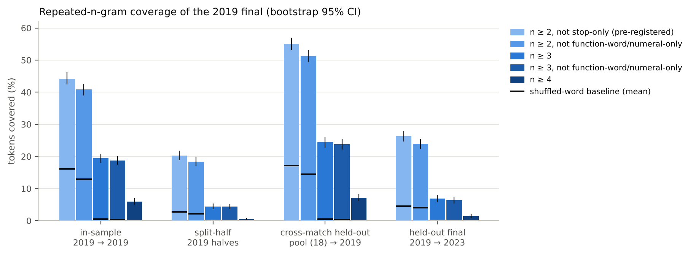
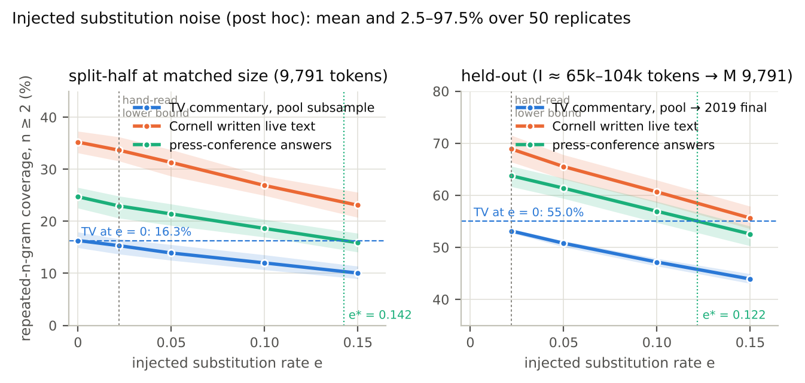
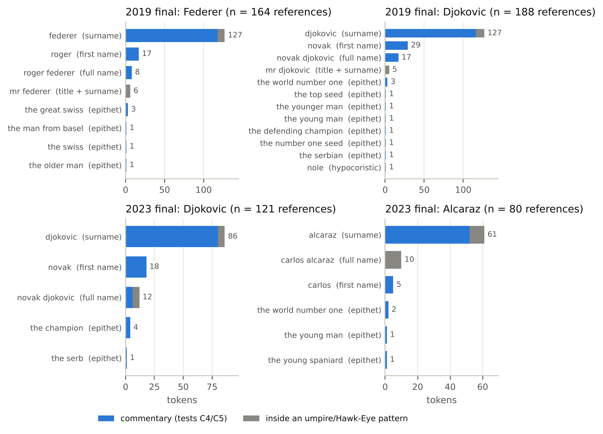
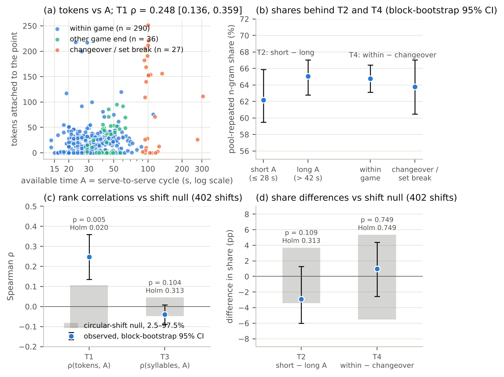

# Formula, economy and the clock: Parry–Lord measures on the television commentary of the 2019 Wimbledon final

Draft, Phase 6 (early): sections 1–4, 6 and 8, the figure scripts and the tables; sections 5 and 7 are placeholders until Phase 5 closes. Every number is read from a results file under `analysis/*/results/` (named in an HTML comment after each table and in the scripts under `paper/figures/`); nothing is typed from memory. Works are cited only where a catalogue, publisher or journal record was fetched (`paper/research/references.md`); any claim about a work's content beyond its record is marked [unverified]. Greek is NFC polytonic; citations have the form Il. 6.146.

## 1. The question

Parry's studies of the epithet and the formula (Parry 1928, 1930, 1932; collected in Parry 1971) made a claim about production as much as about style: a diction of formulae, each regularly used under the same metrical conditions to express a given essential idea [wording of the definition unverified against the page], arranged in noun-epithet systems of wide extension and strict economy, is what lets a singer compose hexameters at speaking pace. Lord (1960; 3rd ed. 2019) made this a theory of composition in performance. Read as a theory of production it has an empirical shape that does not depend on the hexameter. Wherever acceptable discourse must be produced continuously, in real time, against a rhythm set from outside, one expects (i) a large stock of reusable phrases; (ii) for each recurrent idea, alternatives of different length (extension) with little redundancy at any one length (economy, Parry's *thrift*); and (iii) a choice among them governed by the slot to be filled rather than by the idea.

Kuiper and Haggo (1984) argued from livestock auctions that this is not peculiar to verse. Their abstract, the only part of the paper read for this study, says that auctioneers "use an oral formulaic technique", that it "is a response to performance constraints which place a heavy load on short term memory", and that the difference from ordinary speech "is one of degree, not kind". Kuiper's later work carries the argument to race callers and sportscasters (Kuiper and Austin 1990; Kuiper 1996, 2009; titles only). Live sports commentary is therefore an obvious test genre, and tennis adds what the auction lacks: the game imposes a cycle (serve, rally, dead ball, serve) whose lengths are recorded to the second, so the time available for an utterance can be measured rather than inferred. If the cycle acts on the commentator as the verse acts on the singer, the pressure should show as more repeated material and shorter forms when the interval is short.

Three things were tested on the television commentary of the 2019 Wimbledon men's final (Djokovic d. Federer 7–6(5) 1–6 7–6(4) 4–6 13–12(3)), with the 2023 final held out for replication: the formula inventory and its coverage within the match, across other matches and across the held-out match; the noun-epithet system of the two players, its slots and lengths, and whether the choice of form is bound to the time available (economy) and its length to the time available (extension); and timing as a metrical frame, whether the serve-to-serve cycle behaves like a slot that favours repeated and shorter material when it is short. The tests were pre-registered. The data permit much less than the design asked (§2), and much of what follows concerns what survives the limits.

## 2. Corpus sources and their limits

The spoken corpus is the TennisVL test split released with Liu et al. (2026): WhisperX transcripts (Bain et al. 2023) of one television commentary track per match, attached to the rally clips of 20 Grand Slam matches of 2019–2025. For the 2019 final, 373 of 481 clips carry text, 9,702 words after de-duplication of text repeated across consecutive clips (17.7% of the raw words). The release does not name the broadcaster; the commentators address "Boris" 19 times and "Tim" 7 times, so the track is probably BBC Television [unverified: an inference from names in the transcript]. The 2023 final (Alcaraz d. Djokovic; 271 of 368 clips with text, 7,168 words) was excluded from every identification step and used only for replication. The other 18 matches form a reference pool (103,074 words), their broadcasters likewise unnamed. <!-- corpus/README.md §0, §2, §4 (script-generated from corpus/reports/) -->

Three timing layers are aligned point by point: per-shot hit times from the TennisVL video parser (1,939 shots), the match clock of Sackmann's Grand Slam point-by-point data (ElapsedTime at 1 s resolution, the first serve of each of the 422 points), and the human-charted shot sequences of the Match Charting Project. 473 of 481 clips (98.3%) align to a point; video and match clock differ by a constant 26.72 s in 2019 (residual SD 0.28 s), whereas the 2023 source video omits the changeovers (23 cuts). The written contrast is the live-text corpus released with Fu, Danescu-Niculescu-Mizil and Lee (2016): 3,962 updates from one outlet, 175,569 words, of other matches, without timestamps or match identifiers. The player answers in the press-conference transcripts of the same release serve only as a spoken, non-commentary baseline (81,974 answers, 358 interviewees, 2007–2015, edited stenography); `corpus/SOURCES.md` marks them DON'T USE as commentary and they are not used as such (`FOR_HUMAN.md`). Licences: TennisVL is released "strictly for academic research in sports video understanding"; the Match Charting Project and the point-by-point data are CC BY-NC-SA 4.0, so the derived point tables inherit ShareAlike; the Cornell release states no licence. No audio or video was downloaded, no full transcript is committed, and every committed excerpt is at most 15 words. <!-- corpus/README.md §2–3, §7; corpus/SOURCES.md §1 -->

The prominent limitation, which Phase 0 required the paper to restate, is this. No acceptable source gives the same match from a second broadcaster, from radio, or in two media. The transcripts carry no audio, no speaker labels and no word-level times. They are clip-level ASR with an undocumented window: the first score call in a clip is the score *after* the clip's point in 40 of 59 cases, so a clip's text runs on into the following dead time. The word error rate is unknown: a hand-read sample of 500 words found 11 visible errors, 22 per 1,000 words (Wilson 95% CI 12–39), a lower bound because substitutions yielding a plausible word are invisible without audio. Each limit removes a test. One broadcaster: commentator, broadcaster, match and medium are confounded, and no within-match medium contrast exists. No speaker labels: the umpire, Hawk-Eye and the two commentators are one voice, and the umpire can only be masked by pattern. No word times: intonation units cannot be measured, speech during rallies cannot be separated from speech between points, and the metre hypothesis had to be re-specified at the level of the point (§3). Unknown error rate: every contrast between ASR text and edited text is confounded with transcription noise, which breaks exact repetitions (§4.2). <!-- corpus/README.md §0, §4, §7.3; STATUS.md Phase 0 -->

## 3. Methods

**Tokens and the measure.** Text is NFKC-normalised and case-folded, hyphens and dashes become spaces, and a token is `[a-z0-9]+(?:'[a-z0-9]+)*`; n-grams never cross an utterance (one clip's text, one live-text update, one press answer). The pre-registered measure, renamed **repeated-n-gram coverage** after the first review, is the share of tokens of a measurement set M lying inside an n-gram (2 ≤ n ≤ 12) that occurs in at least two utterances of an identification set I and does not consist only of the 182 listed function words. It is a rate of lexical repetition, not Parry's formula, and the comparison with Duggan's (1973) "formulaic density" of repeated hemistichs is an analogy (his criterion's wording is [unverified]; only the record was fetched). A stricter family is reported alongside: n ≥ 3; n ≥ 4; n ≥ 2 excluding strings made only of function words and numerals (digits, score words, cardinals, ordinals); n ≥ 3 with that exclusion. Exact repeats (a) are distinguished from one-slot **systems** (b): frames of two to six tokens with one slot typed `<NAME>`, `<NUM>` or open (open slots internal), attested with at least two fillers in at least three utterances. Four designs: in-sample (I = M = 2019); split-half (odd clips identify, even measure, and the reverse, pooled); cross-match held-out (I = the 18-match pool, M = 2019); the held-out final (I = 2019, M = 2023). Coverage carries a percentile bootstrap over the utterances of M (B = 2,000) with I's inventory fixed. A shuffled-word baseline permutes all tokens over positions, keeping utterance lengths, and recomputes identification and measurement (R = 200); it keeps word frequencies and destroys syntax, so it is a floor.

**Corpus contrasts.** Each corpus is subsampled by whole utterances to the 2019 size (9,791 tokens) and identified and measured on itself, in-sample and split-half, over R = 1,000 replicates; held-out, I is drawn from groups disjoint from M (Cornell: the player pair; press: the interviewee), R = 50. For Cornell the planned 100,000-token I could not be reached under the disjointness rule (median 65,444 tokens), a logged deviation. The inferential statistic for C1, R1 and C2 is the 95% interval of paired replicate differences; the pre-registered "p" (twice the minority-sign share) equals its floor 2/(R + 1) whenever every pair has the same sign, so a Holm value from it reflects R, not evidence, and is not used. The post hoc noise check injects substitutions at rates e ∈ {0, 0.022, 0.05, 0.10, 0.15}, drawn from the TV-pool unigram distribution, into each corpus and reports the rate e* at which the press and Cornell means reach the TV value.

**Referring expressions, economy, extension.** References to the two players are inventoried by a fixed matcher (full name, `mr` + surname, surname, first name, hypocoristics, a regex family of descriptive epithets; the referents of 25 descriptive-epithet tokens such as *the champion* were assigned by hand), each with a syntactic slot from a spaCy dependency parse (33/40 agreement with hand labels) and a length in syllables from the CMU dictionary; pronouns are counted but excluded. *Economy*: D is the number of distinct forms summed over player × slot × dead-time-tercile cells, tested one-sidedly for fewer forms than chance against 10,000 permutations of the tercile labels within player × slot. *Extension*: Spearman ρ between a form's syllables and the dead time before its point, 10,000 permutations within player. References inside umpire and Hawk-Eye patterns (*Mr Federer is challenging*, *Game Djokovic*; 31 tokens in each final) are excluded, a deviation adopted after the first review; the pre-registered all-token results are kept as sensitivity rows. Minimum detectable effects (MDE, 80% power) were simulated afterwards for C3–C5 with the tests as run.

**The timing tests.** The pre-registered contexts for coverage are terciles of the dead time before a clip's point (C3a) and of the time after it (C3b); since the clip's text runs on past the point, C3b is the apt predictor. The metre hypothesis was re-specified before any test ran, because its original terms (intonation units aligned with strikes, speech during rallies) need audio. The unit is the point p, its text the concatenation of all clips aligned to p, the frame the serve-to-serve cycle A_p = ElapsedTime(p + 1) − ElapsedTime(p) from the match clock. "Formulae" here are n-grams occurring at least three times in at least two pool streams (9,609 types; a strict variant with n ≥ 3, five occurrences and three streams has 1,088), and a unit's **pool-repeated n-gram share** is its share of tokens inside one. T1 asks whether tokens track A, a precondition that H0 also predicts (a window spanning the cycle yields more words at a constant rate); only T2–T4 discriminate: T2, a higher share in the shortest than the longest tercile of A; T3, longer formulaic strings (syllables) with more time; T4, a higher share within games than around changeovers and set breaks. The null is the exhaustive circular shift of the whole timing sequence against the unit sequence (shifts 10 to M − 10; 402 in 2019, 314 in 2023), which keeps the serial structure of both; CIs are circular block bootstraps (block 10 units, B = 10,000); Holm is applied within each match's family. MDEs were simulated post hoc on the shifted bases, with and without a share of each unit's text attributed to its neighbours.

**Pre-registration and review.** The metre plan was committed at 6db5d39 (2026-10-07 13:12:47) and the formula plan at de5788a (13:14:07); the first test scripts and results entered the repository at 951adb5 (13:23:15). Later changes are labelled addenda: the metre addendum (3c38cd7, 14:28:59) precedes the post hoc analyses it specifies; the formula addendum, committed with the first outputs of the revised scripts (282fd31, 14:48:18), is a log, not a pre-registration. Two adversarial reviews (`review/critic_analysis_v1.md`: 1 critical, 7 major, 9 minor; v2: 0 critical, 1 major, 11 minor) drove one revision; no confirmatory definition, threshold or rule changed, only the reporting of C1/R1/C2 and the token set of C4/C5, both logged. <!-- git log; review/ -->

## 4. Results

### 4.1 Inventory and coverage

**Table 1. Repeated-n-gram coverage of the 2019 final by design and definition** (% of tokens; bootstrap 95% CI; shuffled rows: mean and 2.5–97.5% over 200 replicates).

| definition | in-sample (2019 → 2019) | split-half (2019 halves) | pool (18 matches) → 2019 | 2019 → 2023 (held-out final) |
|---|---|---|---|---|
| n ≥ 2, not stop-only (pre-registered (a)) | 44.2 [42.5, 46.3] | 20.3 [18.9, 21.8] | 55.0 [53.1, 57.0] | 26.3 [24.7, 28.0] |
| n ≥ 2, not function-word/numeral-only | 40.8 [39.0, 42.6] | 18.4 [17.1, 19.8] | 51.2 [49.4, 53.1] | 24.0 [22.4, 25.5] |
| n ≥ 3 | 19.4 [18.0, 20.9] | 4.5 [3.7, 5.3] | 24.4 [22.7, 26.1] | 6.9 [5.8, 8.0] |
| n ≥ 3, not function-word/numeral-only | 18.7 [17.3, 20.2] | 4.4 [3.6, 5.1] | 23.8 [22.1, 25.4] | 6.4 [5.3, 7.5] |
| n ≥ 4 | 6.0 [5.0, 7.0] | 0.5 [0.2, 0.8] | 7.1 [6.0, 8.3] | 1.4 [0.9, 2.0] |
| (a) + one-slot systems (b), base definition | 48.3 [46.4, 50.5] | 23.3 [21.8, 25.1] | 63.9 [61.9, 65.9] | 29.9 [28.2, 31.7] |
| shuffled-word baseline, base definition (mean [2.5–97.5%]) | 16.2 [15.2, 17.3] | 2.8 [2.2, 3.5] | 17.2 [16.3, 18.1] | 4.6 [4.0, 5.2] |
| shuffled-word baseline, n ≥ 3 | 0.5 [0.2, 0.8] | 0.0 [0.0, 0.0] | 0.5 [0.3, 0.7] | 0.0 [0.0, 0.1] |
| tokens measured | 9791 | 9791 | 9791 | 7216 |

<!-- analysis/formulas/results/coverage_family.csv (coverage, CIs, shuffled baselines); density_main.csv ((a)+(b) row); generated by paper/figures/tables.py -> paper/figures/tables/table1_coverage.md -->

*Figure 1.* Coverage by design and definition (bars ordered by strictness), bootstrap 95% CIs, black dashes for the shuffled-word baseline. Script `paper/figures/fig1_coverage.py`, reading `coverage_family.csv`.

The final repeats within itself 44.2% of its tokens under the base definition, but bigrams carry the figure: 56% of covered tokens have a bigram as their longest cover, and the most widespread items are *the first*, *a little*, *the match*, *going to*, *you know*. Requiring three or more tokens cuts in-sample coverage to 19.4% against a shuffled floor of 0.5%; excluding function-word/numeral-only strings changes it little (40.8%). The split-half design, the honest within-match figure, gives 20.3% (n ≥ 3: 4.5%). Identifying repeats on the 18 other matches raises coverage to 55.0% (n ≥ 3: 24.4%): 919 of the final's 1,194 repeated types occur in at least one other match and 275 in none, so most of the stock is shared across matches and, the pool being other broadcasts [broadcasters unverified], across commentators. One-slot systems add 3–9 points. Of 231 systems, 84 have a top filler taking at least two thirds of occurrences (`<NAME> djokovic` is mostly *novak djokovic*) and barely alternate; the most widespread are the score-call frames (`<NUM> 15`, `40 <NUM>`, `the <_> set`), where the ASR's *13*, *14* and *50* for thirty, forty and fifteen (29 of 195 fillers) are absorbed by the slot. Score calls are said by the umpire and by the commentators, and the transcript does not tell them apart. <!-- maximal_match_2019.csv; formulas_2019.tsv; formulas_cross_stream.csv; systems_2019.tsv; analysis/formulas/report.md §2 -->

### 4.2 Corpus contrasts and the noise check

At matched size, split-half coverage is 16.2% for TV commentary (pool subsamples), 35.3% for the Cornell live text and 24.6% for press answers (n ≥ 3: 3.6, 14.2, 8.2%). C2, the TV–Cornell difference, is −19.1 points, replicate interval [−22.1, −16.3], pre-registered p at its floor 2/1001. It is a corpus difference: the corpora differ in matches, outlet, period, transcription (raw ASR against edited prose) and segmentation (clip windows that cut sentences against whole updates), and matched size equalises tokens only; the difference is not attributable to medium. C1 and R1, the held-out contrasts with press answers (TV 55.0% vs press 66.1%, [−13.9, −8.0]; 2023: 59.5 vs 66.1, [−9.5, −3.6]), are **indeterminate pending a WER estimate**: injected substitution noise brings the press value down to the TV value at e* = 0.122 (held-out) and 0.142 (split-half), while the only estimate of the TV error rate is the lower bound 0.022. The Cornell mean stays above the TV value through e = 0.15 in both designs, but in the held-out design its range at e = 0.15 (55.6 [53.6, 57.9]) overlaps the TV value (55.0 [53.1, 57.0]) and the means cross by extrapolation near 0.16, so the direction of the Cornell contrast is secure against this noise model in the split-half design only. The model is not a bound on real ASR error, which clusters in names, score calls and overlapping speech and includes deletions and merges. <!-- density_medium.csv; confirmatory.csv; asr_noise_sensitivity.csv; asr_noise_summary.json -->

*Figure 2.* Coverage against injected substitution rate, split-half at matched size (left) and held-out (right); dotted verticals mark e*. Script `paper/figures/fig2_noise.py`, reading `asr_noise_sensitivity.csv` and `density_main.csv`.

### 4.3 Confirmatory tests

**Table 2. Confirmatory tests (2019 final, C) and replication (2023 final, R).** Coverage in %, differences in points; for C1/R1/C2 the inferential statistic is the replicate interval; for C3–C5 a permutation p with Holm within the family; MDE at 80% power.

| id | test | estimate | 95% interval | p (pre-registered statistic) | p (Holm) | MDE (80% power, α = 0.05 / Bonferroni) | verdict |
|---|---|---|---|---|---|---|---|
| C1 | coverage, pool → 2019 final, minus press answers (held-out; I ≈ 100k → M 9.8k) | 55.0 vs 66.1; diff -11.1 pp | [-13.9, -8.0] pp (replicate differences) | 0.0002 (= floor 2/(R+1); uncalibrated) | — | — | indeterminate pending a WER estimate |
| R1 | coverage, pool → 2023 final, minus press answers (held-out) | 59.5 vs 66.1; diff -6.7 pp | [-9.5, -3.6] pp (replicate differences) | 0.0002 (= floor 2/(R+1); uncalibrated) | — | — | indeterminate pending a WER estimate |
| C2 | split-half coverage at 2019 size: TV pool minus Cornell live text (corpus contrast) | 16.2 vs 35.3; diff -19.1 pp | [-22.1, -16.3] pp (replicate differences) | 0.0020 (= floor 2/(R+1); uncalibrated) | — | — | corpus difference: 95% interval of differences excludes 0 (not attributable to medium) |
| C3a | coverage (pool-identified), shortest minus longest tercile of dead time before the point | 55.4 vs 55.1; diff +0.4 pp | [-4.0, +4.6] pp (bootstrap) | 0.8770 (permutation) | 1.0000 | 6.4 / 7.9 pp | not rejected |
| C3b | coverage (pool-identified), shortest minus longest tercile of time after the point | 52.5 vs 55.1; diff -2.5 pp | [-7.3, +2.6] pp (bootstrap) | 0.3029 (permutation) | 0.9088 | 7.0 / 8.5 pp | not rejected |
| R3a | as C3a, 2023 final | 60.6 vs 59.1; diff +1.5 pp | [-2.9, +5.9] pp (bootstrap) | 0.5199 (permutation) | 0.6947 | 6.5 / 7.9 pp | not rejected |
| R3b | as C3b, 2023 final | 57.1 vs 60.2; diff -3.1 pp | [-8.2, +1.9] pp (bootstrap) | 0.2304 (permutation) | 0.6947 | 7.2 / 8.5 pp | not rejected |
| C4 | thrift: distinct name forms per player × slot × dead-time tercile, below permutation null | D = 86 vs null mean 84.2 | null 95%: [81, 88] | 0.8932 (one-sided permutation) | 1.0000 | θ = 0.30 / 0.38 | not rejected |
| R4 | as C4, 2023 final | D = 47 vs null mean 49.0 | null 95%: [46, 52] | 0.1737 (one-sided permutation) | 0.6947 | θ = 0.42 / 0.48 | not rejected |
| C5 | extension: Spearman ρ of name length (syllables) with dead time before | ρ = 0.090 | null 95%: [-0.117, 0.114] | 0.1295 (two-sided permutation) | 0.5179 | ρ = 0.17 / 0.21 | not rejected |
| R5 | as C5, 2023 final | ρ = 0.076 | null 95%: [-0.165, 0.147] | 0.3453 (two-sided permutation) | 0.6947 | ρ = 0.22 / 0.27 | not rejected |

<!-- analysis/formulas/results/confirmatory.csv (estimates, intervals, p, Holm, MDEs, verdicts); C4/C5/R4/R5 use the commentary-only token set (status column: revised post hoc, plan addendum 2); generated by paper/figures/tables.py -> table2_confirmatory.md -->

Nothing in the time-pressure family was detected. Coverage in the shortest tercile of available time differs from the longest by +0.4 points (dead time before) and −2.5 (time after) in 2019, +1.5 and −3.1 in 2023; every interval includes zero, and circular-shift nulls in place of the label permutations give p between 0.21 and 0.90. Economy: 86 distinct forms over cells against a null mean of 84.2 (2019), 47 against 49.0 (2023). Extension: ρ = 0.090 and 0.076. With 80% power the tests detect only a coverage difference of 6.4–7.2 points, a regime in which 30% (2019) or 42% (2023) of references take a tercile-specific form, or ρ = 0.17 (0.22 in 2023): "not rejected" means not detected, not absence. The pre-registered all-token set is likewise null (D = 91 vs 89.6; ρ = 0.087). <!-- confirmatory.csv; circular_shift_tests.json; mde_summary.json -->

### 4.4 The noun-epithet system

**Table 3. Referring expressions to the players** (commentary-only = after excluding references inside umpire/Hawk-Eye patterns; forms with their token counts over all references).

| match | player | references (all) | inside umpire patterns (excluded) | commentary-only references | distinct forms (commentary-only) | bare surname % | descriptive epithets % | syllables (min–max) | forms with ≥ 2 tokens (all references) |
|---|---|---|---|---|---|---|---|---|---|
| 2019 | Federer | 164 | 15 | 149 | 7 | 79 | 4 | 2–5 | `federer` 127; `roger` 17; `roger federer` 8; `mr federer` 6; `the great swiss` 3; +3 single-token forms |
| 2019 | Djokovic | 188 | 16 | 172 | 11 | 67 | 5 | 1–7 | `djokovic` 127; `novak` 29; `novak djokovic` 17; `mr djokovic` 5; `the world number one` 3; +7 single-token forms |
| 2023 | Djokovic | 121 | 12 | 109 | 5 | 73 | 5 | 2–5 | `djokovic` 86; `novak` 18; `novak djokovic` 12; `the champion` 4; +1 single-token forms |
| 2023 | Alcaraz | 80 | 19 | 61 | 5 | 85 | 7 | 2–5 | `alcaraz` 61; `carlos alcaraz` 10; `carlos` 5; `the world number one` 2; +2 single-token forms |

<!-- analysis/formulas/results/extension.csv (commentary_only and all_tokens rows), refexpr_inventory.csv (forms and counts); generated by paper/figures/tables.py -> table4_refexpr.md -->

*Figure 3.* Every form used for each player; grey marks tokens inside an umpire/Hawk-Eye pattern. Script `paper/figures/fig3_refexpr.py`, reading `refexpr_tokens_tv_*.csv`, checked against `refexpr_inventory.csv`.

The bare surname is 67–85% of each player's commentary-only references and descriptive epithets 4–7%. The forms that look most Homeric (*the great Swiss*, *the man from Basel*, *the older man*, *the world number one*, *the defending champion*, *the younger man*) occur once or three times each; the full name, the first name and `mr` + surname (the umpire's register) make up the rest. Lengths run from one syllable (*Nole*, once) to seven (*the defending champion*, once), with 84–90% of each player's tokens at two or three syllables; the surname is the commonest form in every player × slot stratum. Third-person pronouns, excluded from the inventory, number 288 in 2019 and 247 in 2023, more than either player's name. <!-- refexpr_inventory.csv; refexpr_syllables.csv; refexpr_summary.json; extension.csv -->

### 4.5 The serve-to-serve cycle as a frame

**Table 4. Metre tests T1–T4** (pool-repeated n-gram share, base definition; circular-shift null; circular block-bootstrap CIs; Holm within each match; MDEs from the post hoc simulation without misattribution).

| match | test | H1′ predicts | estimate [95% CI] | n | p (shift null; shifts) | p (Holm) | sign as H1′ | MDE at α = 0.05 / first Holm step |
|---|---|---|---|---|---|---|---|---|
| 2019wimF | T1 | ρ > 0 (precondition; H0 predicts it too) | ρ = 0.248 [0.136, 0.359] | 353 units | 0.0050 (402) | 0.0198 | yes | — (not simulated) |
| 2019wimF | T2 | > 0 (short intervals more formulaic) | -2.9 pp [-6.0, +1.3] | 353 units | 0.1092 (402) | 0.3127 | no | 5.3 / 6.5 pp |
| 2019wimF | T3 | ρ > 0 (longer formulas with more time) | ρ = -0.040 [-0.088, 0.009] | 353 units / 3460 strings | 0.1042 (402) | 0.3127 | no | ρ = 0.066 / 0.081 |
| 2019wimF | T4 | > 0 (changeover talk less formulaic) | +1.0 pp [-2.5, +4.4] | 353 units | 0.7494 (402) | 0.7494 | yes | 8.3 / 10.6 pp |
| 2023wimF | T1 | ρ > 0 (precondition; H0 predicts it too) | ρ = 0.163 [0.030, 0.285] | 219 units | 0.0318 (314) | 0.0953 | yes | — (not simulated) |
| 2023wimF | T2 | > 0 (short intervals more formulaic) | -4.3 pp [-9.6, +1.1] | 219 units | 0.1206 (314) | 0.2413 | no | 8.2 / 9.7 pp |
| 2023wimF | T3 | ρ > 0 (longer formulas with more time) | ρ = 0.021 [-0.025, 0.065] | 219 units / 2255 strings | 0.4318 (314) | 0.4318 | yes | ρ = 0.081 / 0.096 |
| 2023wimF | T4 | > 0 (changeover talk less formulaic) | not testable: 1 changeover units after exclusions (< 15) | | | | | |

<!-- analysis/metre/results/confirmatory_2019wimF.csv, confirmatory_2023wimF.csv, posthoc_mde.csv (mix = 0); generated by paper/figures/tables.py -> table3_metre.md -->

*Figure 4.* (a) Tokens attached to a point against its cycle A, by dead-ball category; (b) the group shares behind T2 and T4; (c, d) observed statistics with block-bootstrap CIs against the 2.5–97.5% band of the circular-shift null. Script `paper/figures/fig4_metre.py`, reading `units_2019wimF.csv`, `details_2019wimF.json`, `confirmatory_2019wimF.csv`, `nulls_2019wimF.npz`.

Of the 422 points of the 2019 final, 353 survive the exclusions; 63 carry no text. The precondition holds in 2019: tokens attached to a point rise with its cycle (ρ = 0.248 [0.136, 0.359], about 0.53 extra tokens per second), but part of the association lies between categories, since changeover and set-break units carry a median of 109 tokens against 14 within games, and within games ρ is 0.166 [0.046, 0.280]. H0, a constant rate inside a window that spans the cycle, predicts the same, so T1 shows only that clip-level text carries some point-level timing information. The discriminating predictions were not observed: the share is lower, not higher, in short cycles (0.622 against 0.650; −2.9 points [−6.0, +1.3]); string length does not rise with time (ρ = −0.040 [−0.088, 0.009]); changeover talk is not less repetitive (+1.0 point [−2.5, +4.4]). The base share (0.644) is carried by *in the*, *of the*, *on the*; under the strict definition (0.149) the estimates are −0.7 points [−3.5, +3.3], ρ = −0.057 [−0.158, 0.048] and +0.5 points [−2.7, +3.6]. No robustness variant (score calls removed, umpire patterns masked, names masked, the last-hit-to-next-serve interval, exact-repeat units dropped, a continuous time-shift null) gives an effect in the predicted direction; the one unadjusted p below 0.05 (T2 with score calls removed, −3.5 points [−6.6, +0.9], p = 0.0496) points the other way and is not read as evidence either. The shift-null SD is within 3–5% of an iid permutation SD. Under the pre-registered rule, H1′ is **not supported** in 2019. <!-- details_2019wimF.json; posthoc.json; robustness_2019wimF.csv; analysis/metre/report.md §5–7, §10 -->

The 2023 final is not a comparable-range replication: its video omits the changeovers, units whose cycle contains a cut were excluded in advance, the analysed cycles span 15–117 s against 14–305 s in 2019 with one changeover unit against 27, and T4 is untestable. Over that range T2 (−4.3 points [−9.6, +1.1]) and T3 (ρ = 0.021) are null, and the T1 association is weaker and carried by points with a fault clip. What "not detected" means is bounded by the design: the 2019 tests would have found, with 80% power, measured effects of 5.3 points (T2), ρ = 0.066 (T3) and 8.3 points (T4); if half of each unit's text belonged to the neighbouring cycles, the true effects needed rise to 10.8 points, ρ = 0.135 and beyond the simulated range for T4, and ASR errors attenuate further by an unknown factor. The descriptive rate ceiling (T5) is inconclusive: the median rate is 0.41 tokens per second of cycle, and the 90th-percentile rate in long cycles is 0.77 [0.58, 1.13] of that in short ones. <!-- posthoc.json (PH4); posthoc_mde.csv; confirmatory_2023wimF.csv; t5_2019wimF.json -->

## 5. The composition as a reverse test of thrift and extension [to be written after Phase 5]

## 6. Where the commentary–Homer analogy fails, and where it holds

It fails first at the formula. What was counted is lexical repetition: a token inside any string that recurs in two utterances. Parry's formula is defined by a metrical condition and an essential idea, and the measure has neither: there is no metre to condition the string, and its idea is not controlled, so *a little bit* counts beside *the world number one*. The stricter definitions show how much of the headline rests on short repeats (Table 1), and the shuffled floor shows that the longer repeats are real, but no automatic definition reaches Parry's, and the Duggan comparison is an analogy. Homeric studies have in any case moved from the fixed string to the flexible and modified formula (Hoekstra 1965; Hainsworth 1968; surveyed in Edwards 1986, 1988) and, for ordinary language, to the formulaic sequence (Wray 2002); exact-string coverage is a lower bound on repetition of that kind, and only that.

It fails second at economy. A Homeric hero's noun-epithet system has, for each case and slot, one epithet and rarely a second; the test asks whether a commentator's choice among *Federer*, *Roger*, *Roger Federer* and *the great Swiss* is likewise bound to slot and moment. The inventory is surname-dominated (67–85%), the context is a clip-level tercile that does not encode the moment at which a name is chosen, the slot labels come from a parser right in 33 of 40 cases, and the smallest effect the test could see is a regime in which 30% of references take a tercile-specific form. The test is powerless rather than negative, and extension is in the same case: the available lengths run from one to seven syllables, but 84–90% of tokens sit at two or three.

It fails third at the frame. A metrical slot has a shape; the serve-to-serve cycle has only a length, and a loose one (median 34 s, maximum 305 s), while the text attached to a point comes from an undocumented window that runs into the next cycle. The hypothesis that could be tested is temporal, not metrical, and it was tested at the level of the point rather than of the strike or the intonation unit, where Bakker (1997) places the relation between Homeric discourse and the spoken language described by Chafe (1994). No audio, one broadcaster and an unknown error rate stand between this corpus and that test.

Where the analogy holds is narrower but real. The score-call and announcement systems (`<NUM> 15`, `40 <NUM>`, `game <NAME>`, `<NAME> leads by <_> games to <_>`) are functional frames: fixed wording with a typed slot, used at the same point of every cycle, so stable that the ASR's mishearings are absorbed by the slot. They are the umpire's as much as the commentators', and the transcript does not separate the two, but they are the one place where form, function and position coincide as Parry's definition requires. The cross-match stock is the second: repeats identified on 18 other matches cover 55.0% of the final's tokens (24.4% at n ≥ 3) against 20.3% (4.5%) from the other half of the same match, so the shared diction of the genre exceeds any one commentator's self-repetition, as a tradition should. The third is the written contrast, read with its limits: at matched size the written live text repeats itself far more than the spoken commentary (35.3% against 16.2%, split-half), and the sign survives every noise level tried in that design. That reverses the naive expectation that speech under time pressure is the more formulaic, but it is a difference between two corpora, not between two media, and it says nothing yet about Homer.

## 7. Appendices [poem, translation, scansion: after Phase 5]

## 8. Limitations

1. *The measure is repetition, not Parry's formula* (critic B3): coverage orders texts by repetition rate; no definition captures "the same metrical conditions" or "a given essential idea". Only the economy and extension tests take function, not string identity, as the unit.
2. *TV speech against press answers is indeterminate* (A1): edited stenography against raw clip-cut ASR of unknown WER, within-genre against cross-broadcaster identification; 12.2% injected substitution closes the gap. Settling it needs audio for a WER estimate or a within-convention comparison (`FOR_HUMAN.md`, routes 1–2).
3. *TV speech against written live text is a corpus contrast* (B7): different matches, outlet, period, transcription and segmentation; the sign is stable under noise in the split-half design but not secure in the held-out design (v2, M1). A minute-by-minute of the same match (`FOR_HUMAN.md`, route 5) would remove the match confound.
4. *The nulls are low-powered*: MDEs at 80% power are 6.4–7.2 coverage points between time terciles, θ = 0.30–0.42 for thrift, ρ = 0.17–0.22 for extension, 5.3–6.5 points (T2), ρ = 0.066–0.081 (T3) and 8.3–10.6 points (T4); misattribution of clip text to points and ASR errors attenuate true effects by an unknown factor.
5. *Thrift cells are coarse*: context is the clip's tercile, not the position of the name; slots come from a parser (33/40); umpire references are excluded by pattern, which may catch a commentator echoing a call.
6. *C3a used the interval before the clip's point*; C3b is the apt predictor and both are null; label permutations treat adjacent clips as exchangeable, and circular-shift nulls change no conclusion.
7. *The 2023 replication is not at comparable range*: cycles of 15–117 s against 14–305 s, one changeover unit, T4 untestable.
8. *Metre T1 is consistent with H0*: it shows only that clip-level text carries point-level timing information.
9. *One broadcaster, no speakers, no word times, no audio*: commentator, medium and match are confounded; intonation units cannot be measured; the strike-level hypothesis is untested. Routes to a second broadcaster, radio or audio (Box of Broadcasts, BBC archive licensing, the Internet Archive radio collection, other rights holders) need a licence or institutional access and are listed in `FOR_HUMAN.md`.
10. *De-duplication* removed 17.7% of raw words as window overlap and with them some true repetitions; the `text_dedup` sensitivity run bounds the effect below one point.
11. *Hand verdicts and decisions*: 25 epithet referents, 40 slot labels and the 500-word ASR sample are single-annotator judgements awaiting a spot-check; the TennisVL terms-of-use scope, the ShareAlike status of derived tables and the use of a mirror of the removed point-by-point repository are decisions recorded in `FOR_HUMAN.md`.

<!-- analysis/limitations.md; FOR_HUMAN.md -->

## Data and code

Committed: the analysis scripts and every results table, with the pre-registered plans and their addenda (`analysis/formulas/`, `analysis/metre/`); the corpus manifest with the sha256 of each transcript file, per-utterance metadata without text, the aligned point and shot tables, the correction rules and log, and the hand verdicts (`corpus/`); the Homer tools (`homer/`); the figure and table scripts with their PNG/SVG outputs (`paper/figures/`); the verified bibliography (`paper/research/`). Gitignored and never committed: the downloads in `corpus/raw/`, the full transcripts (`corpus/transcripts/*.jsonl`), audio and video of any kind (none was downloaded), and the virtual environment. Committed excerpts of commentary are at most 15 words (12 in the n-gram tables). To rerun from the sources, in the project's `.venv` (`requirements.txt`): `bash corpus/scripts/fetch_phase0.sh`, `bash corpus/scripts/build_corpus.sh`, `bash analysis/formulas/run_all.sh`, `bash analysis/metre/run_all.sh`, then `bash paper/figures/make_all.sh`, which regenerates the four figures and the four tables above. The derived point tables are CC BY-NC-SA 4.0 (attribution Jeff Sackmann / Tennis Abstract); the TennisVL-derived tables are for academic research only.

## References

Only works cited above; each was verified from a fetched catalogue, publisher or journal record on 2026-10-07 (`paper/research/references.md`, which gives the record and a quotation from it). Gaps in a record are repeated here.

- Bain, Max, Jaesung Huh, Tengda Han, and Andrew Zisserman. 2023. "WhisperX: Time-Accurate Speech Transcription of Long-Form Audio." *Proc. Interspeech 2023*, 4489–4493. doi:10.21437/Interspeech.2023-78.
- Bakker, Egbert J. 1997. *Poetry in Speech: Orality and Homeric Discourse*. Ithaca: Cornell University Press.
- Chafe, Wallace. 1994. *Discourse, Consciousness, and Time: The Flow and Displacement of Conscious Experience in Speaking and Writing*. Chicago: University of Chicago Press.
- Duggan, Joseph J. 1973. *The Song of Roland: Formulaic Style and Poetic Craft*. Berkeley: University of California Press. doi:10.1525/9780520313088.
- Edwards, Mark W. 1986. "Homer and Oral Tradition: The Formula, Part I." *Oral Tradition* 1/2: 171–230.
- Edwards, Mark W. 1988. "Homer and Oral Tradition: The Formula, Part II." *Oral Tradition* 3/1–2: 11–60.
- Fu, Liye, Cristian Danescu-Niculescu-Mizil, and Lillian Lee. 2016. "Tie-breaker: Using language models to quantify gender bias in sports journalism." IJCAI workshop on NLP Meets Journalism. arXiv:1607.03895. Data: http://www.cs.cornell.edu/~liye/tennis.html.
- Hainsworth, J. B. 1968. *The Flexibility of the Homeric Formula*. Oxford: Clarendon Press.
- Hoekstra, A. 1965. *Homeric Modifications of Formulaic Prototypes: Studies in the Development of Greek Epic Diction*. Amsterdam: North-Holland.
- Kuiper, Koenraad. 1996. *Smooth Talkers: The Linguistic Performance of Auctioneers and Sportscasters*. Mahwah, NJ: Lawrence Erlbaum.
- Kuiper, Koenraad. 2009. *Formulaic Genres*. Basingstoke: Palgrave Macmillan. doi:10.1057/9780230241657.
- Kuiper, Koenraad, and Paddy Austin. 1990. "They're off and racing now: the speech of the New Zealand race caller." In Allan Bell and Janet Holmes (eds), *New Zealand Ways of Speaking English*, 195–220. Clevedon: Multilingual Matters. [Chapter record from a bibliography page, not a publisher record.]
- Kuiper, Koenraad, and Douglas Haggo. 1984. "Livestock auctions, oral poetry, and ordinary language." *Language in Society* 13: 205–234. doi:10.1017/S0047404500010381.
- Liu, Zhaoyu, Xi Weng, Lianyu Hu, Zhe Hou, Kan Jiang, Jin Song Dong, and Yang Liu. 2026. "TennisExpert: Towards Expert-Level Analytical Sports Video Understanding." arXiv:2603.13397. (The TennisVL benchmark is described in this paper.)
- Lord, Albert B. 1960. *The Singer of Tales*. Harvard Studies in Comparative Literature 24. Cambridge, MA: Harvard University Press. 3rd ed., ed. David F. Elmer, 2019.
- Parry, Milman. 1928. *L'Épithète traditionnelle dans Homère*. Paris: Les Belles Lettres. [Subtitle unverified on the record.]
- Parry, Milman. 1930. "Studies in the Epic Technique of Oral Verse-Making. I. Homer and Homeric Style." *Harvard Studies in Classical Philology* 41: 73–147. doi:10.2307/310626. [End page unverified.]
- Parry, Milman. 1932. "Studies in the Epic Technique of Oral Verse-Making. II. The Homeric Language as the Language of an Oral Poetry." *Harvard Studies in Classical Philology* 43: 1–50. doi:10.2307/310666. [End page unverified.]
- Parry, Milman. 1971. *The Making of Homeric Verse: The Collected Papers of Milman Parry*, ed. Adam Parry. Oxford: Clarendon Press.
- Sackmann, Jeff. *The Match Charting Project*. GitHub repository JeffSackmann/tennis_MatchChartingProject, commit 1813a13. CC BY-NC-SA 4.0 [licence line not read from GitHub in this session].
- Sackmann, Jeff. *Grand Slam Point-by-Point Data, 2011–present*. Upstream repository removed; used from the mirror huggingface.co/datasets/Aneeshers/tennis-sackmann-archive (revision 8ac86f7), which carries the upstream README and the CC BY-NC-SA 4.0 licence.
- Wray, Alison. 2002. *Formulaic Language and the Lexicon*. Cambridge: Cambridge University Press. doi:10.1017/CBO9780511519772.
